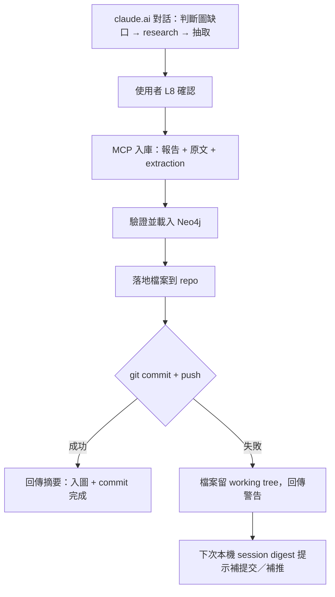

# 遠端入圖的 provenance 紀錄（Remote Intake Provenance）

## Summary

遠端（claude.ai）入圖以「一次研究行動」為單位留下可追溯紀錄：一份過程報告 + 各文件的原文與 extraction JSON 一起落地進 repo，MCP server 在入圖當下自動 commit 並 push（一次研究行動一個 commit）；git 操作失敗不阻擋入圖，由 session 開頭 digest 補提交。

---

## Problem Frame

遠端入圖（claude.ai → MCP `load_extraction`）目前只落地 extraction JSON。研究過程找到的原文遺失；「圖缺什麼 → 所以去查 → 所以入這份」的推理只存在於當下那個 claude.ai 對話，過了就沒了；落地的檔案停在 working tree，等下次本機 session 批次 commit，入圖時間點在 git 歷史裡失真。

三個月後在圖裡看到一條可疑 claim 時，沒有任何東西能回答「這是什麼時候、基於什麼理由進來的」。

---

## Key Decisions

- **紀錄，不是把關。** L8 人工確認留在 claude.ai 對話內、呼叫 `load_extraction` 之前；資料即時進圖，git 是事後帳本。不建 pending/staging 審核層。
- **紀錄單位是「一次研究行動」。** 一次研究常涵蓋多份文件：一份報告、一個 commit 對應一次行動，而非每份文件各一筆。
- **報告住 repo 檔案，不住 PR。** 報告未來最主要的讀者是 Claude session（blind-spot audit、L8 檢查、來源追溯），repo 內檔案可直接 Grep；GitHub 只是 push 出去的瀏覽鏡像（手機 GitHub app 回看用），不是紀錄的家。
- **入圖即提交，digest 當安全網。** MCP server 在入圖當下 commit + push；git 操作失敗則檔案留在 working tree，由既有的 session 開頭 digest 提示補提交。時間戳與理由寫在報告檔內，不依賴 git 時間戳，兩條路徑的帳本內容一致。
- **遠端入庫只收純文字，超限降級。** 原文超過大小上限或非文字（PDF、圖片）→ 存 URL + 關鍵段落節錄。extraction JSON 的 sources 本就帶逐字 quote，URL 日後失效時承重證據句仍在。

---

## Requirements

**落地內容**

- R1. 每次遠端入圖，以研究行動為單位落地：一份過程報告，加上該行動涵蓋的每份文件的原文與 extraction JSON，全部進 repo。
- R2. 原文只收純文字且有大小上限；超限或非文字來源改存 URL + 關鍵段落節錄。
- R3. 報告由 claude.ai 在入圖當下撰寫並隨載入請求透過 MCP 傳入；理由不可事後補寫（過了那個對話就取不回）。

**Git 帳本**

- R4. Server 每次研究行動做一個 git commit，只加入該行動落地的檔案（精確 pathspec，不得 `git add -A`），commit message 取自報告的「為何此時入圖」。
- R5. Commit 成功後接著 push；push 失敗不阻擋、不影響入圖結果。
- R6. Commit 或 push 失敗時，檔案原地保留，工具回傳訊息中明確警告，且 session 開頭 digest 列出待補提交／待補推的入圖紀錄。
- R7. 已存在的 `doc_id` 再次載入時不得靜默覆蓋既有落地檔案。

**報告內容**

- R8. 報告至少包含：入圖時間戳、為何此時入圖（動機來自哪個圖缺口）、涵蓋的文件清單（doc_id + 來源 URL）、搜尋過程摘要、L8 確認備註。每個欄位都要有明確的消費場景，不加沒人讀的欄位。

---

## Key Flows



- F1. 遠端研究入圖
  - **Trigger:** claude.ai 對話中判斷圖缺口 → research → 抽取完成，使用者做完 L8 確認。
  - **Steps:** claude.ai 讀抽取規則 → 組報告 → 把報告、各文件原文（或 URL + 節錄）、extraction JSON 透過 MCP 傳入 → server 驗證、載入 Neo4j、落地檔案 → 一個 commit → push → 回傳含 git 結果的摘要。報告全文在對話中即時可見。
  - **Covers:** R1–R5, R8
- F2. Git 降級路徑
  - **Trigger:** F1 中 commit 或 push 失敗（lock、髒樹、離線）。
  - **Steps:** 入圖與落地照常完成，回傳訊息警告 git 未完成 → 下次本機 session 開頭 digest 列出待補筆數 → 本機逐筆 commit／push，message 從各報告取，時間戳以報告內記載為準。
  - **Covers:** R6

---

## Acceptance Examples

- AE1. **Covers R2.** 一份 150 頁的 PDF 產業報告作為來源 → 原文不落地，落地 URL + claude.ai 節錄的關鍵段落；extraction 照常載入。
- AE2. **Covers R5, R6.** 入圖當下網路不穩 push 失敗 → 入圖成功、commit 成功，回傳訊息註明「push 未完成」；下次本機 session digest 顯示待補推。
- AE3. **Covers R7.** 同一 `doc_id` 第二次載入 → 既有的 raw／extraction／報告不被靜默覆蓋（拒絕或另存版本，由 planning 定案）。

---

## Report Skeleton（草稿，實際使用後再 refine）

```markdown
# 入圖報告：<研究行動一句話標題>
- 入圖時間：<ISO 8601>
- 動機（為何此時）：<當時判斷圖缺了什麼方向>
- 涵蓋文件：<doc_id> ← <來源 URL>（每份一行）
- 搜尋過程：<查了哪些方向、採用/排除了什麼來源、為什麼>
- L8 備註：<origin_entity 獨立性確認的結論>
```

---

## Scope Boundaries

- 不建入圖前的 pending／staging 審核層——L8 把關已在對話內發生。
- 不做 GitHub PR 自動化——git log + repo 檔案即帳本，PR 無 reviewer 也無額外資訊。
- 不回補既有 18 份 extraction 的 provenance——新流程只管從今以後的入圖。
- 引擎B（RSS pending leads）是另一條管線，不在本案範圍。

---

## Dependencies / Assumptions

- MCP server 與 repo working tree、git 憑證同在本機，`origin`（GitHub，https）可推送——已成立。
- 本機可能同時開著另一個 session 持有 git lock；server 端 git 操作必須容忍失敗並走 R6 降級。
- Session 開頭 digest 機制已存在，可擴充以偵測待補提交的入圖紀錄。

---

## Outstanding Questions

**Deferred to Planning**

- 原文大小上限的具體數值（參考 `fetchers/edgar.py` 的 `--max-chars` 精神）。
- R7 重複 `doc_id` 的具體行為：拒絕並要求改名，或自動加版本後綴。
- MCP 介面形狀：擴充 `load_extraction` 參數，或新增一個以研究行動為單位的入庫工具。
- Digest 偵測待補提交的機制：掃 untracked 檔案，或報告檔內帶狀態欄位。
