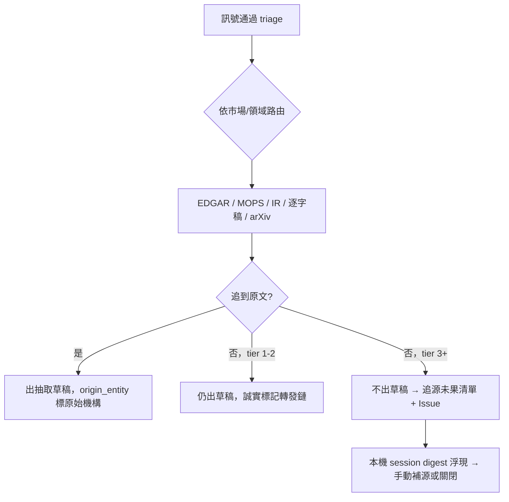

# 追源深度升級（Source Trace Upgrade）

## Summary

建一本共用的「追源手冊」repo skill，把 CLAUDE.md 來源登記表的路由知識變成機器可執行的追源鏈；圖的三個入口（雲端週掃、本機 lead-intake、claude.ai chat）照同一本手冊執行。社群轉發類訊號追不到原文即隔離不入圖；追源未果項目開 Issue 由既有 session digest 浮現；單一 `origin_entity` 主張以圖查詢導出待印證清單。

---

## Problem Frame

圖的價值完全建立在「每條主張可追溯到一手來源」上。使用者的核心恐懼：一句話等級的轉發訊號入了圖、找不到原文也沒有第二人附和，整張圖的可信度就崩了——這不是體驗問題，是系統存在意義問題。

現況有三個缺口。第一，週掃的 R14 追源實作只是「再搜一次 web search」，沒有路由邏輯；`crons/weekly_scan_prompt.md` 完全沒引用 CLAUDE.md 的來源登記表，也沒用到 repo 裡現成的 `fetchers/edgar.py`。實例：7/11 週報中 crux_capital 的 InP 分析轉發追源失敗，用的是通用搜尋而非「InP → 美股 → EDGAR / IR / 法說逐字稿」的路由。第二，追源失敗的訊號目前誠實標記後仍可入圖草稿，品質防線全押在人工核准上。第三，claude.ai chat 透過 MCP connector 已具備入圖能力（讀圖、抽取規則、`load_extraction`），但讀不到 repo 的 `skills/` 目錄——有工具、沒規則書，每次即興發揮。

---

## Key Decisions

- **共用手冊，不是只改週掃 prompt。** 圖的入口有三個（週掃、lead-intake、chat），只修一個入口等於防線有缺口。追源邏輯抽成獨立 repo skill，比照 `skills/signal-triage` 已驗證的「repo skill 當共用規則書」模式；weekly prompt 反而變短（引用取代內文）。
- **分級擋，不是全擋也不是全放。** 一手/二手來源（filing、法說會）追不到完整原文仍放行；社群轉發類（evidence tier 3+）追不到原文就不出抽取草稿。用產出量換圖的可信度。
- **印證不強求當週找到。** 獨立第二來源往往要等下一家公司開法說會。單一 `origin_entity` 的主張自動標記、列入待印證清單即可；清單由圖查詢即時導出（衍生的不過期），不另外維護清單檔。
- **隔離區出口復用既有機制，零新程式碼。** 追源未果項目開 `weekly-scan` label 的 Issue，既有 SessionStart digest（`crons/weekly_scan_digest.py`）本來就會列出這類 Issue；關 Issue 即代表已補源或放棄。
- **chat 取得手冊走 MCP 讀檔工具。** `get_extraction_rules` 的實作就是「讀 repo 檔案端給遠端」；照同一模式端出追源手冊 + intake SOP，單一事實來源仍是 repo 檔案。

---

## Requirements

**追源手冊（新 repo skill）**

- R1. 手冊定義有路由的追源鏈：依訊號的市場/領域分路（美股 EDGAR、台股 MOPS、技術/學術 arXiv 等，沿用 CLAUDE.md 來源登記表），通用搜尋只當第三層退路。
- R2. 每則通過 triage 的訊號必須執行追源，並記錄嘗試過的路由路徑；「追不到」必須附已嘗試清單，不可只寫結論。
- R3. 分級處置：tier 1-2 來源追不到完整原文仍可出草稿（誠實標記）；tier 3+ 追不到原文不出草稿，轉入追源未果清單。
- R4. `origin_entity` 標記規則沿用現行 R14（追到原文標原始機構；追不到標「經 X 轉發，未能獨立取得原文」）。

**入口整合**

- R5. `crons/weekly_scan_prompt.md` 的追源段落改為引用手冊（Stage 0 讀入，比照 signal-triage）。
- R6. `skills/lead-intake` 的驗證迴圈（Step 2）改為引用同一本手冊，不再自帶一份來源分路清單。
- R7. MCP server 新增讀檔工具，把手冊（含 lead-intake SOP 的必要部分）端給 claude.ai chat；內容直接讀 repo 檔案，不複製維護。

**週報與隔離區**

- R8. 週報新增「追源未果清單」段落：每項附原始訊號摘要與已嘗試路由。
- R9. 追源未果項目同步開（或併入）一個 `weekly-scan` label 的 Issue，每項一個 checkbox；既有 digest 不需修改。
- R10. 週報標記「單一 `origin_entity`」的主張；待印證全量清單以圖查詢即時導出，不落地成檔案。
- R11. 對 `parked` 且 materiality 達門檻、但自動化因合法 access gap 無法完成的 lead，產生可由使用者接手的 `manual_source_trace_request`（明列缺少的原文、投資重要性、已嘗試路徑、可接受交付物與回填入口），使用者補回合法來源後由同一 lead／receipt 恢復 pq1，且不因此提高 evidence tier 或繞過 graph admission。

---

## Key Flows

- F1. 週掃追源
  - **Trigger:** 雲端週掃 Stage 2 有訊號通過 triage。
  - **Steps:** 讀手冊 → 依路由嘗試取得原文 → 依 R3 分級處置 → 週報記錄嘗試路徑 → 未果項目開 Issue。
  - **Covers:** R1–R5, R8, R9
- F2. chat 隨手 intake
  - **Trigger:** 使用者在 claude.ai chat 丟一張推文截圖。
  - **Steps:** chat 以 MCP 工具取得手冊與 intake SOP → 拆 claim → 以 web search 依路由追源 → 分級處置 → 使用者 L8 確認後 `load_extraction`；追不到原文的 tier 4 訊號停在 lead-only。
  - **Covers:** R1–R4, R7
- F3. 隔離區補源
  - **Trigger:** 本機開 session，digest 列出開著的追源未果 Issue。
  - **Steps:** 使用者決定重試（本機工具全，含 last30days）或放棄 → 補到原文則走正常 intake、關 Issue；放棄也關 Issue。
  - **Covers:** R9

---

## Acceptance Examples

- AE1. **Covers R2, R3, R8, R9.** crux_capital 型案例：tier 3 轉發、路由嘗試（EDGAR 全文檢索、IR 頁、原作者頁面）皆未果 → 不出抽取草稿；週報未果清單記載嘗試路徑，並出現在 `weekly-scan` Issue 的 checkbox。
- AE2. **Covers R3, R4.** 券商摘要轉述某公司法說內容、逐字稿當週未公開（tier 2 → 可信轉述）→ 照常出草稿，`origin_entity` 標「該公司（經券商轉發，未能獨立取得原文）」。
- AE3. **Covers R7.** chat 收到推文截圖 → 呼叫新 MCP 工具取得手冊 → 依規則判定 tier 4 且追源未果 → 明確告知使用者「lead-only，不入圖」，不產生 `load_extraction` 呼叫。
- AE4. **Covers R10.** 某主張所有 source 的 `origin_entity` 同為一家供應商 → 出現在圖查詢導出的待印證清單；第二個獨立 `origin_entity` 來源入圖後，該主張自動從查詢結果消失，無需人工維護。

---

## Scope Boundaries

- Trending 訊號源擴充與 last30days 的定位（本次討論的「問題 1」）——留待下次 brainstorm。
- 主動為每條主張搜尋第二獨立來源——成本高、雜訊回升，明確不做；印證靠登記 + 後續週掃/手動累積。
- 遠端入圖的過程紀錄落地（報告 + 自動 commit）——屬相鄰的 `docs/brainstorms/2026-07-13-remote-intake-provenance-requirements.md`，不在本案。
- 不引入外部 plugin/skill 進雲端環境（last30days 依賴本機 API 金鑰，不進週掃沙盒）。

---

## Dependencies / Assumptions

- **未驗證假設：** 雲端 routine 沙盒的 Python 能否對 sec.gov 出網（能則直接跑 `fetchers/edgar.py`）。手冊必須定義降級路徑：出網受限時改用 web search 對 EDGAR 全文檢索（`efts.sec.gov` 的網頁版）與 IR 頁面。
- `fetchers/edgar.py` 僅依賴 `requests`，無金鑰亦可跑（缺 `EDGAR_CONTACT_EMAIL` 時有預設值）——已確認。
- 「repo skill 當共用規則書、cloud routine 於 Stage 0 讀入」模式已由 `skills/signal-triage` 驗證可行。
- `crons/weekly_scan_digest.py` 已會列出開著的 `weekly-scan` Issue——已確認，R9 零改動成立。
- MCP server 讀 repo 檔案端給遠端的模式已由 `get_extraction_rules` 驗證（`mcp_server/graph_mcp.py`）。

---

## Outstanding Questions

**Deferred to Planning**

- MCP 介面形狀：新增獨立工具，或擴充 `get_extraction_rules` 一併回傳手冊。
- 手冊與 `skills/lead-intake` Step 2 現有來源分路內容的收斂方式（改引用後 lead-intake 該段如何瘦身）。
- 追源未果 Issue 的粒度：每週一個 Issue（checkbox 列表）或每項一個 Issue。
- 雲端沙盒出網能力的實測（決定 EDGAR 走 fetcher 還是 web search 降級路徑）。

---

## Sources

- `crons/weekly_scan_prompt.md` — 現行 R14 追源規則與週報結構（本案改寫對象）。
- `docs/reports/weekly_scan_2026-07-11.md` — crux_capital 追源失敗實例；triage 稽核顯示過濾層已工作良好。
- `skills/lead-intake/SKILL.md` — 驗證迴圈與來源分路現況（R6 改寫對象）。
- `mcp_server/graph_mcp.py` — `get_extraction_rules` 讀檔端出模式（R7 依循）。
- `crons/weekly_scan_digest.py` — SessionStart digest 現行行為（R9 依賴）。
- `docs/brainstorms/2026-07-13-remote-intake-provenance-requirements.md` — 相鄰案：遠端入圖留帳；兩案共用 digest 與 MCP server，需在 planning 時對齊。
