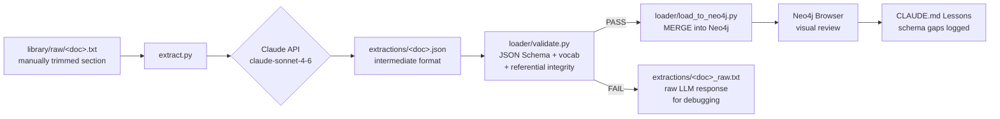
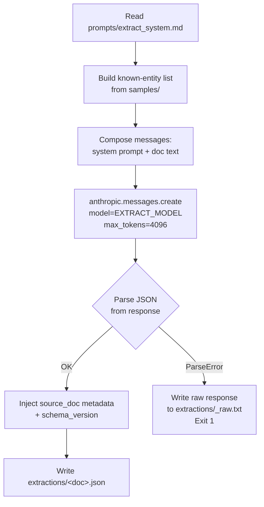

# feat: CPO/矽光子垂直切片 — 基礎建設 + extract 管線

**Scope:** Steps 1+2 of the vertical slice — Docker/Neo4j infra and `extract.py`. Vector/RAG, thesis generation, and human scoring are explicitly deferred to a follow-up plan once the extraction pipeline stabilizes (per L2/L3 discipline).

---

## Summary

Build the two foundations of the CPO/矽光子 vertical slice:

1. **Infra (U1):** Neo4j Desktop brings up Neo4j 5.x with APOC plugin. Schema is applied, the hand-authored sample loads cleanly, and the graph is visually verified in the Neo4j Browser.
2. **Extract pipeline (U2–U3):** `extract.py` reads a raw CPO-related transcript or paper section from `library/raw/`, calls the Claude API with a chokepoint-atlas question-ladder system prompt built from `schema/graph_schema.md` + `schema/vocab.json`, and outputs intermediate JSON compliant with `schema/intermediate_format.schema.json`. The pipeline runs: extract → `loader/validate.py` → `loader/load_to_neo4j.py` → Browser review → schema gaps logged to CLAUDE.md Lessons.

When both steps pass their acceptance criteria the vertical slice v0 is complete. All automation, multi-document batching, and RAG/thesis layers are deferred.

---

## Problem Frame

The schema layer is fully defined and validated (schema, loader, sample). The missing pieces are:
- A running Neo4j instance to actually load data into (nothing is wired to a real DB yet).
- `extract.py`, the LLM-powered extraction stage that is the core of Engine A.

Until a real document runs through `extract → validate → load → human review`, the v0 schema is unproven against real data. Schema gaps, hallucination patterns, and ID-collision behavior are all unknown. This plan closes that gap with the minimum viable pipeline: one document, one extraction run, one manual review.

---

## Requirements

| ID | Requirement |
|---|---|
| R1 | Neo4j 5.x runs locally via Neo4j Desktop with APOC plugin enabled. |
| R2 | Schema setup cypher (`schema/neo4j_setup.cypher`) applies cleanly; 4+ indexes visible. |
| R3 | Sample JSON (`samples/cpo_external_laser_source.json`) loads with correct node/edge/claim counts and MERGE idempotency. |
| R4 | `extract.py` accepts a raw text file, calls Claude API, and writes a JSON file to `extractions/`. |
| R5 | `extract.py` output passes all three validation layers in `loader/validate.py` (JSON Schema, vocab, referential integrity). |
| R6 | Every extracted node/edge/claim carries ≥1 `source_id` with a `locator` and `quote` that supports the claim (provenance is non-negotiable). |
| R7 | Extracted JSON merges correctly into the existing graph (same company — e.g., `co:coherent` — does not duplicate). |
| R8 | Human spot-check of ≥3 extracted edges confirms quote supports the stated relationship (no hallucinations). |
| R9 | Schema gaps and surprises from the first extraction run are recorded in `CLAUDE.md` Lessons. |

**Success criterion (Step 1):** All of R1–R3 pass.
**Success criterion (Step 2):** R4–R9 pass.

---

## Key Technical Decisions

**KTD1 — LLM output format: free-form JSON in system prompt, not tool use.**
Options: (a) Anthropic tool use / structured output, (b) system prompt instructs JSON output + parse + validate.
Decision: (b). The intermediate format schema is complex (nested arrays of different object types); tool definitions for it would be brittle. `loader/validate.py` already provides three-layer validation and is the better guard. If the LLM output fails validation, write the raw response to `extractions/<doc>_raw.txt` for manual inspection and halt. No auto-retry in v0 — human fixes the prompt.
Why: L2/L3 — minimum viable for v0. Validation-on-failure-with-raw-dump gives enough debuggability.

**KTD2 — Entity ID reuse: pass known entity list in system prompt.**
The `id` format is `type_prefix:slug` (e.g., `co:lumentum`). If the LLM invents a new slug for an entity already in the graph, MERGE creates a duplicate.
Decision: The system prompt includes the node list from the existing sample (`co:broadcom`, `co:lumentum`, `co:coherent`, `tech:cpo`, etc.) as a "known entities" reference. The LLM is instructed to reuse these IDs for matching entities and to follow the slug convention for new ones.
Why: Prevents the most obvious ID-collision failure mode on a first run.

**KTD3 — Document chunking: manual pre-selection, no auto-chunking in v0.**
Full earnings transcripts can be 40k+ tokens. CPO-relevant sections are typically 2–5k tokens.
Decision: The implementer manually extracts the CPO/optics section from the source document before passing it to `extract.py`. No automatic chunking. The `--input` file should be the already-trimmed section, not the full transcript.
Why: L3 — auto-chunking adds complexity before we know if the extraction prompt itself works. One clean section is enough to prove the pipeline.

**KTD4 — LLM model: `claude-sonnet-4-6`, configurable via env var.**
Extraction requires careful schema adherence and source attribution. Sonnet provides sufficient quality at reasonable cost for a low-volume dev workflow.
Decision: Default to `claude-sonnet-4-6`. Expose as `EXTRACT_MODEL` env var so the implementer can switch to Opus for harder documents.

**KTD5 — System prompt location: `prompts/extract_system.md`, read at runtime.**
Embedding the prompt in source code makes iteration slower (requires a code edit, not a text edit).
Decision: `extract.py` reads `prompts/extract_system.md` at startup. The file is committed to git so prompt versions are tracked.

---

## High-Level Technical Design

### Pipeline flow



### extract.py internal flow



---

## Scope Boundaries

### In scope
- Neo4j Desktop + Neo4j 5.x with APOC
- `schema/neo4j_setup.cypher` application and index verification
- Sample load verification (Step 1 acceptance criteria)
- `library/raw/` and `extractions/` directory structure
- `prompts/extract_system.md` — extraction system prompt
- `extract.py` — CLI extraction script
- Integration run with one hand-picked CPO source document
- Human review of extracted graph in Neo4j Browser
- Schema gap logging in CLAUDE.md

### Deferred to Follow-Up Work
- Multi-document batch (8–10 sources) — after the single-document pipeline stabilizes
- Vector embedding and RAG query interface — indexes exist in Neo4j; integration deferred
- Thesis generation (Tier 1 Directional Lane Memo) — deferred until extraction is stable
- Human scoring rubric / structured evaluation template — deferred
- Engine B (SNS/X crawler) and Engine C (fundamentals/Postgres) — per CLAUDE.md development order
- `concentration_score` derivation (currently hand-filled in sample) — deferred
- Automatic chunking of long documents — deferred
- Cross-document confidence reconciliation batching — deferred

### Outside this plan's scope
- Production deployment, scheduling, or automation
- Agent frameworks (LangGraph/CrewAI) — pure Python functions for v0
- Postgres / Engine C schema

---

## Implementation Units

### U1. Neo4j Desktop Infrastructure

**Goal:** Neo4j 5.x running locally via Neo4j Desktop with APOC; schema applied; sample loaded and visually verified.

**Requirements:** R1, R2, R3

**Dependencies:** None

**Files:**
- `.env.example` (already committed — no changes needed)
- `.gitignore` (already committed — no changes needed)
- `docker-compose.yml` — already committed; remains in repo as an optional Docker alternative for future use, but is not the active path.

**Approach:**
1. Download and install **Neo4j Desktop** from [neo4j.com/download](https://neo4j.com/download/) (Windows installer, free).
2. In Neo4j Desktop: **New Project → Add → Local DBMS**, select Neo4j version **5.x** (e.g. 5.26), set a password.
3. Before starting: go to the **Plugins** tab → install **APOC** (one-click install).
4. Click **Start** to launch the database. Bolt URI will be `bolt://localhost:7687`.
5. Copy `.env.example` to `.env`; fill in `NEO4J_URI=bolt://localhost:7687`, `NEO4J_USER=neo4j`, `NEO4J_PASSWORD=<password set in step 2>`, and `ANTHROPIC_API_KEY`.
6. Apply schema: open Neo4j Browser at `http://localhost:7474`, connect, then either:
   - Paste the full contents of `schema/neo4j_setup.cypher` into the query editor and run, **or**
   - Use cypher-shell (bundled with Neo4j Desktop under the **Terminal** button): `cat schema/neo4j_setup.cypher | cypher-shell -u neo4j -p <password>`
7. Load sample: `python loader/load_to_neo4j.py samples/cpo_external_laser_source.json --apoc`

**Test scenarios:**
- `SHOW INDEXES;` returns ≥4 indexes (entity_id_unique, entity_type, entity_level, entity_role, plus fulltext and vector indexes).
- `MATCH (n) RETURN count(n)` returns 10 (9 Entity nodes + 1 Claim).
- `MATCH ()-[r:SUPPLIES_TO]->() RETURN r.attributes` returns 2 rows each with `substitutability`, `lead_time_weeks`, and `qualification_status` populated.
- Re-running `loader/load_to_neo4j.py samples/cpo_external_laser_source.json --apoc` does not increase node/edge count (MERGE idempotency).

**Verification:** All four acceptance checks from `docs/next-steps.md` §Step 1 pass in Neo4j Browser.

---

### U2. Source Document Preparation + Directory Scaffolding

**Goal:** `library/raw/<doc>.txt` exists with the CPO-relevant section of a real Tier 1 or Tier 2 source; `extractions/` directory is ready.

**Requirements:** R4, R6 (precondition)

**Dependencies:** U1 (Neo4j must be up so the integration run in U4 can proceed)

**Files:**
- `library/raw/.gitkeep` (create directory)
- `extractions/.gitkeep` (create directory)
- `library/raw/<doc>.txt` — the actual source document (human task, not generated)

**Approach:**
- Create directory structure. Both directories should be committed to git via `.gitkeep`; the actual raw documents and extractions can be `.gitignore`d or kept tracked — leave this decision to the implementer based on file size.
- **Source selection (human step):** Pick one document from the Tier 1/2 priority list in CLAUDE.md:
  1. **Preferred:** Coherent or Lumentum most recent earnings transcript — search the CPO / co-packaged optics / external laser section. This is ~2–5k tokens of focused content.
  2. **Alternative:** OFC/ECOC conference paper on CPO architecture (PDF → extract text).
  - Store the original file in `library/raw/` regardless of format. If it is a PDF, also store a plain-text version. Provenance note (company, quarter/year, URL, retrieval date) should appear as a comment at the top of the `.txt` file or in a sidecar `library/raw/<doc>.meta.json`.
- Pass only the CPO/optics-relevant section to `extract.py` (manual trim per KTD3), not the full transcript.

**Test scenarios:**
- `library/raw/` and `extractions/` directories exist and are reachable.
- The selected `.txt` file is non-empty and contains explicit mention of CPO, external laser source, or supply-chain relationships that can form graph edges.

**Verification:** Implementer can run `python extract.py --input library/raw/<doc>.txt ...` without file-not-found errors.

---

### U3. `extract.py` + System Prompt

**Goal:** CLI script that reads a raw document, calls Claude API with the chokepoint-atlas question-ladder prompt, and writes a valid intermediate JSON to `extractions/`.

**Requirements:** R4, R5, R6

**Dependencies:** U2

**Files:**
- `extract.py` (create — repo root, matching `docs/next-steps.md` interface)
- `prompts/extract_system.md` (create)

**Approach:**

*CLI interface (locked per KTD, matches next-steps.md):*
```
python extract.py --input library/raw/<doc>.txt \
                  --source-type transcript \
                  --evidence-tier 1 \
                  --out extractions/<doc>.json
```
Optional: `--model` override (defaults to `EXTRACT_MODEL` env var, then `claude-sonnet-4-6`).

*`prompts/extract_system.md` structure:*
The system prompt is the main determinant of extraction quality. It should contain, in order:
1. **Role statement:** You are a supply-chain intelligence analyst extracting a structured knowledge graph from primary source documents.
2. **Vocabulary table:** Node types, relation types, abstraction levels, roles — verbatim from `schema/vocab.json`. The LLM reads these as the only valid values.
3. **Attribution rule (physical / relational / time-varying split, from CLAUDE.md L4):** Properties that don't change when you swap the other endpoint → node `attributes`. Properties that depend on the specific relationship → edge `attributes`. Time-varying market observations → do not extract (they go to Postgres, not the graph).
4. **Question-ladder (from chokepoint-atlas, cited in CLAUDE.md):** Work through the document in four passes: (1) Mega-trend / end demand driver → (2) Which stack layers does this document name? → (3) Where is concentration / substitutability low? (chokepoint candidates) → (4) What exact quotes support each claim?
5. **Known entity list:** Node IDs from the existing sample to reuse (e.g., `co:broadcom`, `co:lumentum`, `co:coherent`, `tech:cpo`, `tech:external_laser_source`). New entities follow `type_prefix:slug` convention with lowercase snake_case slugs.
6. **Source attribution rule (mandatory):** Every node, edge, and claim must include `source_ids` that point to `sources[]` entries with `locator` (section/page reference) and `quote` (verbatim text that supports the claim). No claim without a quote.
7. **Output instruction:** Respond with only a valid JSON object matching the `intermediate_format` schema. No prose before or after the JSON. Specify the required top-level keys: `schema_version`, `source_doc`, `sources`, `nodes`, `edges`, and optionally `claims`.

*`extract.py` implementation:*
- Read `prompts/extract_system.md` at startup (not hard-coded in the script).
- Build the user message from the raw document content.
- Call `anthropic.messages.create` with `system=<prompt>`, `max_tokens=4096`.
- Attempt to parse the response text as JSON. On `json.JSONDecodeError`: write raw response to `extractions/<doc>_raw.txt`, print error with file path, exit 1.
- Inject `source_doc` metadata (doc_id derived from input filename, title from `--title` arg or filename, source_type and evidence_tier from CLI args).
- Write the final JSON to `--out`.
- Do not call `validate.py` internally — caller is expected to run it as a separate step (keeping the two concerns separate).

**Patterns to follow:** `loader/load_to_neo4j.py` for env var loading pattern and argparse style. `loader/validate.py` for the three-layer check that will run after extraction.

**Test scenarios:**
- Happy path: valid transcript section → `extract.py` produces JSON → `loader/validate.py` returns OK.
- JSON Schema compliance: every required top-level key present; all nodes have `id`, `type`, `name`, `abstraction_level`, `confidence`, `source_ids`.
- Vocabulary compliance: all `type`/`relation`/`abstraction_level`/`role` values are in `schema/vocab.json`.
- Referential integrity: every `source_id` in nodes/edges/claims has a matching entry in `sources[]`.
- Source attribution: every extracted node/edge/claim has ≥1 `source_id` with a non-empty `quote`.
- ID reuse: entities matching the known entity list (e.g., Broadcom, Lumentum) use the canonical `co:*` IDs, not freshly invented ones.
- Parse error path: if LLM returns non-JSON, `extractions/<doc>_raw.txt` is written and the script exits with code 1.
- Missing API key: script exits cleanly with a clear error message before making any API call.

**Verification:** `python extract.py --input library/raw/<doc>.txt --source-type transcript --evidence-tier 1 --out extractions/<doc>.json` exits 0, and `python loader/validate.py extractions/<doc>.json` prints `OK`.

---

### U4. Integration Run + Human Review + Gap Logging

**Goal:** The full pipeline runs end-to-end with a real document; ≥3 extracted edges are spot-checked for hallucination; schema gaps are recorded.

**Requirements:** R7, R8, R9

**Dependencies:** U1, U2, U3

**Files:**
- `CLAUDE.md` (modify — append new Lessons under the existing Lx entries)

**Approach:**
Run the three-step pipeline in order:
```
python extract.py --input library/raw/<doc>.txt --source-type transcript --evidence-tier 1 --out extractions/<doc>.json
python loader/validate.py extractions/<doc>.json          # must pass
python loader/load_to_neo4j.py extractions/<doc>.json --apoc
```

Then open Neo4j Browser at `http://localhost:7474` and run:
```cypher
MATCH (n:Entity)-[r]->(m:Entity) RETURN n, r, m LIMIT 50;
```

**Human review checklist (per next-steps.md Step 2.4):**
- Are the extracted nodes/edges correct? Are there hallucinated relationships not supported by the source?
- Pick ≥3 edges. Trace each back to `source_ids` → `sources[].quote` in the JSON. Does the quote actually support the relationship type and direction?
- Are any known entities (e.g., `co:coherent`) created as duplicate nodes instead of MERGEing to the canonical ID?
- Are any important entities or relationships from the document absent from the graph?

**Gap logging:** Append a new Lesson (L6 or next available) to `CLAUDE.md` documenting:
- What the schema failed to express (new edge types needed? new node types? unexpected `abstraction_level` assignments?)
- What the extract prompt got wrong (hallucinated edges? missing entities? wrong attribute placements?)
- What `validate.py` caught vs. what only human review caught

**Test scenarios:**
- Pipeline runs without errors from extract through load.
- `MATCH (n) RETURN count(n)` count is greater than after the sample load (new nodes were added).
- The new nodes/edges correctly MERGE with existing nodes (no `co:coherent-2` or similar duplicates).
- ≥3 sampled edges pass the quote-supports-claim check in human review.
- `CLAUDE.md` has a new Lesson entry with at least one concrete schema finding.

**Verification:** All Step 2 acceptance criteria from `docs/next-steps.md` pass. CLAUDE.md has been updated with extraction findings.

---

## Open Questions

| # | Question | Status |
|---|---|---|
| OQ1 | Which specific document to use for the first extraction? (Coherent Q3 FY26 transcript CPO section? OFC 2025 paper?) | Decide at implementation time — check IR pages / arXiv for most recent. |
| OQ2 | Should `library/raw/` contents be committed to git? Files could be large (transcripts). | Implementer decides based on file size. If <500KB, commit. If larger, add to `.gitignore` and document in `library/raw/README.md`. |
| OQ3 | `validate.py` currently runs as a separate invocation. Should `extract.py` optionally call it inline via `--validate` flag? | Deferred — the separate pipeline step is fine for v0. |

---

## Risks & Dependencies

| Risk | Likelihood | Impact | Mitigation |
|---|---|---|---|
| LLM output fails JSON parse or schema validation | Medium | Blocked on first run | Raw response is written to `_raw.txt`; human inspects and iterates on system prompt |
| Entity ID mismatch creates duplicate nodes | High on first run | Graph becomes noisy | Known entity list in system prompt mitigates; human review catches it; fix slug in prompt and re-run |
| Transcript section too long for context window | Low (trimmed to CPO section) | Truncated extraction | Manual trim per KTD3; chunk if needed as a follow-up |
| APOC not loaded in time when Neo4j starts | Low | `--apoc` flag fails | Add `--no-apoc` fallback (already in `load_to_neo4j.py`); wait 20–30s after `docker compose up -d` |
| Neo4j Desktop installation issues | Low | Infra blocked | Standard Windows installer; if version 5.x unavailable in Desktop, download standalone Neo4j 5.x Community zip from neo4j.com and run manually |

**External dependency:** Anthropic API key (`ANTHROPIC_API_KEY`) must be set in `.env`. Extract will fail cleanly if missing.

---

## Sources & Research

- `docs/next-steps.md` — primary implementation spec; this plan operationalizes Steps 1 and 2 exactly.
- `CLAUDE.md` — schema design decisions (L1–L5), vocabulary authority, chokepoint-atlas method reference.
- `schema/graph_schema.md` — node/edge/claim field shapes, evidence tiers.
- `schema/vocab.json` — canonical vocabulary for all enum fields.
- `schema/intermediate_format.schema.json` — JSON Schema that `extract.py` output must satisfy.
- `samples/cpo_external_laser_source.json` — reference for node ID conventions and known entity list to pass to system prompt.
- `loader/load_to_neo4j.py`, `loader/validate.py` — existing patterns to mirror.
