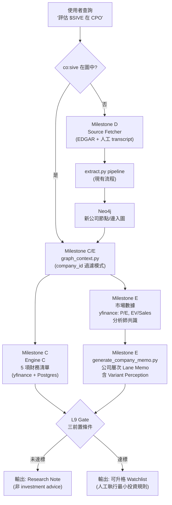
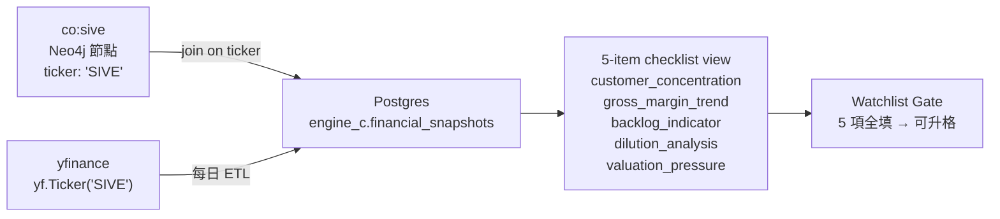

# feat: 投資查詢能力規劃 — $SIVE 問題透鏡下的系統缺口審查 + 下一階段里程碑

**Scope:** 以「如果現在問系統評估 $SIVE 在 CPO 的獨佔性並給投資建議」為思想實驗，逐層拆解當前系統的失敗點，建立缺口分類表，並規劃後續四個里程碑（C/D/E/F）的具體實作單元。$SIVE 作為未知公司透鏡使用，不收集實際資料。

---

## Summary

Milestone B 已完成（8 篇文件 → CPO 知識圖譜 → Lane Memo v1，評分 26/30）。系統目前是「批次管線」：人工準備文件 → 抽取 → 圖 → 出 thesis。如果現在問「評估 $SIVE 在 CPO 的獨佔性，給投資建議」，系統在六個層次上失敗：沒有 $SIVE 資料、沒有自動取資料能力、沒有公司層次 thesis 模式、沒有財務驗證（Engine C）、沒有 Variant Perception 的市場數據、沒有 thesis→部位的最小規則。

本計畫把這六個失敗點轉化為四個里程碑：

| 里程碑 | 內容 | 引擎 |
|---|---|---|
| **Milestone C** | Engine C Bootstrap — A→C join key + Postgres + 5 項財務清單 | C |
| **Milestone D** | Source Fetcher — EDGAR 自動取文件 + 新公司 onboarding 流程 | A |
| **Milestone E** | 公司層次查詢模式 + Variant Perception 市場數據接入 | A + C |
| **Milestone F** | 第二條垂直切片（非 AI 領域）+ 最小投資規則定義 | 方法論 |

---

## $SIVE 問題透鏡：當前系統會怎麼失敗？

這一節是診斷，不是實作。用問題拆解系統在哪裡斷掉。

### 第一層：資料層失敗

**問：`co:sive` 在 Neo4j 圖裡嗎？**
答：不在。圖裡只有 Coherent、Lumentum、Broadcom、Nvidia 等 8 篇文件覆蓋的公司。

**失敗現象：** `graph_context.py` 回傳空 context 或最多回傳 CPO 領域通用節點。`generate_lane_memo.py` 收到空 context 後要麼崩潰、要麼輸出純幻覺內容。

**問：系統知道自己沒有資料嗎？**
答：不知道。目前沒有「公司不在圖中」的偵測與回報機制。

**缺口 D1 — 無公司存在性檢查，且無「不在圖中」的處理路徑。**

### 第二層：資料取得層失敗

**問：系統能自己去找 $SIVE 的資料嗎？**
答：不能。`library/raw/` 需要人工放文件，沒有任何自動取文件機制。

**問：如果 $SIVE 是真實上市公司，需要哪些文件？**
- SEC EDGAR：10-K（Products/Competition 章節）、最近 2-3 季 10-Q、8-K（重大事件）
- 法說會逐字稿（earnings call transcript）
- IR 投資人簡報

**問：如果 $SIVE 是小公司，分析師覆蓋少怎麼辦？**
答：目前系統沒有「覆蓋稀疏警告」機制。來源愈少，幻覺風險愈高，但系統不會提示。

**缺口 D2 — 無 Source Fetcher。新公司 onboarding 完全依賴人工。**
**缺口 D3 — 無分析師覆蓋稀疏偵測（underfollowed company evidence quality flag）。**

### 第三層：圖 / 分析層失敗

**問：就算有 $SIVE 資料，能出公司層次的 thesis 嗎？**
答：不能。`graph_context.py` 拉的是**整個 CPO 領域**的節點，沒有「針對這家公司」的過濾參數。`generate_lane_memo.py` 生成的是**產業 thesis**，不是**公司 thesis**。

**問：$SIVE 在 CPO stack 的哪一層？是瓶頸嗎？**
答：無法自動判斷。需要文件支撐，且 `sole_source` 判定需要客戶端或第三方來源（L8 鐵律），單靠 $SIVE 自己的法說會只能算 `verified_by_absence`。

**缺口 D4 — `graph_context.py` 無公司過濾模式，`generate_lane_memo.py` 無公司層次 thesis 模板。**

### 第四層：財務驗證層失敗（Engine C 缺失）

**問：$SIVE 的毛利率趨勢、客戶集中度、backlog、稀釋、估值壓力能一鍵查出來嗎？**
答：完全不能。Engine C 是空殼，沒有 Postgres schema、沒有任何財務數據 pipeline。

**問：按照 CLAUDE.md，不完成 5 項財務核驗，Lane Memo 能升格成 Watchlist 嗎？**
答：按規則不能升格，但系統沒有 gate 來強制這個規則——目前靠人工自律。

**缺口 D5 — Engine C 未實作。5 項財務核驗清單是人工願望，不是系統 gate。**
**缺口 D6 — A→C join key（ticker 欄位）尚未 patch 到現有 Company 節點（已記錄在 solutions/，是 Engine C 的 P0 blocker）。**

### 第五層：市場定價層失敗

**問：Variant Perception 要填「市場現在信 X，本 thesis 認為 Y，催化劑 Z」，這裡的 X 從哪來？**
答：目前完全靠人工判斷「市場共識是什麼」。沒有股價、沒有 forward P/E、沒有 EV/Sales、沒有分析師共識估值。

**問：$SIVE 的股價隱含假設是什麼？**
答：系統無法回答。Variant Perception 目前是必填欄但沒有數據支撐，只能靠人腦。

**缺口 D7 — 無市場數據接入（股價、估值倍數、分析師共識），Variant Perception 是人工填空。**

### 第六層：決策輸出層失敗

**問：如果 $SIVE 的 Lane Memo 通過評分，接下來該買嗎？買多少？**
答：系統沒有定義。「投資建議」的輸出停在 thesis 文字，沒有進場條件、部位上限、持有期、出場條件。

**問：L9 三個前置條件（第二切片 / 最小規則 / 5 項財務清單）都沒達到，系統知道嗎？**
答：不知道。沒有自動 gate，沒有降級輸出（research note vs. investment recommendation）。

**缺口 D8 — 訊號→部位斷開。thesis 成立後沒有最小版的交易規則。**
**缺口 D9 — L9 前置條件無自動 gate，系統可能在條件未達到時輸出「投資建議」標籤。**
**缺口 D10 — 方法論只在 AI 多頭 + CPO 單一領域驗證，regime 穩健性未知（盲點 B7）。**

---

## Problem Frame

上述十個缺口可歸納為三條結構性斷層：

1. **資料斷層（D1/D2/D3）：** 系統是封閉的。新公司沒有自動入庫路徑，問一個圖外公司等於問一個沒有知識的系統。
2. **引擎斷層（D4/D5/D6/D7）：** 質化分析（Engine A）和量化驗證（Engine C）沒有接上。thesis 的「故事」缺乏財務錨點，Variant Perception 缺乏市場數據錨點。
3. **決策斷層（D8/D9/D10）：** 從「研究」到「行動」之間完全空白。系統輸出研究素材，但不知道什麼時候可以變成投資建議，也不知道進出場規則是什麼。

---

## Key Technical Decisions

**KTD1 — Engine C 第一階段：用 yfinance 作為財務數據源，不自建爬蟲**

理由：yfinance 覆蓋美股絕大多數數據（收盤價、P/E、EV/Revenue、毛利率歷史、股息稀釋），免費，無需 API key，且有成熟 Python 套件。限制：延遲 1 天、分析師預測準確性有限、台股覆蓋弱（台股財務數字先 defer）。Engine C 第一階段驗證流程，之後再評估換 paid API（如 Polygon、財報狗）。

**KTD2 — Source Fetcher：EDGAR 優先，transcript 先人工，論文後上**

EDGAR SEC API 免費、文件品質高（Tier 1）、結構化（公司可由 ticker 定位）。法說會逐字稿初期仍人工（Seeking Alpha / Motley Fool 有版權問題，需評估授權）；arXiv 論文在非 CPO 第二切片可能需要，屆時再加。Source Fetcher 不是黑箱：輸出仍是 `library/raw/{doc_id}.txt` + `{doc_id}.meta.json`，接回現有 extract pipeline，不動下游。

**KTD3 — 公司層次 thesis：graph_context.py 加 `company_id` 過濾，不新建獨立模組**

`build_context(driver, company_id=None)` 加選填參數：`None` 為現有產業全圖模式；傳入 `company_id`（如 `co:sive`）則過濾「以該公司為端點的節點/邊/Claims」。不新建獨立公司模組，因為公司 thesis 本質上是產業 thesis 的子集，複製一份會造成分叉維護。

**KTD4 — Variant Perception 數據：yfinance forward P/E + 分析師目標價，人工補「市場敘事」**

yfinance 可取 forward P/E、EV/Revenue、分析師目標價（均值/中位數/範圍）。但「市場現在信什麼敘事」仍需人工填一行（例如：「市場定價 $SIVE 是 pure-play CPO laser supplier，本 thesis 認為 EML laser 路徑會被 DFB 取代」）。自動的是數字錨點，人工的是敘事解讀。

**KTD5 — 最小投資規則：人工執行，系統只做 checklist gate**

不在系統裡做自動下單或 sizing 計算。系統的責任是：確認 5 項財務清單已填、確認 L9 三個前置條件達標、確認 thesis 有 variant perception 且有 disproof_condition。通過後輸出「可進 Watchlist」，但買多少、何時買由人工決定（等 Engine C 量化因子定義後再自動化）。最小投資規則作為人工 SOP 文件存在（`docs/investment-sop.md`），不是系統程式碼。

**KTD6 — 第二條垂直切片域：選「非 AI、有明確 B2B 供應鏈、有 Tier 1 文件可取」的產業**

候選域（U8 選一）：
- 台灣 PCB 供應鏈（健鼎、南亞電路板、欣興 → 覆蓋 MOPS 台股文件）
- 工業半導體設備（Applied Materials / Lam Research 的非 AI logic segment）
- 醫療影像設備（GE HealthCare / Siemens Healthineers 供應鏈）

判準：方法論是否在沒有 AI capex 多頭的環境下仍能找出有意義的瓶頸與 variant perception。

---

## High-Level Technical Design

### 目標系統流程（完成本計畫後）



### Engine C 資料流



---

## Scope Boundaries

### In scope
- 缺口分類表（D1–D10，本文件已完成）
- Milestone C：Engine C Bootstrap（U1–U3）
- Milestone D：Source Fetcher EDGAR + 新公司 onboarding（U4–U5）
- Milestone E：公司層次查詢模式 + Variant Perception 數據接入（U6–U7）
- Milestone F：最小投資規則 SOP + 第二切片選域規劃（U8–U9）

### Deferred to Follow-Up Work
- Engine C 量化因子模型（回測框架、因子定義、樣本內外切分）— 盲點 B6，等 C Bootstrap 跑真實資料後再規劃
- 法說會逐字稿自動取得（版權問題需先評估）
- 台股 MOPS 財務數據（yfinance 台股覆蓋有限，待第二切片選定域後評估）
- Engine B SNS 爬蟲
- Underwrite Sheet（第三級 thesis 模板）
- 自動化部位 sizing（依 Engine C 量化因子定義後規劃）

### Outside this plan's scope
- 完整交易系統（自動下單、組合管理、風控系統）
- Agent 框架（LangGraph/CrewAI）
- 生產環境部署 / 雲端化

---

## Implementation Units

### U1. A→C Join Key Patch（Engine C P0 Blocker）

**Goal:** 把 `ticker` 欄位 patch 進現有 Company 節點，讓 Engine C 有 join key 可用。同時把 TICKER_MAP 合入 `loader/load_to_neo4j.py`，確保未來新公司載入自動帶 ticker。

**Requirements:** 所有已知上市公司節點有 `ticker` 欄位；私人公司明確設 `null`；新公司載入後不再有 `not_mapped` 狀態。

**Dependencies:** 無（獨立可執行，不需等 Postgres 就緒）

**Files:**
- `scripts/add_tickers.py`（新建，一次性 Cypher patch script）
- `loader/load_to_neo4j.py`（修改：加 TICKER_MAP + `load_company_node()` 邏輯）

**Approach:** 完整設計已記錄於 `docs/solutions/architecture-patterns/knowledge-graph-data-quality-and-engine-c-join-key.md`（Plan A + Plan B）。直接依照該文件實作，不重新設計。

**Test scenarios:**
- 執行 `scripts/add_tickers.py` 後，`MATCH (c:Entity {type:'Company'}) RETURN c.id, c.attributes.ticker` 全部已知公司為 `ok`，私人公司為 `known_private`，無 `not_mapped`
- 新增一個測試公司節點（如 `co:test_co`），確認不在 TICKER_MAP 的公司不會被錯誤賦值
- 重跑現有文件（coherent_q3fy26）的 load，確認 `co:coherent` 的 ticker 仍為 `COHR`（MERGE 不覆蓋）

**Verification:** Cypher 查詢回傳所有 Company 節點的 ticker 狀態一覽，零個 `not_mapped`。

---

### U2. Engine C Postgres Schema + ETL Pipeline

**Goal:** 建立 Engine C 的 Postgres schema，並用 yfinance 跑每日 ETL，讓 5 項財務核驗清單可以由 ticker 自動查出。

**Requirements:** 可由 `ticker` 查出毛利率歷史（至少 4 季）、客戶集中度指標（10-K 揭露或 revenue 集中度）、稀釋（shares outstanding 歷史）、估值倍數（trailing/forward P/E, EV/Revenue）；backlog 若無法自動取則留人工填欄位並標記。

**Dependencies:** U1（ticker 欄位已 patch，ETL 知道要取哪些 ticker）

**Files:**
- `engine_c/__init__.py`（新建）
- `engine_c/schema.sql`（新建，Postgres DDL）
- `engine_c/etl_yfinance.py`（新建，daily ETL）
- `engine_c/checklist.py`（新建，5-item checklist 查詢函式）
- `docker-compose.yml`（修改：加 Postgres service，若尚未有）

**Approach:**

`schema.sql` 核心表：
- `financial_snapshots(ticker, snapshot_date, gross_margin, operating_margin, shares_outstanding, revenue_ttm, ev_revenue, pe_trailing, pe_forward, analyst_target_mean, analyst_target_count)` — 每日快照，時間序列
- `manual_fields(ticker, field_name, value, updated_at, source_note)` — 人工填入的欄位（如 backlog、客戶集中度文字描述）

`etl_yfinance.py`：每天跑一次，對 TICKER_MAP 中所有非 null ticker 呼叫 `yf.Ticker(t).info` 和 `yf.Ticker(t).quarterly_financials`，插入 `financial_snapshots`。

`checklist.py`：`get_checklist(ticker) -> dict`，回傳 5 項各自的狀態（`ok` / `manual_required` / `missing`）與數值，供 Lane Memo gate 使用。

**Test scenarios:**
- `etl_yfinance.py COHR LITE AVGO` 執行成功，三個 ticker 的 snapshot 寫入 Postgres
- `checklist.get_checklist('COHR')` 回傳 dict，5 項各有 `status` 欄位
- `gross_margin` 歷史至少有 4 個季度數值
- `pe_forward` 若 yfinance 無法取得（私人公司/資料缺），回傳 `None` 而非拋錯
- `manual_fields` 可插入 `(COHR, 'backlog', '...', ...)` 並由 checklist 正確讀取

**Verification:** 執行 `python engine_c/checklist.py COHR`，終端機印出 5 項核驗清單結果，每項有數值或明確的 `manual_required` 標記。

---

### U3. Watchlist Gate — 5 項財務清單自動化

**Goal:** 在 Lane Memo 升格流程中加入強制 gate：5 項財務清單全部通過（或人工標記 reviewed）才能升格 Watchlist，否則輸出 "Research Note" 標籤而非 "Investment Recommendation"。

**Requirements:** Lane Memo 輸出檔頭有明確的 `output_type: research_note | watchlist_candidate`；升格條件可查、可人工 override（帶 override 理由）。

**Dependencies:** U2（checklist.py 可用）

**Files:**
- `thesis/generate_lane_memo.py`（修改：加 gate 邏輯，傳入 checklist 結果）
- `prompts/lane_memo_system.md`（修改：加 output_type 格式說明）

**Approach:** `generate_lane_memo.py` 在 API call 前先跑 `checklist.get_checklist(ticker)`，把 5 項狀態注入 system prompt context。若有任何 `missing`（非 `manual_required`），system prompt 加警告「以下財務數據缺失，請在輸出標題加上 [Research Note]」；全部 ok / manual_required → 加 `[Watchlist Candidate]`。

**Test scenarios:**
- 傳入 COHR（5 項都有數據），輸出包含 `[Watchlist Candidate]`
- 傳入一個不在 Postgres 的假 ticker，輸出包含 `[Research Note]` 且說明缺少哪些項目
- `--override-gate` CLI flag 可強制跳過 gate（帶 override_reason 寫入 memo header）

**Verification:** 重跑 CPO Lane Memo（COHR），確認 output_type 欄位存在且標記正確；檢查 gate skip 時 header 有 override 記錄。

---

### U4. Source Fetcher — EDGAR SEC 自動取文件

**Goal:** 依 ticker 從 SEC EDGAR 自動抓最近 N 份 10-K / 10-Q / 8-K，轉成 `library/raw/{doc_id}.txt` + `{doc_id}.meta.json`，接回現有 extract pipeline，不動下游。

**Requirements:** 輸出格式與現有人工準備文件一致（同一 `library/raw/` 路徑與 meta.json schema）；支援至少 10-K / 10-Q；rate limit 友善（EDGAR 要求 User-Agent header + < 10 req/s）。

**Dependencies:** U1（ticker 已 patch，知道要查哪個 CIK）

**Files:**
- `fetchers/__init__.py`（新建）
- `fetchers/edgar.py`（新建）
- `fetchers/utils.py`（新建，共用 rate limiter / doc_id 生成）

**Approach:**

```
EDGAR flow:
1. ticker → EDGAR company search API → CIK
2. CIK → submissions JSON (sec.gov/cgi-bin/browse-edgar) → filing list
3. filter by form_type (10-K, 10-Q, 8-K)
4. 取最近 N 份 → 下載 primary document (htm/txt)
5. 簡單 HTML strip → 純文字
6. 輸出:
   library/raw/{ticker}_{form}_{date}.txt
   library/raw/{ticker}_{form}_{date}.meta.json
   meta.json: {doc_id, source_type, evidence_tier, company, ticker, form_type, filed_date, url}
```

User-Agent header 必須帶 `contact_email`（讀 `.env` 的 `EDGAR_CONTACT_EMAIL`）。每份文件之間 sleep 0.2s 避免超過 EDGAR rate limit。

**Test scenarios:**
- `python fetchers/edgar.py --ticker COHR --forms 10-K --n 1` 下載成功，`library/raw/cohr_10k_YYYYMMDD.txt` 存在且非空
- 輸出 `meta.json` 的 `evidence_tier` 自動設為 `1`（10-K/10-Q）或 `2`（8-K）
- 下載後可直接接 `python extract.py --input library/raw/cohr_10k_*.txt` 不報錯
- EDGAR 無此 ticker 時（如假 ticker），回傳明確錯誤而非崩潰
- rate limit：連續下載 5 份文件，確認沒有 429 回應

**Verification:** 對 COHR 執行 full flow：`fetchers/edgar.py` → `extract.py` → `validate.py` → `load_to_neo4j.py`，新文件節點正確 MERGE 進 Neo4j。

---

### U5. 新公司 Onboarding 流程

**Goal:** 定義當查詢一家圖外公司時的完整 SOP，並在 `query/graph_context.py` 加入「公司不在圖中」偵測與提示，避免空 context 產生幻覺 thesis。

**Requirements:** 查詢不在圖中的公司時，系統回報明確訊息 + 建議的 onboarding 步驟；onboarding 流程可在 5 步內完成（fetch → extract → load → verify → query）。

**Dependencies:** U4（EDGAR fetcher 可用）

**Files:**
- `query/graph_context.py`（修改：加 `company_exists()` 前置檢查 + `company_id` 過濾模式）
- `docs/onboarding-sop.md`（新建，新公司 onboarding checklist）

**Approach:**

`build_context(driver, company_id=None)` 加邏輯：
- `company_id` 傳入時：先 `MATCH (n:Entity {id: $company_id}) RETURN count(n)` 檢查存在性
- 不存在 → 回傳 `{"status": "not_found", "company_id": company_id, "suggestion": "run fetchers/edgar.py --ticker <TICKER>"}`
- 存在 → 以該公司為中心過濾：`MATCH path = (c:Entity {id:$id})-[*1..2]-(n:Entity) RETURN path`

`docs/onboarding-sop.md` 記錄 5 步流程：
1. `fetchers/edgar.py --ticker <TICKER> --forms 10-K,10-Q --n 2`
2. `python extract.py --input library/raw/<doc>.txt ...`
3. `python loader/validate.py extractions/<doc>.json`
4. `python loader/load_to_neo4j.py extractions/<doc>.json`
5. 確認：`MATCH (n:Entity {id:'co:<ticker>'}) RETURN n` 存在後執行 context query

**Test scenarios:**
- `build_context(driver, company_id='co:sive')` → 回傳 `status: not_found` 而非崩潰或空字串
- `build_context(driver, company_id='co:coherent')` → 回傳以 Coherent 為中心的子圖 context（含鄰近 2 跳的節點/邊）
- `build_context(driver)` 無 company_id → 維持原有產業全圖模式（向後相容）

**Verification:** 對不在圖中的公司，終端機印出明確提示；對圖中公司，context 只含與該公司有直接關係的節點/邊。

---

### U6. Variant Perception 數據接入

**Goal:** 在 Lane Memo 生成時自動注入市場數據（stock price, forward P/E, EV/Revenue, 分析師目標價），提供 Variant Perception 填寫的數字錨點，讓「市場定價隱含假設 X」有量化基礎而非純猜測。

**Requirements:** Lane Memo context 含當前股價、valuation 倍數、分析師目標價範圍；人工填寫的「市場敘事解讀」仍是必填，系統只提供數字錨點。

**Dependencies:** U2（yfinance ETL 已跑，financial_snapshots 有數據）；U3（Engine C 可查）

**Files:**
- `engine_c/market_data.py`（新建，market snapshot 查詢）
- `thesis/generate_lane_memo.py`（修改：注入 market_data context）
- `prompts/lane_memo_system.md`（修改：加 Variant Perception 數字錨點格式說明）

**Approach:**

`market_data.get_snapshot(ticker) -> dict` 回傳：
```python
{
  "price": 42.15,
  "pe_forward": 18.3,
  "ev_revenue": 3.2,
  "analyst_target_mean": 55.0,
  "analyst_target_count": 12,
  "implied_growth_assumption": "市場 EV/Rev=3.2x 隱含 ~15% 年增率假設"  # 自動計算
}
```

注入 Lane Memo system prompt：
```
## 市場定價數據（Variant Perception 錨點）
- 當前股價: $42.15
- Forward P/E: 18.3x（同業均值: [待填]）
- EV/Revenue: 3.2x
- 分析師目標價: 均值 $55 (N=12)
- 隱含假設: EV/Rev=3.2x 對應約 15% 年增率

[請填寫 Variant Perception: 市場現在信什麼敘事 X，本 thesis 認為 Y，催化劑 Z]
```

**Test scenarios:**
- `market_data.get_snapshot('COHR')` 回傳非空 dict 含 price 和 pe_forward
- 無市場數據（私人公司）時，注入 `"市場數據不可用（私人公司或資料缺失）"` 而非拋錯
- Lane Memo 輸出含「市場定價數據」段落，且 Variant Perception 段落有數字引用

**Verification:** 重跑 CPO Lane Memo（COHR），輸出的 Variant Perception 段落有具體股價/估值倍數引用，不再是空白或純文字猜測。

---

### U7. L9 前置條件 Gate + 輸出降級

**Goal:** 在 `generate_lane_memo.py` 加入 L9 三個前置條件的自動檢查，未達標時將輸出降級為 "Research Note"，防止系統在方法論未驗證前輸出帶有「投資建議」標籤的內容。

**Requirements:** 三個前置條件各有獨立 check；任一未達標則 `output_type = research_note`；達標時 `output_type = watchlist_candidate`；每個 check 的狀態可查詢。

**Dependencies:** U3（Watchlist Gate 已建，財務清單 check 已有）；U9（第二切片完成後才能讓條件一達標）

**Files:**
- `thesis/preconditions.py`（新建，L9 三個前置條件 check）
- `thesis/generate_lane_memo.py`（修改：整合 preconditions check）

**Approach:**

```python
# thesis/preconditions.py
def check_all() -> dict:
    return {
        "second_slice_done": _check_second_slice(),      # 看 docs/plans/ 有無非 AI 切片完成記錄
        "min_investment_rules_defined": _check_sop(),    # 看 docs/investment-sop.md 存在且非空
        "financial_checklist_available": _check_engine_c()  # Engine C Postgres 可連且有數據
    }
```

`generate_lane_memo.py` 在輸出前跑 `check_all()`，全 True → `[Watchlist Candidate]`，否則 `[Research Note: 前置條件未達標: {list}]`。

**Test scenarios:**
- 三個前置條件全 False 時，輸出 header 含 `[Research Note]` 且列出未達標項目
- 全 True 時輸出 `[Watchlist Candidate]`
- `--force-research-note` CLI flag 強制降級（帶理由）

**Verification:** 目前三個前置條件都未達標，執行後確認 CPO Lane Memo 輸出被降級為 Research Note 並說明原因。

---

### U8. 最小投資規則 SOP

**Goal:** 以 Markdown 文件定義人工執行的最小投資規則，讓「thesis 成立」和「應該買什麼、買多少、何時出場」之間不再是空白。這是 L9 前置條件 #2，也是回答「訊號→部位斷開」盲點（B8）的最小可行解。

**Requirements:** 進場條件 / 單檔部位上限 / 持有期 / 出場條件各有一條清楚規則；規則簡單到人工可執行，不需要系統自動化。

**Dependencies:** U7（前置條件 check 裡會讀這份文件的存在）

**Files:**
- `docs/investment-sop.md`（新建）

**Approach:**

文件結構（6 個欄位，每欄位一條規則）：

```markdown
# 最小投資規則 SOP（人工執行版）

## 進場條件（全部滿足才進場）
1. Lane Memo 輸出為 [Watchlist Candidate]（非 Research Note）
2. Variant Perception 已明確填寫（市場信 X，本 thesis 信 Y，催化劑 Z）
3. 財務核驗清單 5 項全部 ok 或 manual_reviewed
4. disproof_condition 已定義且過去 30 天無觸發跡象

## 部位上限
- 單檔上限：不超過可投入資金的 5%
- 同一供應鏈主題（如 CPO）總曝險：不超過 20%

## 持有期
- 最短持有 90 天（避免短線雜訊）
- 每季重新評估一次 disproof_condition 狀態

## 出場條件（任一觸發即強制 review）
1. disproof_condition 觸發 → 48 小時內 review，決定 retire / revise / hold
2. Thesis 評分低於失敗閾值（可信度 < 3 或可證偽性 < 3）
3. 公司基本面 gap（毛利率連續 2 季下降超過 5pp）

## Benchmark
- 對比基準：SOXX ETF（半導體籃子）
- 追蹤週期：6 個月後，風險調整後 return 是否優於 SOXX

## 版本
v1 — 人工執行，等 Engine C 量化因子定義後再自動化。
```

**Test scenarios:**（文件驗收，非程式測試）
- 文件存在且非空
- 6 個欄位全部有具體規則（無 TBD / 待定）
- 文件中有 benchmark 定義
- `thesis/preconditions.py` 的 `_check_sop()` 讀取此文件並回傳 True

**Verification:** 人工閱讀文件，能回答「如果 CPO Lane Memo 今天升格 Watchlist，我第一步做什麼、部位多少、什麼時候賣」。

---

### U9. 第二條垂直切片 — 選域 + 執行規劃

**Goal:** 選定一個非 AI / 非 CPO 的第二供應鏈主題，規劃並執行完整的 extract → thesis 流程，驗證方法論在不同 regime / 主題下仍能找出有意義的瓶頸與 variant perception。這是 L9 前置條件 #1，也是回答盲點 B7（Regime 依賴）的必要步驟。

**Requirements:** 第二切片的文件來自不同 regime 或非 AI 產業；跑完後用同一份 `thesis/scoring_rubric.md` 評分，若分數與 CPO 切片相當（>= 20/30），視為方法論通過跨域驗證。

**Dependencies:** U4/U5（Source Fetcher + onboarding 流程可用），有助於加速但非必要；仍可人工準備文件

**Files:**
- `docs/plans/2026-XX-XX-005-feat-second-vertical-slice-plan.md`（本單元輸出一份獨立計畫，不在本計畫文件內展開）
- `library/raw/<slice2_docs>/`（人工或 EDGAR fetcher 取得）
- `extractions/<slice2_docs>.json`
- `thesis/<slice2>_v1_lane_memo.md`

**Approach — 域選定判準（U9 開始前做一次決策）：**

| 候選域 | 優點 | 缺點 |
|---|---|---|
| 台灣 PCB 供應鏈（健鼎/南亞電路板/欣興）| MOPS 有台股文件 + 非 AI | 財務數字 yfinance 覆蓋弱，需 MOPS 爬蟲 |
| 工業半導體設備（AMAT/LRCX 非 AI segment）| EDGAR 文件充足 + 美股 | 與 AI capex 仍有相關性 |
| 醫療影像設備（GE HealthCare/Siemens Healthineers）| 明確非 AI + B2B 供應鏈 | 台灣投資人熟悉度低 |

**建議：工業半導體設備（AMAT/LRCX 的 foundry / mature node segment）。** EDGAR 文件充足、美股估值工具完整、且此 segment 在 AI capex 退潮時有獨立的需求驅動（台積電先進製程以外的成熟製程 capex），是夠好的 regime 對照。

**時程建議（相對於本計畫里程碑）：**
- Milestone C + D 完成後啟動（預估本計畫 U1–U5 約 3-4 週）
- 第二切片本身預計 2-3 週（文件準備 + extract + thesis）
- Milestone E/F 的 U6–U8 可與第二切片並行

**Test scenarios:**
- 第二切片的 Lane Memo 完成，用 `thesis/scoring_rubric.md` 評分
- 評分 >= 20/30（方法論通過跨域驗證）
- Variant Perception 段落有具體「市場信 X vs thesis 信 Y」（非共識主張）
- `thesis/preconditions.py` 的 `_check_second_slice()` 更新後回傳 True

**Verification:** 兩份 Lane Memo（CPO + 第二域）並排比較，方法論輸出品質在非 AI 領域無斷崖式下降。若評分 < 20/30，強制 review 方法論假設，不啟動 Engine C 全功能。

---

## Open Questions

| # | 問題 | 狀態 |
|---|---|---|
| OQ1 | 法說會逐字稿自動取得：Seeking Alpha 有版權問題，是否有免費替代來源（如 Motley Fool Transcripts、公司 IR 官網 PDF）？ | 待評估，影響 U4 範圍 |
| OQ2 | 台股財務數字（第二切片若選 PCB 域）：yfinance 覆蓋台股不完整，需要財報狗 / MOPS API 嗎？ | 待 U9 選域決定後評估 |
| OQ3 | `$SIVE` 是否是真實公司？如果是，U4 執行時應優先取其 EDGAR 資料作為測試案例 | 請確認 |
| OQ4 | 第二切片域最終選定（工業半導體設備 vs 其他）：建議 AMAT/LRCX mature segment，請確認或重選 | 請確認 |
| OQ5 | Engine C 量化因子模型（B6 盲點）何時規劃？建議第二切片完成、兩條 thesis 都有前瞻追蹤記錄後再啟動 | 暫 defer，等 Milestone F 完成後評估 |

---

## Risks & Dependencies

| 風險 | 機率 | 影響 | 緩解 |
|---|---|---|---|
| yfinance API 某些 ticker 資料不穩定（PE forward 常為 None）| 高 | 財務清單不完整 | `manual_fields` 表補人工填寫；5 項中允許最多 2 項為 `manual_reviewed` 仍通過 gate |
| EDGAR 下載速度慢（長文件如 10-K 可達 200+ 頁）| 中 | onboarding 耗時 | 先只取 Business + MD&A + Risk Factors section，大幅減小文件體積；chunker 需求留 defer |
| 第二切片評分 < 20/30，方法論可能有問題 | 低中 | 需要回頭審查整個 Engine A 方法論 | 這是設計好的 falsification：若發生，記錄哪個環節失效，優先於繼續開發 Engine C |
| 法說會逐字稿取得受版權限制，D 里程碑只剩 EDGAR | 中 | 文件多樣性下降（缺少法說會 Q&A 段落）| 先用 EDGAR 8-K（有時含法說會摘要）+ 人工補全幾份高價值逐字稿 |
| $SIVE 若是未上市公司，EDGAR 無資料，整個 Source Fetcher 對其無效 | 依 OQ3 | onboarding 流程只能人工 | 先確認 $SIVE 身分（OQ3），再決定是否需要 SEC 以外的資料來源 |

---

## 缺口總覽（快速參照）

| 缺口 ID | 描述 | 對應 Unit |
|---|---|---|
| D1 | 無公司存在性檢查，圖外公司查詢無處理 | U5 |
| D2 | 無 Source Fetcher，新公司完全依賴人工 | U4 |
| D3 | 無分析師覆蓋稀疏警告 | U5（標記）|
| D4 | graph_context.py 無公司過濾模式 | U5 |
| D5 | Engine C 未實作，5 項核驗是人工願望 | U2/U3 |
| D6 | A→C join key（ticker）未 patch | U1 |
| D7 | 無市場數據，Variant Perception 靠猜測 | U6 |
| D8 | 訊號→部位斷開，無最小投資規則 | U8 |
| D9 | L9 前置條件無自動 gate，可能提前發出建議 | U7 |
| D10 | 方法論只在 AI 多頭驗證，regime 穩健性未知 | U9 |

---

## Sources & Research

- `docs/blind-spot-audit-v0.md` — 十個系統性盲點審查（本計畫缺口 D1–D10 的主要來源）
- `docs/solutions/architecture-patterns/knowledge-graph-data-quality-and-engine-c-join-key.md` — Engine C join key 設計（U1 直接引用）
- `docs/plans/2026-06-26-002-feat-cpo-vertical-slice-thesis-plan.md` — Milestone B 完成記錄（本計畫的起點）
- `CLAUDE.md` — L7（thesis 生命週期）、L8（自我報告確認偏誤）、L9（Engine C 前置條件）、盲點 B6/B7/B8（量化/regime/訊號斷層）
- `CONCEPTS.md` — A→C Join Key 定義，確認 ticker 是正確的 join key 術語
