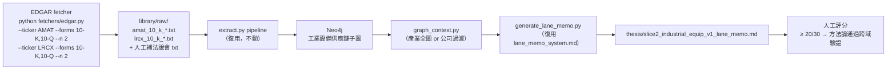

# feat: 第二條垂直切片 — 工業半導體設備（AMAT/LRCX Mature Node Segment）

> **⚠ 現況校正（2026-07-18）：** 本檔保留為 active（`thesis/preconditions.py` `_check_second_slice()` 硬性依賴其存在，勿刪），但下列細節已過時，**以當前 gate 為準**：
> - **輸出檔名** 不可用 KTD3／U3 的 `slice2_industrial_equip_*`——gate 只認檔名含 `amat`／`lrcx`／`semi_equip`／`mature_node` 的 `*_lane_memo.md`。建議 `thesis/amat_lrcx_mature_node_v1_lane_memo.md`。
> - **達標需三件**：非空 `## Variant Perception` 段落 + 同 stem 的 `*_scoring.md`（可信度／可證偽性／市場差異度／總分 ≥3／≥3／≥2／≥20）。
> - EDGAR fetcher 10-Q 已驗證可用（`--forms 10-Q --n 1`）。當前 gate 與 roadmap 定位見 `AGENTS.md` 開發優先序第 1 項。

**Scope:** 用與 CPO 切片相同的 extract → graph → thesis 流程，對工業半導體設備（Applied Materials / Lam Research 的非 AI、成熟製程 segment）跑一次完整的垂直切片，驗證方法論在沒有 AI capex 多頭的環境下是否仍能找出有意義的瓶頸與 variant perception。完成後 `thesis/preconditions.py` 的 `_check_second_slice()` 回傳 True，L9 前置條件 #1 達標。

---

## Summary

CPO/矽光子是第一條切片，但它在 AI capex 大多頭環境下開發，且借自 chokepoint-atlas 的視角本身偏向「小市值瓶頸獵手」。方法論需要一個 regime 對照：非 AI、有獨立需求驅動、有充足 Tier 1 文件的供應鏈主題。

選定域：**工業半導體設備的成熟製程 Capex 週期**
- Applied Materials (AMAT) + Lam Research (LRCX) 的 mature node / foundry segment
- 需求驅動：汽車電子、IoT、工業控制 → 28nm/40nm 成熟製程產能需求（與 AI capex 相關性低）
- 供應鏈結構：設備 → 晶圓廠（TSMC/Samsung/GlobalFoundries）→ 終端客戶
- 文件：EDGAR 10-K（AMAT/LRCX）+ 法說會

---

## Problem Frame

若不做第二切片，有兩個根本問題無法排除：
1. **方法論可能只描述「AI 多頭」** 而非「alpha」；等下一個 regime 才知道。
2. **L9 前置條件 #1 未達標**，系統不能輸出「投資建議」標籤，只能輸出「研究備忘」。

成功判準：第二切片的 Lane Memo 用 `thesis/scoring_rubric.md` 評分 ≥ 20/30，且 Variant Perception 段落有具體非共識主張。

---

## Key Technical Decisions

**KTD1 — 選 AMAT/LRCX mature segment，不選整體公司**

AMAT/LRCX 的 AI 相關收入（High Bandwidth Memory、先進邏輯設備）與成熟製程設備是同一家公司，但可以在 10-K 的 segment 報告和法說會中找到分拆的細節。Thesis 要針對成熟製程 capex 週期，不是 AI DRAM。

**KTD2 — 文件選源策略（Tier 1 優先，3+ origin_entity）**

| 來源 | Form | origin_entity |
|---|---|---|
| AMAT 最近 10-K（Products & Service 章節）| 10-K | amat |
| LRCX 最近 10-K（業務描述章節）| 10-K | lrcx |
| AMAT 最近 2 季法說會（成熟製程提及段落）| Transcript | amat |
| LRCX 最近 1 季法說會 | Transcript | lrcx |
| TSMC 或 GlobalFoundries 法說會（客戶端確認設備需求）| Transcript | tsmc / gfs |

至少 3 個不同 origin_entity，確保來源獨立性（CLAUDE.md L8）。

**KTD3 — 完成後觸發 _check_second_slice()**

`thesis/preconditions.py` 的 `_check_second_slice()` 搜尋 `thesis/` 目錄下是否存在非 CPO 的 Lane Memo 檔案（`slice2_*_lane_memo.md`）。本計畫執行完後，該檔案應存在。

---

## Scope Boundaries

### In scope
- 文件選源（5-8 篇 Tier 1/2，至少 3 個 origin_entity）
- extract → validate → load（復用現有 pipeline）
- `query/graph_context.py` company_id=None（產業全圖模式，無需改動）
- `thesis/generate_lane_memo.py --topic industrial_semicon_equipment`（或直接跑現有腳本）
- 輸出：`thesis/slice2_industrial_equip_v1_lane_memo.md`
- 人工評分（用 `thesis/scoring_rubric.md`）

### Deferred to Follow-Up Work
- 成熟製程設備與 CPO 的跨切片比較分析
- 第三條切片（若第二切片通過，再考慮擴展）

### Outside this plan's scope
- Engine B/C 的整合（第二切片只跑 Engine A）
- 針對 AMAT/LRCX 的 Watchlist 升格（需先完成 Engine C）

---

## High-Level Technical Design



---

## Implementation Units

### U1. 文件準備與 EDGAR Fetch

**Goal:** 用 EDGAR fetcher 下載 AMAT/LRCX 的 10-K + 10-Q，補充至少一份客戶端法說會（TSMC 或 GlobalFoundries）。

**Dependencies:** 本計畫 parent plan 的 U4（EDGAR fetcher 已建）

**Files:**
- `library/raw/amat_10_k_*.txt` × 1
- `library/raw/amat_10_q_*.txt` × 1
- `library/raw/lrcx_10_k_*.txt` × 1
- `library/raw/lrcx_10_q_*.txt` × 1
- `library/raw/tsmc_transcript_*.txt` × 1（人工準備）

**Approach:**
```powershell
python fetchers/edgar.py --ticker AMAT --forms 10-K,10-Q --n 2
python fetchers/edgar.py --ticker LRCX --forms 10-K,10-Q --n 2
# TSMC 法說會人工準備（IR 網站下載）
```

**Test scenarios:**
- 5 份文件均存在 `library/raw/` 且 meta.json 有 `ticker` 和 `evidence_tier`
- 至少 3 個不同 `origin_entity`

---

### U2. Extract → Validate → Load

**Goal:** 把工業設備文件跑完 pipeline，入 Neo4j 圖。

**Dependencies:** U1（文件已備齊）

**Files:**
- `extractions/amat_10_k_*.json`
- `extractions/lrcx_10_k_*.json`
- `extractions/tsmc_*.json`（等）

**Approach:** 每份文件按現有流程執行：
```powershell
python extract.py --input library/raw/<doc>.txt --source-type filing --evidence-tier 1 --title "<>" --out extractions/<doc>.json
python loader/validate.py extractions/<doc>.json
python loader/load_to_neo4j.py extractions/<doc>.json --apoc
```

**Test scenarios:**
- 每份 validate.py 返回 OK
- Neo4j 有 `co:amat`、`co:lrcx` 等 Company 節點
- 圖跨越至少 3 個 abstraction_level（end_demand / module_subsystem / equipment_epitaxy）

---

### U3. Thesis 生成 + 人工評分

**Goal:** 生成第二切片的 Lane Memo，人工評分 ≥ 20/30 視為方法論通過。

**Dependencies:** U2

**Files:**
- `thesis/slice2_industrial_equip_v1_lane_memo.md`（生成）
- `thesis/slice2_scoring.md`（評分記錄）

**Approach:**
```powershell
python thesis/generate_lane_memo.py --out thesis/slice2_industrial_equip_v1_lane_memo.md
```
若 graph_context 返回的仍是 CPO 數據（因圖中 CPO 節點佔多數），改用 company_id 過濾：
```powershell
python thesis/generate_lane_memo.py --company-id co:amat --out thesis/slice2_industrial_equip_v1_lane_memo.md
```

**Test scenarios:**
- 評分 ≥ 20/30（可信度 ≥ 3 且可證偽性 ≥ 3 且市場差異度 ≥ 2）
- Variant Perception 段落有具體的「市場信 X vs thesis 信 Y」
- `thesis/preconditions.py` 的 `_check_second_slice()` 在 Lane Memo 存在後回傳 True

**Verification:** 兩份 Lane Memo 並排比較（CPO vs 工業設備），方法論輸出品質在非 AI 領域無斷崖式下降。

---

## Open Questions

| # | 問題 | 狀態 |
|---|---|---|
| OQ1 | AMAT/LRCX 的 10-K 有多長？是否需要 chunker？ | 待 U1 下載後確認（通常 150+ 頁，可能需要抽 Products/MD&A section） |
| OQ2 | TSMC 法說會是否提及成熟製程設備需求（區分先進製程）？ | 待 U1 後人工確認選源 |

---

## 時程建議

本計畫在 parent plan（004）的 Milestone C/D/E 完成後啟動：
- **Milestone C/D 完成**（Engine C Bootstrap + EDGAR fetcher）→ U1 可自動化
- **預估 U1-U3 總時間**：1-2 個 session（主要瓶頸是文件選源品質判斷）
- **L9 前置條件 #1 達標**：U3 評分通過後

---

## Sources & Research

- `docs/plans/2026-07-08-004-feat-investment-query-gap-audit-plan.md` — parent plan，U9 定義本計畫
- `CLAUDE.md` — L9 前置條件、B7 Regime 依賴盲點、L8 來源獨立性
- `thesis/scoring_rubric.md` — 評分標準（6 個維度 × 5 分 = 30 分）
