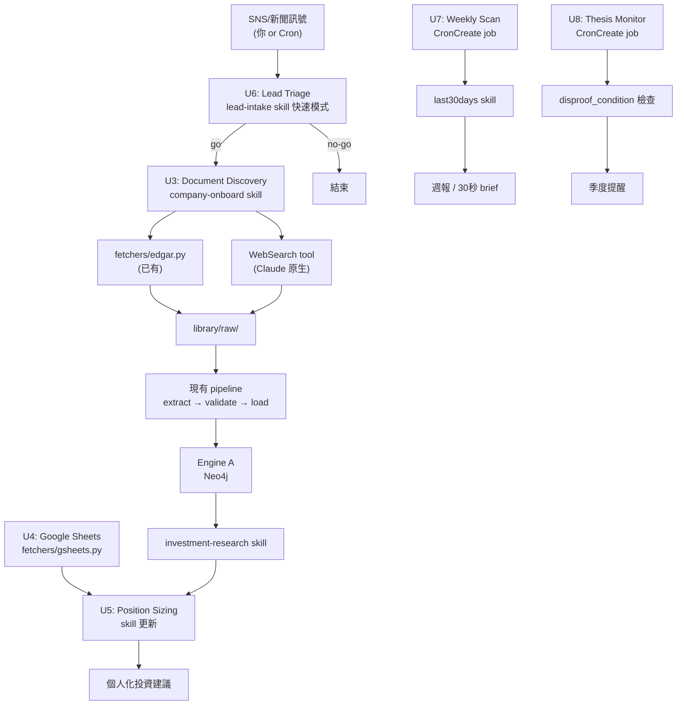

# feat: StockBotv2 Personal Investment Advisor — Full Roadmap

**Scope:** 將 StockBotv2 從「批次研究工具」升級為「個人 AI 主題投資顧問」——能自動取得可信文件、強制來源品質門檻、整合個人資產組合、主動推送訊號、並在 L9 前置條件滿足後開放個人化投資建議。

---

## Summary

目前系統的根本問題：研究品質被來源品質卡住（L8 自我報告偏誤），且每一步都需要人工。解法不是換架構，而是在現有三層架構上加四個能力：**品質閘道**（拒絕偏誤資料）、**自動取件**（省去搜尋剪貼）、**資產組合層**（個人化建議）、**注意力機制**（不要求用戶定時回來）。

本計畫取代 Plan 004 的里程碑框架，成為唯一的工作起點。Plan 005（第二垂直切片）保持 active，作為 M2 內容里程碑的執行指南。

---

## Problem Frame

**現在問 "SIVE 值得投資嗎" 的失敗路徑：**
1. 圖裡只有 SIVE 自家 2025 overview，答案必然正面（L8 偏誤）
2. 沒有個人資產 context，建議沒有「你能買多少」的維度
3. 如果你忙著做別的事，沒有人提醒你市場有了新動態

**成功後的路徑：**
- 系統發現 SIVE 相關新訊號 → 主動推送 30 秒 brief
- 你說「研究 SIVE」→ 系統自動找文件、你確認後自動入庫
- Lane Memo 需要 ≥3 個不同 origin_entity 才能生成，系統拒絕偏誤
- 你問「要買多少」→ 系統從 Google Sheets 知道你的 bucket 大小，給出有根據的建議

---

## Requirements

來源：`docs/brainstorms/2026-07-10-investment-advisor-repositioning-requirements.md`

- **R1** 一家公司的分析必須有 ≥3 個不同 `origin_entity` 才能生成 Lane Memo
- **R2** 文件發現 + 入庫 pipeline 的人工步驟只剩「確認來源獨立性」
- **R3** 系統知道用戶的高風險 bucket 大小和當前持倉（來自 Google Sheets）
- **R4** 投資建議包含針對 bucket 的 position sizing 建議
- **R5** SNS/新聞訊號在 ≤3 個 conversation turn 內完成 go/no-go 評估
- **R6** 每週自動掃描活躍主題，輸出可在 5 分鐘內讀完的週報
- **R7** 高訊號事件觸發 30 秒 brief，用戶一句話決定是否繼續
- **R8** 每季自動提醒 thesis 核查（disproof_condition 追蹤）
- **R9** 所有新能力在 L9 preconditions 未通過前，投資建議標籤維持 [Research Note]

---

## High-Level Technical Design

### 新增數據流



### 品質閘道位置

```
extract.py → validate.py → [U1: origin_entity 多樣性檢查] → load_to_neo4j.py
                                        ↓ (失敗)
                            "需要更多獨立來源才能繼續"

thesis/generate_lane_memo.py → [U1: Lane Memo 硬阻擋]
                                        ↓ (未達標)
                            "Company X 目前只有 1 個 origin_entity，需要 ≥3"
```

### 資產層接入點

```
fetchers/gsheets.py (U4)
    ↓ 回傳 dict: {total_assets, high_risk_budget, positions}
investment-research SKILL.md (U5)
    → 注入到 Lane Memo / advice 生成時的 context
```

---

## Scope Boundaries

### In scope
- U1–U8 八個實作單元（見下方）
- M1 CPO Depth Sprint（內容里程碑，非程式碼）
- M2 第二垂直切片（follow Plan 005）

### Deferred to Follow-Up Work
- Engine B SNS API 直接串接（X/Threads API 成本過高）
- 自動判斷來源獨立性（L8 人工確認是設計，不是缺口）
- 跨公司 sector map 報告模板（深度先於廣度）
- Underwrite Sheet（Watchlist 有足夠深度再說）
- 全自動 thesis 更新（人工入庫 + 觸發是設計選擇）

### Outside this product's identity
- 完全自動的投資決策
- 個人 X feed 爬蟲
- 即時股價追蹤 / 技術分析

---

## Key Technical Decisions

**KTD1 — Agentic Document Discovery 以 skill 實現，不另寫 Python script**
Claude 在對話中用現有工具（fetchers/edgar.py via Bash、WebSearch、Write）完成取件 + 入庫。不增加新的 Python 程式碼，降低維護成本。實作為新的 `company-onboard` skill（SKILL.md）。

**KTD2 — Source Quality Gate 分兩層**
(a) `loader/validate.py` 加 origin_entity 多樣性警告（warn，不 hard block，允許繼續入庫）；
(b) `thesis/generate_lane_memo.py` 加硬阻擋（error，不允許生成 Lane Memo）。
原因：入庫不阻擋允許積累資料；出報告阻擋才是真正保護投資建議品質的地方。

**KTD3 — A→C Ticker Patch：在 load 時寫入 + 一次性 migration**
`load_to_neo4j.py` 已有 TICKER_MAP；修法是在 `_build_node_params()` 對 Company node 時，把 `TICKER_MAP.get(node_id)` 加入 `attributes` dict。既有節點跑一次 migration Cypher。

**KTD4 — Google Sheets 以 fetchers/gsheets.py 實現，每 session 快取**
GCP Service Account credentials 存在 `.env`（`GSHEETS_CREDENTIALS_JSON` + `PORTFOLIO_SHEET_ID`）。每次 session 第一次呼叫時取資料、後續 cache dict 在 process 生命週期內，避免 API quota 問題。

**KTD5 — CronCreate jobs 輸出到 memory 檔**
Cron job 跑完的週報 / thesis 提醒寫入 `C:/Users/Cheng/.claude/projects/.../memory/` 目錄，下次開啟 Claude Code 對話時自動帶入。這是 Windows 本機最可靠的「通知」方式，不依賴 daemon 常駐或 push notification 設定。

**KTD6 — 主題清單為 repo 內的純文字檔**
`config/themes.txt`：每行一個主題名稱 + 關鍵字，cron job 讀取並逐主題呼叫 last30days。格式簡單，user 可直接編輯。

---

## Content Milestones（非程式碼，追蹤用）

### M1: CPO Depth Sprint

**目標：** SIVE、Coherent、Lumentum、＋ 2 家客戶端公司（如 Arista、Nvidia）各達到 ≥3 個不同 `origin_entity`，SIVE 的 `gate_override` 移除。

**觸發條件：** U1、U3 完成後執行（品質閘道 + 自動取件都到位）。

**完成標準：** `python loader/validate.py` 在這 5 家公司的 JSON 上不再回報 "sole source L8 weak"；`python thesis/preconditions.py` 的 financial_checklist 可通過（SIVE.ST 資料在 SQLite 中）。

### M2: 第二垂直切片

**目標：** 依 Plan 005 執行 AMAT/LRCX mature node segment 切片，產出 Lane Memo，使 `_check_second_slice()` 回傳 True。

**觸發條件：** M1 完成後（方法論在 CPO 上驗證過再切新主題）。

**完成標準：** `thesis/preconditions.py` 全部通過 → 投資建議標籤升格為 [Investment Note]。

---

## Implementation Units

### U1. Source Quality Gate

**Goal:** 在兩個層次強制執行 ≥3 origin_entity 規則：validate.py 警告層 + generate_lane_memo.py 硬阻擋層。

**Requirements:** R1, R9

**Dependencies:** 無

**Files:**
- `loader/validate.py` — 新增 `_check_origin_diversity()` 函式
- `thesis/generate_lane_memo.py` — 新增 gate check（呼叫 Neo4j 查 origin_entity 數量）

**Approach:**
- `validate.py`：在現有三層驗證後，加第四層：從 JSON 的 `sources[]` 提取所有 `origin_entity`，若 distinct count < 3，append WARN（不是 error，允許入庫）
- `generate_lane_memo.py`：生成前呼叫 `query/graph_context.py` 取得 company 的 sources，若 distinct origin_entity < 3，raise `QualityGateError` 並印出缺少的來源類型建議（例：「目前只有供應商自我報告，需要客戶端文件或第三方報告」）
- gate_override 需要：明確的 `--force` flag + 終端警告，不能靜默繞過

**Test scenarios:**
- 3 個不同 origin_entity 的 JSON → validate.py 無 WARN，generate_lane_memo.py 正常執行
- 1 個 origin_entity（如只有 Sivers 自家 IR）→ validate.py 出 WARN，generate_lane_memo.py 拒絕並說明缺少什麼
- 使用 `--force` 繞過 → 輸出 Lane Memo 並在頂部插入 `⚠️ gate_override: L8 偏誤風險` 標記
- 同一 origin_entity 的 3 份文件（如 3 份 Sivers IR）→ 仍視為 1 個 origin_entity，警告

**Verification:** `python loader/validate.py samples/single_source.json` 輸出 WARN；`python thesis/generate_lane_memo.py --company-id co:sivers_semiconductors` 回傳 QualityGateError。

---

### U2. A→C Ticker Patch

**Goal:** 在 Neo4j Company 節點的 `attributes` 中寫入 `ticker`，使 Engine C 能用 graph 資料 join 財務數據。

**Requirements:** R3, R4（財務數據查詢的前提）

**Dependencies:** 無

**Files:**
- `loader/load_to_neo4j.py` — `_build_node_params()` 加 ticker 注入邏輯
- `loader/migrate_add_ticker.py` — 一次性 migration script（新建）

**Approach:**
- `load_to_neo4j.py`：在 `_build_node_params()` 中，如果 `node.type == "Company"` 且 `node.id` 在 TICKER_MAP，把 `{"ticker": TICKER_MAP[node.id]}` merge 進 `attributes` dict 後再序列化為 JSON
- 私人公司（ticker=None）也寫入：`{"ticker": null}`，明確標記「已知無 ticker」
- `migrate_add_ticker.py`：執行一次 Cypher `MATCH (n:Company) WHERE n.attributes IS NOT NULL ...` 對每個已存在節點補 ticker 屬性

**Test scenarios:**
- load 一個 Coherent JSON → 之後查 Neo4j：`MATCH (n:Company {id: "co:coherent"}) RETURN n.attributes` 包含 `"ticker": "COHR"`
- load 一個 Anthropic JSON → attributes 包含 `"ticker": null`
- `migrate_add_ticker.py --dry-run` → 印出 plan 但不執行
- Engine C smoke test：`python engine_c/checklist.py COHR` 在 patch 後仍正常執行

**Verification:** `python loader/migrate_add_ticker.py` 執行無 error；之後 `python engine_c/checklist.py COHR` 回傳有值的結果。

---

### U3. Company Onboarding Skill

**Goal:** 新的 skill SKILL.md，定義 Claude 執行 "研究這家公司" 的完整工作流——自動搜尋文件、格式化、呈現 shortlist、用戶確認後自動跑 pipeline。

**Requirements:** R2

**Dependencies:** U1（需要品質閘道到位，onboarding 才有意義）

**Files:**
- `skills/company-onboard/SKILL.md` — 新建

**Approach:**

Skill 定義以下操作流程（Claude 在對話中執行，不需要另一個 Python script）：

1. **Discover**：接收公司名稱 → 呼叫 `fetchers/edgar.py --company <NAME>` 取 SEC filings + 用 WebSearch 找近期新聞/分析報告/學術論文（各不超過 3 份）
2. **Curate**：把找到的文件列成 shortlist，每份標明：標題、來源類型（自家 IR / 客戶端 / 第三方 / 學術）、origin_entity、抓到的關鍵 quotes
3. **Gate check**：在 shortlist 上標記「這批文件的 origin_entity 多樣性是否達到 ≥3？」若否，提示缺少什麼
4. **User confirm**：「以上 N 份文件，要全部入庫嗎？」（逐份可排除）
5. **Ingest**：對每份確認的文件，用 Write tool 寫入 `library/raw/`，然後 Bash 跑 `extract.py → validate.py → load_to_neo4j.py`
6. **Summary**：「已載入 X 份文件，新增 Y 個節點，Z 條 edge。當前 origin_entity 數量：N。」

觸發詞：「研究 X 公司」、「onboard X」、「把 X 加進知識庫」、「找 X 的文件」。

法說會逐字稿不在 EDGAR 內，需要走 WebSearch 找 Seeking Alpha / 公司 IR 網站；SKILL.md 需明確說明此差異並優先搜尋客戶端文件（比供應商 IR 更高價值）。

**Test scenarios:**
- "研究 SIVE" → skill 找到 SEC 文件（SIVE 是瑞典股，EDGAR 無資料）+ WebSearch 結果，shortlist 至少 3 份
- SIVE shortlist 全部是 Sivers 自家文件 → gate check 標出「未達 ≥3 origin_entity」並建議找客戶文件
- 用戶排除某份文件後確認 → 只有被確認的文件被寫入 library/raw/
- pipeline 跑完 → `python query/graph_context.py --company-id co:sivers_semiconductors` 回傳非空結果

**Verification:** 跑完 onboarding 後 Neo4j Browser 能查到新節點；`loader/validate.py` 對產出 JSON 無 schema error。

---

### U4. Google Sheets Portfolio Connector

**Goal:** 新的 fetcher 從 Google Sheets 取用戶的資產分布，供 position sizing 使用。

**Requirements:** R3

**Dependencies:** U2（ticker 需要在圖裡才能做 position join）

**Files:**
- `fetchers/gsheets.py` — 新建
- `.env.example` — 新增 `GSHEETS_CREDENTIALS_JSON` 和 `PORTFOLIO_SHEET_ID` 兩個 key

**Approach:**
- 用 Google Sheets API v4（用戶已有 GCP API 經驗）；credentials 走 Service Account JSON 路徑，`GSHEETS_CREDENTIALS_JSON` 環境變數存 JSON 字串或檔案路徑
- 目標：讀一個固定結構的 Sheet（欄位：total_assets, high_risk_budget, positions list），回傳 dict
- 每次 process 生命週期只 call API 一次，cached in module-level `_PORTFOLIO_CACHE`
- 若未設定 env var → graceful fallback，回傳 `{"available": False}` 而非 crash
- `get_portfolio()` 為主要 API；`refresh_portfolio()` 強制清快取重取

**Test scenarios:**
- env var 設定 + valid sheet → 回傳包含 `total_assets`, `high_risk_budget`, `positions` 的 dict
- env var 未設定 → 回傳 `{"available": False, "reason": "GSHEETS_CREDENTIALS_JSON not set"}`
- sheet 格式不符（欄位缺失）→ 回傳 `{"available": False, "reason": "missing column: high_risk_budget"}`
- 第二次呼叫 → 使用快取，不再 call API（可從 log 確認）

**Verification:** `python fetchers/gsheets.py` 直接執行時印出 portfolio dict；`.env.example` 有明確說明格式。

---

### U5. Personalized Advice Mode

**Goal:** 更新 investment-research skill，當 Google Sheets 資料可用時，自動在 Lane Memo 和 advice 回答中加入 position sizing 建議。

**Requirements:** R3, R4, R9

**Dependencies:** U4（需要 portfolio data）、U1（需要品質閘道）

**Files:**
- `skills/investment-research/SKILL.md` — 更新

**Approach:**

在 SKILL.md 的「生成 Lane Memo / 投資建議」段落新增：

1. **Portfolio context injection**：生成建議前，在 SKILL.md 中明確指示 Claude 呼叫 `python fetchers/gsheets.py`；若 `available=True` 則把 `high_risk_budget` 和 `positions` 注入到 prompt context
2. **Position sizing 框架**（寫在 SKILL.md 中，Claude 直接執行）：
   - thesis conviction level（1-5，基於 Lane Memo 評分）
   - bucket 使用率（現有持倉 / high_risk_budget）
   - 建議比例：conviction 5 + 低使用率 → 可至 bucket 的 15%；conviction 3 → ≤8%；conviction <3 → 不建議建倉
3. **L9 Gate 整合**：在 SKILL.md 中明確：`python thesis/preconditions.py` 不通過時，position sizing 建議改為「目前無法給建議，L9 前置條件未達標」
4. **Entry framing**：不是「現在買」，而是「當 X 發生時建倉是合理的」（符合長持 + thesis-based 風格）

**Test scenarios:**
- 問 "SIVE 買多少" + L9 未通過 → 回答包含 L9 未通過說明，無 sizing 數字
- 問 "SIVE 買多少" + L9 通過 + gsheets available + SIVE Lane Memo 存在 → 回答包含 bucket 百分比建議和進場條件
- 問 "SIVE 買多少" + gsheets unavailable → 回答包含 "Google Sheets 未設定，無法個人化建議" + 請用戶設定
- 問 "SIVE 買多少" + quality gate 未過（SIVE 仍 gate_override）→ 回答包含品質風險警告

**Verification:** 問 "SIVE 值得投資嗎？我該買多少？" 時，回答結構包含：thesis 評估 + L9 狀態 +（若可用）portfolio-aware sizing 建議。

---

### U6. Lead Triage Fast Path

**Goal:** 更新 lead-intake skill，在現有完整驗證流程前加一個 ≤3 turn 的快速 go/no-go 層。

**Requirements:** R5

**Dependencies:** 無

**Files:**
- `skills/lead-intake/SKILL.md` — 更新（在現有 SOP 前加 Fast Path 段落）

**Approach:**

在 SKILL.md 最前面加「Fast Path」段落（完整 SOP 不變，只是加前置快速層）：

**Fast Path 觸發條件：** 用戶貼的是 1-3 句話 / 一則標題 / 一條推文，而非完整文件。

**Fast Path 三步驟（≤3 turns）：**
1. **分類**（Turn 1）：訊號類型（產品新聞 / 供應鏈 / 財報 / 市場情緒 / 不相關）+ 與現有圖的關聯（哪些已有節點受影響？）
2. **評估**（Turn 1 或 2）：go / no-go / need-more-info。Go = 建議開完整研究；No-go = 說明為什麼不入庫（tier 4 / 無新資訊 / 與現有 thesis 不矛盾）
3. **行動**（Turn 2 或 3）：Go → 自動呼叫 company-onboard skill（U3）；No-go → 結束；Need-more-info → 一個問題

**特殊情境：** 若訊號可能觸發現有 thesis 的 disproof_condition → 快路徑中明確標出「⚠ 可能觸發 [COMPANY] thesis 的 disproof condition：[條件文字]」，不論 go/no-go 都要說。

**Test scenarios:**
- 貼一則「Nvidia 法說會提到 CPO 量產加速」推文 → Turn 1 分類為「供應鏈 / 產品」，標出 NVDA/COHR 相關節點，Turn 2 給 go 建議
- 貼一則 tier 4 論壇「$SIVE 要爆了」 → Turn 1 標為 tier 4 情緒，Turn 2 給 no-go 且說明原因
- 貼一則客戶法說會提到 "replacing our current laser supplier" → 標出可能觸發 SIVE/Lumentum 的 sole_source disproof condition
- 貼完整 PDF 文件 → 跳過 Fast Path，直接走現有完整 SOP

**Verification:** 貼一則 CPO 相關推文後，3 個 turn 內得到分類 + go/no-go + 行動建議。

---

### U7. Weekly Scan Cron

**Goal:** 每週自動掃描活躍主題，產出週報（5 分鐘可讀）+ 高訊號事件觸發 30 秒 brief。

**Requirements:** R6, R7

**Dependencies:** 無（獨立 cron job，需要 last30days skill 可用）

**Files:**
- `config/themes.txt` — 新建（活躍主題清單）
- `crons/weekly_scan_prompt.md` — 新建（CronCreate job 的 prompt 模板）

**Approach:**

`config/themes.txt` 格式：
```
# StockBotv2 Active Themes — 每行一個主題，空行或 # 開頭為 comment
CPO silicon photonics external laser: SIVE, Coherent, Lumentum, Nvidia
# AMAT LRCX mature node: AMAT, LRCX (inactive until M2)
```

`crons/weekly_scan_prompt.md`：定義 CronCreate job 執行的 Claude session 行為：
- 讀取 `config/themes.txt` 中的 active 主題
- 對每個主題呼叫 `/last30days` skill（或等效搜尋）
- 合成週報：各主題的新訊號 + 與現有 thesis 的關聯 + 本週值得深挖的 1-2 件事
- 週報寫入 `C:/Users/Cheng/.claude/projects/.../memory/weekly_scan_YYYY-MM-DD.md`（KTD5）
- 若發現高訊號事件（法說會相關、disproof 觸發跡象）→ 另寫 30 秒 brief 到同一目錄

CronCreate job：每週五台灣時間下午 6 點觸發（週末有空讀）；prompt 指向 `crons/weekly_scan_prompt.md`。

**Test scenarios:**
- 手動執行 weekly scan prompt → 產出結構化週報到 memory 目錄
- themes.txt 有 comment 行 → 被正確忽略，不搜尋
- 發現 CPO 相關高訊號新聞（Nvidia 法說會） → 週報內有 brief 標記 + 30 秒摘要
- 週報寫入後，下次開 Claude Code 對話 → memory 系統自動帶入「本週有新週報」提示

**Verification:** 跑一次 prompt 後 memory 目錄出現 `weekly_scan_*.md`；格式包含主題 section + actionable items。

---

### U8. Thesis Lifecycle Monitor

**Goal:** 每季自動提醒 thesis 核查，格式為「thesis 已 N 個月，disproof condition 是 X，Y 有觸發跡象嗎？」

**Requirements:** R8

**Dependencies:** 無

**Files:**
- `crons/thesis_monitor_prompt.md` — 新建（CronCreate job prompt）

**Approach:**

CronCreate job：每 13 週觸發一次（季度）。

Prompt 行為：
- 讀取 `thesis/` 目錄中所有 `*_lane_memo.md`
- 對每份 memo 提取：thesis 建立日期、disproof_condition 文字、thesis status（active/watch/retired）
- 對 active theses：搜尋 disproof condition 相關的近期新聞（用 WebSearch）
- 輸出提醒到 memory 目錄：「SIVE thesis 已 6 個月。Disproof condition：[X]。搜尋結果：無明顯觸發跡象。建議：維持 active，下次核查 2026-10。」
- 若有觸發跡象 → 標記 `[⚠ REVIEW REQUIRED]`，優先呈現

**Test scenarios:**
- 手動執行 prompt → 讀到 cpo_v1_lane_memo.md 和 sivers_v1_lane_memo.md，輸出各自的核查摘要
- thesis 日期超過 3 個月 → 輸出中包含「距建立 X 個月」
- disproof condition 相關新聞找到 → 標記 [⚠ REVIEW REQUIRED]
- thesis 標記為 `retired` → 在核查中跳過

**Verification:** 手動執行後 memory 目錄有 `thesis_review_YYYY-MM-DD.md`；對 active thesis 各有一段核查摘要。

---

## Risks & Dependencies

| 風險 | 可能性 | 緩解 |
|------|--------|------|
| GCP API 認證重新設定複雜 | 中 | 用戶有先例，`.env.example` 提供明確步驟；gsheets.py 有 graceful fallback |
| CronCreate 在 Windows 本機需要 Claude Code daemon 常駐 | 高 | KTD5：cron 輸出到 memory 檔，就算 cron 沒跑，下次對話手動觸發也能補 |
| last30days skill 的 3 個來源不涵蓋足夠的 CPO 訊號 | 中 | Weekly scan prompt 設計為「結果少時出 sparse week 提示」，不假裝有訊號 |
| SIVE 是瑞典股，yfinance SIVE.ST 資料可能不完整 | 中 | checklist.py 的 `manual_required` status 已處理此情況；不 crash，標 manual |
| 法說會逐字稿抓取：非 EDGAR，依賴 WebSearch 品質 | 中 | company-onboard skill 明確說明此限制，優先推薦用戶直接提供 IR 頁面 URL |

---

## Open Questions

- **CronCreate 設定細節**：Windows 本機的 CronCreate daemon 設定步驟需要在第一次跑 U7/U8 時釐清，不是 planning-time 問題。
- **Google Sheets 結構**：`fetchers/gsheets.py` 假設特定欄位名稱；實際 sheet 結構在 U4 實作時與用戶對齊。
- **themes.txt 的初始內容**：U7 完成時由用戶填入第一批主題關鍵字。

---

## Implementation Sequence（建議執行順序）

1. **U1 + U2**（無相依，可同 session 完成）— 修好資料品質閘道和 ticker
2. **U3**（依賴 U1）— Onboarding skill 到位後做 M1 CPO Depth Sprint
3. **M1 CPO Depth Sprint**（內容任務）— U3 到位後執行，讓 CPO 主題達到可信標準
4. **U4 + U5**（U4 先，U5 依賴 U4）— 個人化建議層
5. **U6 + U7 + U8**（可平行）— 注意力層
6. **M2 Second Vertical Slice**（follow Plan 005）— M1 完成後
7. **L9 Gate 自動通過** — M2 完成 + investment-sop.md + Engine C 可用 → `preconditions.py` 全通過

---

## Sources & Research

- `docs/brainstorms/2026-07-10-investment-advisor-repositioning-requirements.md` — 本計畫 origin
- `docs/plans/2026-07-08-005-feat-second-vertical-slice-plan.md` — M2 執行指南（仍 active）
- `thesis/preconditions.py` — L9 gate 現有實作
- `loader/load_to_neo4j.py` — TICKER_MAP 確認存在，gap D6 分析
- `engine_c/checklist.py` — 財務清單現有實作確認
