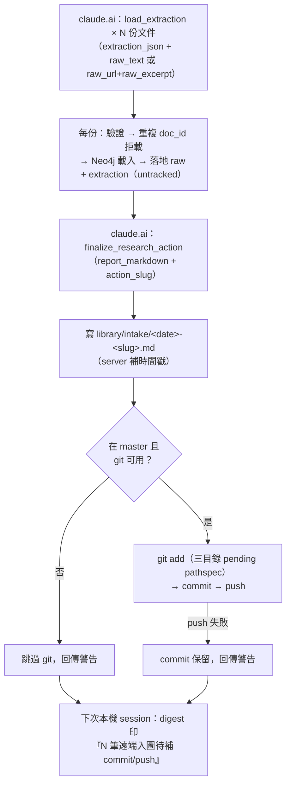

# feat: 遠端入圖 provenance 紀錄——研究行動落地、自動 commit/push、digest 安全網

> **⚠ 已由 008 統一工作計畫完整取代（2026-07-15）**；本檔只保留需求演進與歷史脈絡，不再是實作規格或必要附件。所有現行介面、安全修正與測試矩陣均以 008 的 U11–U15 為唯一權威。

## Summary

擴充 Graph MCP Gateway：`load_extraction` 增收原文（超限降級 URL + 節錄、重複 doc_id 拒載），新增 `finalize_research_action` 工具在研究行動收尾時落地入圖報告並做一個 git commit + push；`crons/weekly_scan_digest.py` 增加待補提交檢查當安全網。

---

## Problem Frame

遠端入圖目前只落地 extraction JSON（見 origin：docs/brainstorms/2026-07-13-remote-intake-provenance-requirements.md）。原文遺失、入圖理由只存在於當下的 claude.ai 對話、檔案停在 working tree 導致時間點失真。本 plan 實作 brainstorm 定案的「紀錄不是把關」方案：L8 確認仍在對話內，git 是事後帳本。

---

## Requirements

沿用 origin 的 R-ID，實作以下列為準：

**落地內容**

- R1. 每次遠端入圖以研究行動為單位落地：一份報告 + 每份文件的原文與 extraction JSON，全部進 repo。
- R2. 原文只收純文字且有大小上限；超限或非文字來源改存 URL + 關鍵段落節錄。
- R3. 報告由 claude.ai 在入圖當下透過 MCP 傳入，不可事後補寫。
- R7. 已存在的 `doc_id` 再次載入時拒載，不靜默覆蓋。

**Git 帳本**

- R4. 每次研究行動一個 commit，只加入該行動落地的檔案（精確 pathspec），message 取報告的動機句。
- R5. Commit 成功後 push；push 失敗不阻擋、不影響入圖結果。
- R6. Commit 或 push 失敗時檔案原地保留、回傳明確警告，session digest 列出待補筆數。

**報告內容**

- R8. 報告至少含：入圖時間戳（server 端寫入）、為何此時入圖、涵蓋文件清單（doc_id + 來源 URL）、搜尋過程摘要、L8 確認備註。

---

## Key Technical Decisions

- **兩段式 MCP 介面，不做巨型原子工具**：`load_extraction` 擴充三個選填參數（`raw_text` / `raw_url` / `raw_excerpt`）逐份收文件；新工具 `finalize_research_action(report_markdown, action_slug)` 收尾。單次呼叫 payload 有界，現行逐份載入流程不變。（synthesis 已確認）
- **「待收尾」以 git 狀態定義，server 不留記憶體狀態**：finalize 收集的對象是 `library/raw/`、`extractions/`、`library/intake/` 三目錄下所有 untracked/modified 檔案。單人使用下「這三個目錄裡未 commit 的東西」恆等於待收尾的入圖；server 重啟不掉狀態。
- **重複 `doc_id` 拒載並要求改名**，不做自動版本後綴——帳本不說謊優先於便利。（synthesis 已確認）
- **分支防護：只在 master 上才自動 commit**；checkout 在其他分支（如審 weekly-scan PR 時）就降級走 digest 路徑，避免 intake commit 汙染 PR 分支。（synthesis 已確認）
- **原文上限 200,000 chars，server 端強制**：超限拒收 `raw_text` 並回訊指示改用 `raw_url` + `raw_excerpt`。參考 `fetchers/edgar.py` 的 `--max-chars` 截斷先例（其預設 50k 是抓取端預算；入庫端收的是已篩選過的文本，上限放寬）。
- **git 操作全部 subprocess + timeout + 優雅失敗**，風格對齊 `crons/weekly_scan_digest.py`（失敗回警告、絕不炸穿工具回應）。add 一律精確 pathspec，禁 `git add -A`。
- **報告檔路徑 `library/intake/YYYY-MM-DD-<action_slug>.md`**；同名時加 `-2`、`-3` 後綴。時間戳由 server 寫入（claude.ai 不可靠報時）。
- **測試基建**：repo 目前沒有測試；本 plan 建立 `tests/` + pytest（dev 依賴），git 邏輯用 tmp 目錄裡 `git init` 的臨時 repo 驗證。MCP 端到端走手動 smoke（claude.ai 實呼叫）。

---

## High-Level Technical Design

流程對應 origin 的 F1（正常入圖）與 F2（git 降級）。

---

### U1. intake 模組：落地與 git 帳本核心邏輯

- **Goal:** 一個不依賴 MCP/Neo4j 的純邏輯模組，承載原文落地、上限與重複防呆、pending 探測、commit/push。
- **Requirements:** R2, R4, R5, R7（部分）, R8 的檔案寫入面
- **Dependencies:** 無
- **Files:** `mcp_server/intake.py`（新）、`tests/test_intake.py`（新）、`requirements.txt` 或等效處加 pytest dev 依賴
- **Approach:** 提供函式：`save_raw(doc_id, raw_text, raw_url, raw_excerpt)`（含 200k 上限與 url-only 必附節錄的檢查）、`extraction_exists(doc_id)`、`pending_intake_files()`（三目錄 untracked/modified 清單）、`write_report(slug, report_markdown)`（補時間戳、同名後綴）、`commit_and_push(paths, message)`（分支防護、pathspec add、push 非致命）。git 皆走 subprocess、timeout、失敗回結構化結果不丟例外。
- **Patterns to follow:** `crons/weekly_scan_digest.py` 的 subprocess 優雅失敗寫法；`fetchers/edgar.py` 的截斷警告訊息風格。
- **Test scenarios:**
  - happy path：`save_raw` 純文字 → `library/raw/{doc_id}.txt` 落地
  - Covers AE1：`raw_text` 超過 200k chars → 拒收並指示改用 URL + 節錄；改傳 `raw_url` + `raw_excerpt` → 落地含 URL 與節錄的檔案
  - 邊界：只給 `raw_url` 不給 `raw_excerpt` → 拒收（節錄必附）
  - Covers AE3：`extraction_exists` 對已存在 doc_id 回 True（拒載據此觸發）
  - `pending_intake_files` 在 tmp git repo 中正確列出三目錄新檔、忽略目錄外檔案
  - commit happy path：tmp repo 於 master → 一個 commit 只含指定 pathspec
  - 分支防護：checkout 非 master 分支 → 不 commit、回「已跳過」結果
  - Covers AE2：無 remote 的 tmp repo push 失敗 → commit 保留、回傳 push 失敗但整體不拋錯
  - 報告同名：同日同 slug 寫兩次 → 第二份自動 `-2` 後綴
- **Verification:** pytest 全綠；tmp repo 的 `git log` 人工抽查一筆 commit 內容只含 intake 檔案。

### U2. `load_extraction` 擴充：收原文、拒載重複

- **Goal:** 遠端載入時原文與 extraction 一起落地，重複 doc_id 在寫圖前被擋下。
- **Requirements:** R1（文件面）, R2, R7
- **Dependencies:** U1
- **Files:** `mcp_server/graph_mcp.py`、`tests/test_intake.py`
- **Approach:** 增加選填參數 `raw_text` / `raw_url` / `raw_excerpt`。順序：解析 JSON → 取 doc_id → `extraction_exists` 重複即拒載（訊息指示改名或先在本機處理）→ schema 驗證 → 載圖 → 落地 extraction + raw。raw 落地失敗與現行 extractions/ 落地失敗同款處理：警告不阻擋。docstring 更新為「一份文件一呼叫，行動結束必呼叫 finalize_research_action」。
- **Patterns to follow:** 現行 `load_extraction` 的拒載訊息風格（graph_mcp.py:139-199）。
- **Test scenarios:**
  - Covers AE3：doc_id 已存在 → 回傳拒載訊息、不觸碰 Neo4j（以 monkeypatch 斷言 driver 未被建立）
  - 不帶任何 raw 參數 → 行為與現行完全相同（回溯相容）
  - 帶 `raw_text` → 圖載入後 `library/raw/` 出現對應檔案
- **Verification:** pytest 綠 + 手動 smoke：從 claude.ai 載一份帶原文的測試 extraction，確認兩個檔案落地、重複載入被拒。

### U3. 新工具 `finalize_research_action`：報告落地 + commit + push

- **Goal:** 研究行動收尾的單一入口：收報告、集 pending、一個 commit、push，回傳含 git 結果的摘要。
- **Requirements:** R1（行動面）, R3, R4, R5, R6（回傳警告面）, R8
- **Dependencies:** U1, U2
- **Files:** `mcp_server/graph_mcp.py`、`tests/test_intake.py`
- **Approach:** 參數 `report_markdown`、`action_slug`、`commit_headline`（報告動機句，作 commit message 首行）。流程：`write_report` → `pending_intake_files` → 空清單則回「無待收尾文件」→ `commit_and_push` → 摘要列出：報告路徑、本次 commit 涵蓋檔案數、git 三態（committed+pushed / committed 未 push / 未 commit 原因）。docstring 載明報告骨架五欄（origin R8）。
- **Test scenarios:**
  - happy path：兩份已落地文件 + 報告 → 一個 commit 含 5 個檔案（2 raw + 2 extraction + 1 report）
  - 無 pending 文件時呼叫 → 報告仍落地？——否：回「無待收尾文件」且不寫報告（防空行動汙染 intake 目錄）
  - Covers AE2：push 失敗 → 回傳含「push 未完成」字樣
  - 非 master 分支 → 回傳含「未 commit（分支防護）」字樣、檔案保留
- **Verification:** pytest 綠 + 手動 smoke：claude.ai 完整跑一次「載兩份 → finalize」，GitHub 手機 app 上看得到報告與 commit。

### U4. digest 安全網：待補 commit/push 檢查

- **Goal:** 本機開 session 時，未完成 git 收尾的入圖會被看見。
- **Requirements:** R6
- **Dependencies:** U1（重用 `pending_intake_files`）
- **Files:** `crons/weekly_scan_digest.py`、`tests/test_intake.py`
- **Approach:** digest 增一段純本機檢查（不依賴 gh）：三目錄 untracked/modified 檔案數 + 領先 `origin/master` 的本機 commit 中觸及三目錄者。任一非零印一行 `🗂 N 筆遠端入圖待補 commit/push（開 session 後說「補提交入圖」即可處理）`。沿用安靜原則：全零不輸出；git 不可用優雅跳過。
- **Patterns to follow:** 同檔案內 `_list` / `_backlog_count` 的 try/except + timeout 寫法。
- **Test scenarios:**
  - tmp repo 有 untracked intake 檔 → 計數正確
  - 全部已 commit 且已 push（tmp repo 以本機 bare repo 當 remote）→ 無輸出
  - 有 commit 未 push → 計入待補 push
- **Verification:** pytest 綠 + 手動：留一個未 commit 的檔案開新 session，digest 行出現。

### U5. 遠端協定文件：讓 claude.ai 知道新規則

- **Goal:** 遠端的 claude.ai 讀規則書時即知道 raw 政策、finalize 義務與報告骨架；本機文件同步。
- **Requirements:** R2, R3, R8 的協定面
- **Dependencies:** U2, U3
- **Files:** `prompts/intake_protocol.md`（新）、`mcp_server/graph_mcp.py`（`get_extraction_rules` 附加該檔）、`docs/remote-access-architecture.md`、`CLAUDE.md`（管道層一行帶過 + 指路）
- **Approach:** `intake_protocol.md` 內容：一份文件一次 `load_extraction`（附 raw）、行動結束必呼叫 `finalize_research_action`、raw 超限降級規則、報告骨架（沿用 origin 的 Report Skeleton 草稿）、L8 備註必填。`get_extraction_rules` 回傳串接此檔。remote-access-architecture 的工具清單從四工具更新。
- **Test scenarios:** Test expectation: none——純文件與字串串接，由 U2/U3 的 smoke 一併驗證（規則書內容出現在工具回傳中）。
- **Verification:** 手動 smoke：claude.ai 呼叫 `get_extraction_rules`，回傳含 intake 協定段落。

---

## Scope Boundaries

- 不回補既有 18 份 extraction 的 provenance（origin 定案）。
- 不做 GitHub PR 自動化；Weekly Signal Scan 的 PR 審核管線不動。
- 不建入圖前 staging/審核層——L8 把關留在對話內。

### Deferred to Follow-Up Work

- 報告格式的 refine：骨架先照 origin 草稿上線，實際用過幾次後再修（用戶明言要一起 refine）。
- digest 提醒後的「補提交」自動化腳本化——先靠本機 Claude 對話式處理，量大再固化。

---

## Risks & Dependencies

- **git lock 競態**：本機 session 與 server 同時操作 git。緩解：subprocess timeout + 失敗即降級 digest 路徑（R6 本來就是為此存在），不重試不等待。
- **push 需要憑證**：server 進程的 git 憑證需與使用者日常 push 相同（Windows 憑證管理員）。實作時 smoke 驗證；失敗屬 R5 非致命路徑。
- **finalize 被遺忘**：claude.ai 可能載完文件沒收尾。緩解：`load_extraction` 回傳訊息尾端提醒「記得 finalize」；漏掉由 digest 接住。
- **與平行工作線的檔案交集**：Weekly Signal Scan（另一 plan）也會產出 extraction 草稿；其草稿走 PR 分支不落 master working tree，與 pending 探測不衝突——實作時確認其草稿目錄不在本 plan 的三目錄內。

---

## Open Questions

**Deferred to implementation**

- `commit_headline` 未提供時的 fallback（從 report_markdown 首行擷取，或用 slug）——實作時定。
- pytest 引入方式（requirements-dev.txt vs 現有依賴檔案的實際形狀）——看 repo 現況。
- `pending_intake_files` 對「modified」（非 untracked）檔案是否納入 commit——預期只有 untracked，遇到 modified 屬異常，實作時決定警告或納入。
