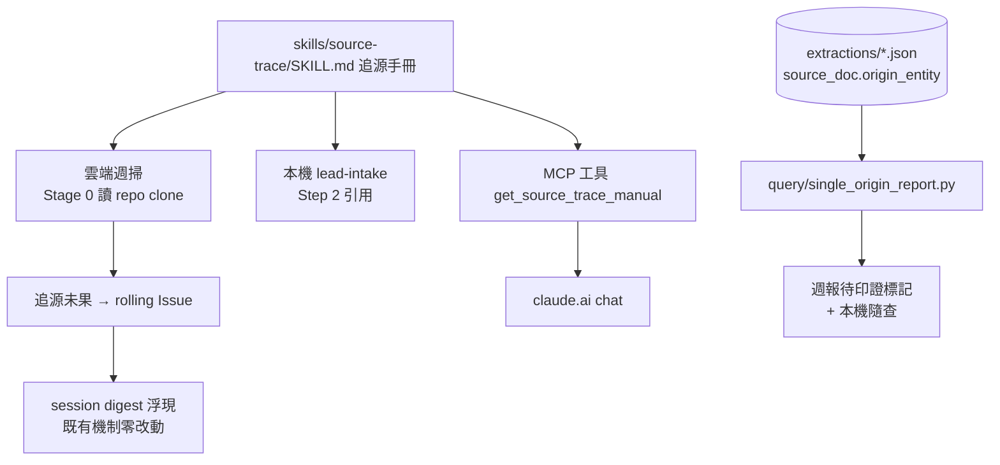

# feat: Source Trace Manual — 三入口共用追源鏈與印證登記

> **⚠ 已由 008 統一工作計畫取代為工作起點（2026-07-15）**；追源相關單元對應 008 的 U4、U6–U10。本檔保留作為規格附件（008 的 U6 細節以此為參考），**請勿移除**。注意：本檔 U2 的「掃 extractions/ 版待印證工具」已被 008 的圖查詢版（U4）取代，不再適用。

## Summary

新增 `skills/source-trace/SKILL.md` 追源手冊作為單一事實來源，週掃 prompt、lead-intake、claude.ai chat（經新 MCP 讀檔工具）三個圖入口共用；新增掃 `extractions/` 的待印證衍生工具；週報加追源未果清單並以 rolling Issue 接回本機 digest。

---

## Problem Frame

圖的可信度建立在主張可追溯到一手來源，但現行追源是「再搜一次 web search」，沒有路由；追源失敗的訊號仍可出草稿，品質防線全押在人工核准。claude.ai chat 已有入圖工具但拿不到規則書。完整動機與決策見 origin：`docs/brainstorms/2026-07-13-source-trace-upgrade-requirements.md`。

---

## Requirements

沿用 origin 的 R-IDs（R1–R10），本 plan 不新增需求。

**追源手冊（新 repo skill）**

- R1. 手冊定義有路由的追源鏈：依市場/領域分路（美股 EDGAR、台股 MOPS、技術/學術 arXiv 等），通用搜尋只當第三層退路。
- R2. 每則通過 triage 的訊號必須執行追源並記錄嘗試路徑；「追不到」必附已嘗試清單。
- R3. 分級處置：tier 1-2 追不到完整原文仍可出草稿（誠實標記）；tier 3+ 追不到不出草稿，轉入追源未果清單。
- R4. `origin_entity` 標記規則沿用現行 R14（追到標原始機構；追不到標「經 X 轉發，未能獨立取得原文」）。

**入口整合**

- R5. `crons/weekly_scan_prompt.md` 追源段落改為引用手冊（Stage 0 讀入，比照 signal-triage）。
- R6. `skills/lead-intake` Step 2 改為引用同一本手冊，不再自帶來源分路清單。
- R7. MCP server 新增讀檔工具把手冊端給 claude.ai chat；內容直接讀 repo 檔案，不複製維護。
- R8. 週報新增「追源未果清單」段落：每項附原始訊號摘要與已嘗試路由。
- R9. 追源未果項目寫入 `weekly-scan` label 的 Issue（checkbox），既有 digest 不需修改。
- R10. 週報標記單一 `origin_entity` 的主張；待印證全量清單即時衍生導出，不落地成檔案。

---

## Key Technical Decisions

- **手冊為單一事實來源，三入口引用不複製。** 組合兩個已驗證模式：repo skill 當共用規則書（`skills/signal-triage` 由週掃 Stage 0 讀入）+ MCP 讀檔端出（`get_extraction_rules` 讀 `prompts/extract_system.md`）。規則只住一個檔案，改一處三入口同步生效。
- **雲端 EDGAR 主路徑 = web search，`fetchers/edgar.py` 僅本機入口。** Pro 方案 routine sandbox 出網白名單不可自訂（U7a 四次實測，見 `docs/solutions/architecture-patterns/mcp-connector-route-past-cloud-sandbox-egress.md`），不賭 sec.gov 可直連。手冊寫成路由優先序而非工具綁定；首次雲跑在稽核段記錄實際可用路徑。
- **待印證清單推導源 = `extractions/*.json`，不是 Neo4j。** `origin_entity` 只存在抽取檔的 `source_doc` 欄位，loader 未寫入圖（SourceDoc 入圖為既有 issue #4，不拉進本案）。沿用 `thesis/generate_lane_memo.py` `_check_source_diversity` 的掃磁碟模式；雲端 routine 有 repo clone 同樣可掃。issue #4 完成後只需替換資料源，清單介面不變。
- **隔離 Issue = 單一 rolling「追源未果 backlog」Issue。** 每週有未果項目時 append checkbox 區塊到既有 open Issue（無則新開，打 `weekly-scan` label）。相比每週一個 Issue：digest 輸出乾淨、不隨週數增生；使用者清空後關閉即可。
- **手冊必須自足。** 遠端起草者（chat）唯一的 context 就是端過去的規則書（遠端入圖硬化清單的核心教訓）；手冊內含遠端 intake 所需的 SOP 摘要與所有格式規則，MCP 工具只端這一份檔案，不要求 chat 另讀其他本機資源。

---

## High-Level Technical Design

單一手冊扇出到三個入口，待印證清單由 extractions 衍生：

分級處置流程（tier 判定 → 出草稿/隔離）已定義於 origin 的 Key Flows，手冊照抄為可執行規則，此處不重複。

---

## Implementation Units

### U1. 追源手冊 skill

- **Goal:** 建立 `skills/source-trace/SKILL.md`，把來源登記表的路由知識寫成機器可照跑的追源鏈。
- **Requirements:** R1–R4、R10（標記規則部分）
- **Dependencies:** 無
- **Files:** `skills/source-trace/SKILL.md`（新增）
- **Approach:** 結構比照 `skills/signal-triage/SKILL.md`（定位一句話 → 輸入 → 規則 → 輸出格式 → 與其他 skill 分工表）。內容五塊：(a) 路由表——依市場/領域分路，每路寫明工具優先序（雲端：web search 指定站點；本機：`fetchers/edgar.py` 等），通用搜尋為第三層；(b)「追到原文」的判定——取得可逐字引用文本，或 URL + 關鍵段落節錄（對齊 remote-intake-provenance 案的降級規則）；(c) 分級處置表（tier 1-2 放行誠實標記 / tier 3+ 隔離）；(d) 嘗試紀錄格式——每則訊號輸出「已嘗試路由 × 結果」清單；(e) 遠端 intake SOP 摘要——chat 入口自足所需的最小集（拆 claim、tier 判定、L8/L6 鐵律引用、隔離時明講 lead-only）。
- **Patterns to follow:** `skills/signal-triage/SKILL.md` 的章節結構與「與其他 skill 分工」表；tier 定義沿用 `skills/lead-intake/SKILL.md` 鐵律 2。
- **Test scenarios:** Test expectation: none — 純 prose 規則書。
- **Verification:** 對照 origin AE1–AE4 逐條走查手冊文字可推出相同處置；自足性檢查——手冊沒有引用任何 chat 拿不到的資源（本機路徑僅標註「本機入口適用」）。

### U2. 待印證衍生工具

- **Goal:** 新增 `query/single_origin_report.py`：掃 `extractions/*.json`，輸出「所有來源同一 `origin_entity`」的 edge/claim 清單（markdown）。
- **Requirements:** R10
- **Dependencies:** 無
- **Files:** `query/single_origin_report.py`（新增）
- **Approach:** 沿用 `thesis/generate_lane_memo.py` `_check_source_diversity` 的掃描模式。粒度：每條 edge/claim 的 `source_ids` → doc_id 前綴（`<doc_id>_s<N>`，L6 Gap2 全域格式）→ 該 doc 的 `source_doc.origin_entity`；全部映射到同一 entity 者列入清單，依公司分組輸出。CLI：無參數全量、`--company-id` 過濾。
- **Test scenarios:**（repo 無測試框架，以可重跑的驗證執行代替自動化測試）
  - Covers AE4. 合成兩份 fixture：同一條 edge 分別由不同 `origin_entity` 的兩份 doc 覆蓋 → 該 edge 不出現在清單。
  - 現有全量 extractions 跑一次 → 已知孤證主張（`sivers_ar_2025` 單源者）出現在清單。
  - 空目錄 / 無 JSON → 輸出空清單、exit 0，不拋例外。
  - 某份 doc 缺 `origin_entity` 欄位 → 略過該 doc 並在輸出尾端警告，不中斷。
- **Verification:** 對真實資料輸出抽查 3 條，人工比對對應 extraction JSON 的 sources。

### U3. 週掃 prompt 改寫

- **Goal:** `crons/weekly_scan_prompt.md` 接上手冊：追源成為 triage 後的強制步驟，報告與 Issue 承接產出。
- **Requirements:** R2–R3（執行面）、R5、R8–R10
- **Dependencies:** U1、U2
- **Files:** `crons/weekly_scan_prompt.md`
- **Approach:** Stage 0 加讀 `skills/source-trace/SKILL.md`；Stage 2 與 Stage 3 之間插入「Stage 2.5 — Trace（照手冊執行，逐項記錄嘗試路徑）」；Stage 3 只對追源通過（或 tier 1-2 誠實標記）的項目抽取；Stage 4 週報結構新增「追源未果清單」段落、抽取草稿的來源標註要求「單一 origin_entity 者標記 ⚠ 待印證」（可跑 `python query/single_origin_report.py`，掃 repo clone 不需出網）；Issue 規則——查 open 的「追源未果 backlog」Issue（`weekly-scan` label），append 本週 checkbox 區塊，無則新開；鐵律區補「追源未果的 tier 3+ 訊號絕不出抽取草稿」。原 R14 段落改為指向手冊，避免雙份規則漂移。
- **Patterns to follow:** 現有 Stage 0 讀 signal-triage 的寫法；Issue 操作沿用 Stage 0 既有 `gh` 指令風格。
- **Test scenarios:** Test expectation: none — prompt 文件。
- **Verification:** 下一次週掃實跑（或手動觸發 routine）：報告含追源未果段落與嘗試路徑；tier 3+ 未果項目無草稿（AE1）；tier 2 轉述有草稿且轉發鏈標記正確（AE2）；backlog Issue 有本週區塊且 digest 列得出來。

### U4. lead-intake 瘦身引用

- **Goal:** `skills/lead-intake/SKILL.md` Step 2 的市場分路清單改為引用手冊，消除雙份路由規則。
- **Requirements:** R6
- **Dependencies:** U1
- **Files:** `skills/lead-intake/SKILL.md`
- **Approach:** 保留迴圈機制（拆 claim、來源核對表、鐵律、分層處置）；Step 2 的分路內文替換為「依 `skills/source-trace/SKILL.md` 路由執行」+ 一行摘要；Fast Path Turn 3 補提手冊。不動 Step 0/1/3–6。
- **Test scenarios:** Test expectation: none — prose 文件。
- **Verification:** 走查一次 Fast Path 情境，確認引用後流程無斷點、無殘留的舊分路內文。

### U5. MCP 手冊端出工具

- **Goal:** `mcp_server/graph_mcp.py` 新增 `get_source_trace_manual` 工具，chat 入口取得手冊全文。
- **Requirements:** R7
- **Dependencies:** U1
- **Files:** `mcp_server/graph_mcp.py`、`docs/remote-access-architecture.md`
- **Approach:** 比照 `get_extraction_rules`：讀 `skills/source-trace/SKILL.md` 原文回傳，docstring 寫明呼叫時機（收到未驗證線索、開始 intake 前必讀）。模組 docstring 的工具清單同步（現況已漏列 `get_extraction_rules`，一併補齊為五工具）；`docs/remote-access-architecture.md` 的四工具說明更新為五。
- **Patterns to follow:** `get_extraction_rules`（`mcp_server/graph_mcp.py`）的讀檔與回傳格式。
- **Test scenarios:**（驗證執行）
  - 本機啟 server、以 MCP client（或直接呼叫函式）取工具 → 回傳含路由表全文。
  - 手冊檔案暫時改名 → 工具回傳可讀錯誤訊息，server 不崩（比照 `load_extraction` 的異常包裝原則）。
- **Verification:** 手機或網頁 chat 實測呼叫一次工具，收到手冊全文；Covers AE3——chat 對 tier 4 未果訊號依手冊回覆 lead-only、不呼叫 `load_extraction`。

### U6. 專案文件同步

- **Goal:** CLAUDE.md 反映新 skill 與路由歸屬。
- **Requirements:** 追溯性（無對應 origin R-ID）
- **Dependencies:** U1
- **Files:** `CLAUDE.md`
- **Approach:** Skill 層表格加 `skills/source-trace` 一列（觸發場景：任何入口要追源/驗證來源時）；「來源登記表」段落加一行註記「機器可執行版住 `skills/source-trace`，本表為人讀摘要」。
- **Test scenarios:** Test expectation: none — 文件。
- **Verification:** 表格與註記存在且路徑正確。

---

## Scope Boundaries

沿用 origin：trending 訊號源擴充與 last30days 定位、主動搜第二獨立來源、遠端入圖留帳機制（provenance 案）、外部 plugin 進雲端——皆不在本案。

### Deferred to Follow-Up Work

- issue #4（SourceDoc 入圖）完成後，把 `query/single_origin_report.py` 資料源換成圖查詢。
- `loader/validate.py` 的 G5 origin_entity 同質性警告（CLAUDE.md 開發優先序既有項目，與 R10 互補但獨立）。
- chat 入口自動開隔離 Issue（chat 無 `gh`；現階段 chat 的未果項目停在對話內 lead-only，由使用者自行決定是否記錄）。

---

## Risks & Dependencies

- **雲端 prompt 遵循品質。** 週掃 prompt 已 65 行，再加規則會更飄；緩解：追源規則全部住手冊、prompt 只留引用與流程位置，主 prompt 淨增行數壓在最小。
- **sec.gov 直連能力未知。** 不影響設計（web search 為主路徑），但首次雲跑要在稽核段記錄各路由實際可用性，回填手冊。
- **GitHub 自建 Issue 不通知本人**（硬化清單附帶發現）：backlog Issue 的 surfacing 靠 digest，與既有 R10 設計一致，不新增通知管道。
- **rolling Issue 編輯衝突**：routine append 與使用者勾選同時發生的機率極低；append 失敗時退化為新開 Issue，不阻擋週掃完成。

---

## Sources & Research

- `docs/brainstorms/2026-07-13-source-trace-upgrade-requirements.md` — origin；R-IDs 與 AE1–AE4 皆引用自此。
- `skills/signal-triage/SKILL.md` — 共用規則書的結構與引用模式（U1、U3 依循）。
- `mcp_server/graph_mcp.py` — `get_extraction_rules` 讀檔端出模式（U5 依循）；`load_extraction` 的異常包裝原則。
- `thesis/generate_lane_memo.py` `_check_source_diversity` — extractions 掃描與 origin_entity 統計的既有實作（U2 依循）。
- `docs/solutions/architecture-patterns/mcp-connector-route-past-cloud-sandbox-egress.md` — sandbox 出網限制實測、遠端規則書自足鐵律、GitHub 通知坑。
- `crons/weekly_scan_digest.py` — digest 列 `weekly-scan` Issue 的既有行為（R9 零改動的依據）。
- `docs/brainstorms/2026-07-13-remote-intake-provenance-requirements.md` — 相鄰案；原文大小上限與 URL+節錄降級規則對齊（U1 的「追到原文」判定）。
