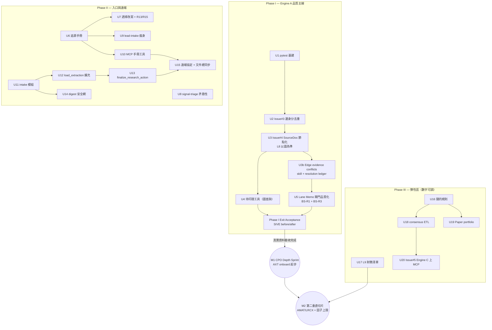

# feat: 統一工作計畫 — Engine A 品質優先（Phase I–III）

**本計畫是唯一工作起點**，取代 roadmap 006 與兩份 2026-07-14 的 007 plan。三份 origin brainstorm 的需求全數收納，依「Engine A 品質優先、數字規則保留彈性」重新分期。

---

## Summary

Phase I 修 Engine A 的尺與閘門（邊身分去重、SourceDoc 節點化、待印證圖查詢、Lane Memo 品質閘門），讓 generate_lane_memo 先做到好、M1 解鎖；Phase II upgrade 圖的入口（三入口共用追源手冊）與遠端 provenance 帳本（原文落地 + 自動 commit + digest 安全網）；Phase III 是彈性區——錢的規則、獨立前瞻模擬投資帳本、Engine C 擴充，固定結構、數字可調。

---

## Problem Frame

三條線的痛各自成案（見 origins），合流的理由是執行順序互相糾纏：盲點批次的「修尺先量」改寫了 roadmap 待辦的順序（Issue #3/#4 必須先於 M1）；SourceDoc 節點化決定了待印證清單的實現方式（真圖查詢 vs 掃磁碟繞道）；追源手冊與注意力層修補動同一批檔案。分場執行會互踩，故重整為一份分期計畫。使用者定調：**Engine A 與 Lane Memo 品質是主線；Engine C 與需要拍板實際數字的部分放最後、保留彈性**。

---

## Requirements（追溯表）

需求原文住在三份 origin，本表只做落點對照。ID 前綴：ST = source-trace、PV = provenance、BS = blind-spot、REV = 本次 plan review 定案。

| Origin | R-IDs | 主題 | 落點 |
|--------|-------|------|------|
| ST | R1–R4 | 追源鏈路由、嘗試紀錄、分級擋、origin_entity 標記 | U6 |
| ST | R5–R7 | 三入口整合（週掃 / lead-intake / MCP） | U7、U9、U10 |
| ST | R8–R9 | 追源未果清單 + Issue + digest | U7 |
| ST | R10 | 待印證清單（衍生導出） | U4、U6、U7 |
| PV | R1–R3, R7 | 原文落地、超限降級、報告即時傳入、同 doc_id 衝突防護 | U11、U12、U13、U15 |
| PV | R4–R6 | git 帳本：單 commit、push 非致命、digest 補提 | U11、U13、U14 |
| PV | R8 | 報告內容五欄 | U11、U13、U15 |
| BS | R4 | 修尺先於 M1（Issue #3/#4） | U2、U3 |
| BS | R1, R3 | 閘門品質化：L9 second_slice 內容檢查、邊層 L8 檢查 | U5 |
| BS | R13–R15 | 注意力層：核准協定、矛盾性要素、替代關鍵字 | U7、U8 |
| BS | R2, R5–R6, R8–R9 | L9 財務清單、錢的規則（sizing min、擁擠折扣 N=8、因子上限、出場優先） | U16、U17 |
| BS | R7 | consensus_coverage 觀測落地 Engine C | U18 |
| BS | R10–R12 | 決策可稽核、績效對照與首筆 SIVE 決定留痕 | U19 |
| 006 | Issue #3/#4/#5 | 邊去重、SourceDoc、Engine C 上 MCP | U2、U3、U20 |
| REV | F9 | edge attribute assertion 保存、衝突衍生、LLM proposal + 人工核准 resolution | U2、U3、U3b、U5 |
| REV | F12 | Lane Memo 引用的 evidence 可機讀追溯，gate 只檢查實際引用的 edge／claim | U5 |
| REV | F13 | 遠端報告 `action_slug` 驗證與寫入路徑 containment | U11、U13 |
| REV | F14 | 原文依授權／雲端保存權決定 Git storage permission，不以付費／免費分類 | U11、U12、U13、U15 |
| REV | F15 | 自訂 benchmark 改為獨立、前瞻、append-only 的 paper portfolio；SOXX 僅選填對照 | U19 |

---

## Key Technical Decisions

- **早期 schema correctness-first。** 目前資料庫剛建立、資料量小；遇到 provenance、資料正確性或安全邊界問題時，可直接改 schema／attribute／ID、重建或覆寫既有資料，不為已知錯誤形狀保留相容 workaround。仍須做 dump、dry-run、manifest、reconciliation 與測試；此原則已同步到 AGENTS.md L10。
- **修尺先量（BS 定案）。** Issue #3（邊身分）與 #4（SourceDoc 節點化）提到 M1 之前；M1 達標計數以修復後的圖為準。這是 Phase I 的骨架。
- **待印證清單 = 真・圖查詢。** 因 #4 提前，`origin_entity` 將入圖（SourceDoc 節點），待印證工具直接建圖查詢版——007a plan 的「掃 extractions/ 過渡版」作廢，不蓋過渡品。「衍生不維護」原則不變：清單永遠現算，第二獨立來源入圖即自動消失。
- **L8 計數以圖為準（治本 L6 Gap2）。** `generate_lane_memo` 的 `_check_source_diversity` 從掃磁碟改為查圖；遠端/本機入圖天然同一本帳。`extractions/` 不再是線上查詢來源，但仍是可重放的 provenance ground truth 與 Phase II Git 帳本。
- **SourceDoc 是文件節點；Claim／EdgeAssertion 真實 CITES。** 每份 extraction 建一個 `SourceDoc` node。Claim 與每份文件對 domain edge 的 `EdgeAssertion` 都是 node，故各以 `[:CITES]` 連到 SourceDoc。canonical domain edge 仍維持 Neo4j relationship，不把整張 domain graph reify；relationship 上保留聯集、去重後的 `source_doc_ids`（文件粒度）與 `source_ids`（逐字引文粒度）作快速查詢，但 per-document 候選屬性與 confidence 以 EdgeAssertion 為證據真相。SourceDoc 另保存 Git 權限 metadata `storage_permission` 與 `permission_basis`；Phase I 舊 corpus 允許 null，Phase II U11 盤點後與磁碟 extraction 同步，U12 新入口則必填。
- **Canonical edge 是 assertions 的 materialized view。** 每份 extraction edge 建全域 `EdgeAssertion.id=<doc_id>_<local_edge_id>`，保存 `edge_key`、src/type/dst、候選 attributes、edge-existence confidence、source_ids 與文件時間。canonical relationship 的 `confidence` 只表示「此關係存在」的信心；`sole_source`、`substitutability` 等屬性不得用它決勝。無衝突屬性可自動投影；衝突屬性在 resolution 前為 unknown 並列入 `open_conflict_attributes`。
- **Edge attribute 衝突是衍生 queue，resolution 才持久化。** 衝突單位固定為 `edge_key + attribute`；open queue 由 EdgeAssertion + SourceDoc + `library/resolutions/*.json` 現算，不維護第二份 mutable conflict registry。resolution JSON 版本控制並帶 candidate-set hash；新證據改變候選集合時舊 resolution 自動 stale、衝突重開。LLM 只依 skill 產 proposal，程式驗證、使用者核准後才投影 canonical 值；`unknown` 是合法決議。
- **Lead time 拆成結構基準與當期觀測。** 製程／元件不因交易對手改變的物理週期用 node `intrinsic_cycle_time_weeks`；特定供應關係在正常條件下的慢變基準用 edge `structural_lead_time_weeks`。缺料、利用率、物流等造成的實際交期屬帶時戳觀測，未來進 Engine C；在觀測 schema 建成前只能作 dated Claim，不得寫進 structural 欄位。既有 extraction corpus 已查無 `lead_time_weeks`，可直接改名不背相容包袱。
- **U2/U3/U3b 共用凍結 migration corpus。** 三步視為同一 maintenance window：開始前暫停本機與 MCP 圖寫入，先做 Neo4j dump，再從 `extractions/` 產生一份 manifest（每筆含 `doc_id`、repo-relative path、SHA-256）。U2/U3 只接受同一 manifest，U3b 對該 corpus 的 assertions 做完整 materialization/reconciliation；hash/集合改變或圖上 provenance 無對應磁碟文件即 fail closed。已明確列為 open/unknown 的 attribute conflict 是可追蹤狀態，不算 reconciliation 遺失；U5 gate 生效後才恢復寫入。
- **Lane Memo 先產 evidence manifest，再決定報告等級。** 不用公司整張子圖當 gate 範圍，也不事後猜 Markdown 用了哪條邊。LLM 交付 provider-independent JSON envelope（`memo_markdown` + 機讀 evidence items）；應用層以 JSON Schema 驗證 `edge_key`/Claim/EdgeAssertion/source IDs 皆來自本次 context 且相互對得上，才對實際引用的 evidence 執行 L8/conflict gates。報告類型由程式於驗證後寫入，不讓 LLM 自選；manifest 失敗時 fail closed 為 Research Note。驗證後 manifest 以 sidecar JSON 與 memo 一起版控，供 thesis lifecycle 稽核與重生成。
- **追源手冊單一事實來源，三入口引用不複製。** 組合已驗證模式：repo skill 規則書（signal-triage 前例）+ MCP 讀檔端出（`get_extraction_rules` 前例）。雲端 EDGAR 主路徑 = web search（Pro sandbox 出網白名單不可自訂，U7a 四次實測）；`fetchers/edgar.py` 僅本機入口。
- **分級擋 + rolling Issue。** tier 3+ 追不到原文不出草稿，進單一 rolling「追源未果 backlog」Issue（`weekly-scan` label），既有 digest 零改動浮現。
- **兩段式遠端 intake 介面（PV 定案）。** `load_extraction` 擴充選填 raw 參數逐份收文件，並回傳該份文件實際落地路徑；client 在同一研究行動內累積成功載入的 `doc_ids` manifest，`finalize_research_action` 只以這份 manifest 收尾（報告 + 單 commit + push）。三目錄的整體 git 狀態只用於 pending/digest 提醒，不再充當本次 commit scope；server 仍不保存跨呼叫記憶體狀態。只在 master 自動 commit；原文上限 200k chars；同 doc_id 不加版本後綴，改以 canonical content hash 判斷「可恢復重試」或「衝突拒載」。
- **遠端入圖採 filesystem-first、可恢復一致性。** Neo4j 與檔案系統無法共用 transaction，而 extraction 是 migration ground truth，因此 U12 必須先以 no-clobber atomic publish 保存已驗證的 extraction/raw，再以冪等 loader 寫圖。寫圖失敗時檔案留作 pending 並可用相同內容續跑；同 doc_id 不同內容一律拒絕。只有圖重放成功的 doc_id 才回給 client 納入 finalize manifest。
- **Finalize fail-closed。** 建立報告或改動 index 前先 `git fetch origin master`，要求 index 無既有 staged changes、目前分支為 master、且 `HEAD == origin/master`；任一不符即不 commit、不 push，回傳可供手機端處理的 pending 摘要。通過後只 stage manifest 解析出的允許路徑與本次報告；manifest 外的 pending 檔案保留並警告，不得混入 commit。
- **所有 client-controlled 檔名元件都做格式驗證 + path containment。** `doc_id` 與 `action_slug` 只接受小寫 ASCII 英數、`-`、`_`，長度 1–64；報告的最終路徑（含同名 `-2`、`-3` 後綴）在寫入前必須 resolve 並確認仍位於指定 root。格式驗證是主要邊界，containment 是 defense in depth；不依賴 client 或 prompt 保證安全。
- **Git 原文政策依 storage permission，不依付費／免費。** 每份新文件必填 `storage_permission` 與 `permission_basis`：`repo_full` 表示公開授權、public domain／官方原始文件，或授權條款允許在 private cloud 完整保存；`repo_excerpt` 表示只允許研究所需的 URL、metadata、有限節錄與衍生研究；`local_only` 表示不允許任何 source-derived content 進 GitHub。授權不明時 fail closed 為 `local_only`，而不是從「已付費」推論可上傳。`repo_full` / `repo_excerpt` 的 eligible artifacts 才從 `.gitignore` 移除；`library/private/` 永久 ignored，且 `local_only` 文件不得進遠端 finalize。此分類只解決 Git/GitHub 保存權，不自動代表可將內容送給第三方 LLM；後者仍必須符合來源條款。
- **原文 URL 也是不可信輸入。** 不接受 cookies、authorization headers 或含 username/password 的 URL；儲存前去除 fragment，並對 `token`、`access_token`、`key`、`sig`、`signature`、`auth`、`X-Amz-*`、`X-Goog-*` 等 secret-bearing query keys 移除值，只保留可版控的 canonical URL。清理後 URL 不可用不是拒絕清理的理由；可另以不落地的 runtime credential 取得內容。
- **Phase III 分離客觀觀測與投資政策。** Engine C 只保存帶時間戳的原始事實，不保存 `crowding` 等可由門檻推出的分類。規則語意與人工流程住 `docs/investment-sop.md`；所有可調數字與 `policy_version` 以 `config/investment_policy.json` 為唯一機器權威，由查詢/決策層當下計算。skill 與程式皆引用同一設定，不硬編第二份數字。使用者明言此區會常改。
- **Paper portfolio 是獨立 bounded context。** 模擬投資不寫進 `thesis/`、Neo4j 或 Engine C；repo root 獨立 `paper_portfolio/` 保存設定、append-only transactions 與定期 reviews。Engine A 提供當時 thesis/evidence，Engine C 只提供價格／FX 原始觀測，paper portfolio 程式在查詢時衍生持倉、NAV 與損益，不維護另一份可手改的 positions truth。它用來做前瞻決策稽核，不是歷史回測，也不因少量樣本宣稱 alpha。
- **Benchmark 降為選填機會成本對照。** 移除自訂 AI 供應鏈籃子、成分版本與再平衡引擎；paper transaction 只可選填一個可公開取價的 `benchmark_ticker`，半導體主題預設建議 `SOXX`，不作 gate、不參與 thesis 評分。只有當累積至少 10 筆同類型、已結束的前瞻決策，且真的需要分離主題 beta 與選股效果時，才重開自訂 benchmark 設計。
- **pytest 基建提前到 Phase I。** identity/provenance/materialization migration 會動真實圖資料，需要測試保護；後續所有純邏輯單元（intake、conflict detector/resolver、閘門、衍生工具）沿用同一基建。git 邏輯用 tmp 目錄 `git init` 臨時 repo 驗證；Neo4j 相關測試以本機實例跑（無 CI，單人環境）。

---

## High-Level Technical Design

Phase I 的 identity → SourceDoc → conflict resolution → quality gate 為主串行；U4 可在 SourceDoc 後並行。Phase II 兩條線（追源、provenance）可並行；Phase III 的 U16（政策）與 U18（客觀觀測）可獨立開發，U20 同時依賴兩者，於查詢時組成 raw observation + policy view。注意 U17 是 M2／[Investment Note] 解鎖的硬性前置（見 Content Milestones），不受 Phase III「彈性延後」框架約束。

---

## Phase I — Engine A 品質主線

### U1. pytest 測試基建

- **Goal:** 建立 `tests/` 與 pytest dev 依賴，供全計畫的純邏輯單元使用。
- **Requirements:** 無直接 origin R-ID（PV 案 KTD 提前）
- **Dependencies:** 無
- **Files:** `tests/`（新目錄）、`requirements.txt` 或 `requirements-dev.txt`（看現況形狀，PV 案 open question 在此定案）
- **Approach:** 最小可用：pytest + 一個煙霧測試。git 類測試的 tmp-repo fixture（`git init` 臨時目錄）在此先建成 conftest 共用 fixture。
- **Test scenarios:** Test expectation: none — 基建本身以「煙霧測試通過」驗證。
- **Verification:** `pytest` 可執行且綠。

### U2. Issue #3 — canonical edge／EdgeAssertion／Claim 身分修復 + 磁碟重放 migration

- **Goal:** canonical domain edge 以 `(src, type, dst)` 為身分並帶穩定 `edge_key`；每份文件的 edge 輸入另保存為全域唯一 `EdgeAssertion`，Claim id 改全域格式 `<doc_id>_clN`；migration 以凍結 extraction manifest 指定的磁碟 corpus 重建所有 provenance。
- **Requirements:** BS-R4、REV-F9 的 assertion 資料前提
- **Dependencies:** U1
- **Files:** `loader/load_to_neo4j.py`、`loader/migrate_replay_identity.py`（新，兼具 manifest build/verify preflight）、`schema/graph_schema.md`、`schema/intermediate_format.schema.json`、`prompts/extract_system.md`、`tests/test_edge_identity.py`（新）
- **Precondition:** 動圖前先建立下方 Phase I Exit Acceptance 的 SIVE before snapshot；沒有 baseline 不得開始實跑 migration。
- **Approach:** 現況已查證：邊 MERGE 以 doc-local `{id}` 為 key 且 `source_ids` 為覆寫語意——同三元組跨文件早已互相覆蓋（實測 5 組同 local id 碰撞），且 `"cl1"` 出現在 15/17 份抽取檔、圖上 Claim 節點已坍縮；只能從磁碟重放。修法：(a) 單一 helper 由 `(src_id, relation, dst_id)` 產穩定 `edge_key`，canonical relationship 以三元組 MERGE；(b) 每個 extraction edge 建 `EdgeAssertion.id=<doc_id>_<local_edge_id>`，保存 edge_key、src/type/dst、該文件候選 `attributes_json`、edge-existence confidence、source_ids、source_doc_id；(c) relationship 的 source_ids/source_doc_ids 用不依賴 APOC 的聯集語意，本機/遠端完全一致；relationship `confidence` 只代表關係存在，不再替屬性決勝；canonical attributes 在本步先清空，交 U3b 由 assertions materialize；(d) Claim id 改 `<doc_id>_clN`，edge subject 解析成 `subject_kind=edge + subject_edge_key`，node subject 維持 `ABOUT`；(e) schema 將 `lead_time_weeks` 改為 `structural_lead_time_weeks`，並新增 node `intrinsic_cycle_time_weeks` 定義，舊名在新 extraction 驗證時拒收（目前 corpus 零筆，migration 無資料搬移）；(f) preflight 產生 manifest 與「manifest 有/圖沒有、圖有/manifest 沒有」reconciliation；migration 必填 `--manifest`、驗 hash、重建 relationship/EdgeAssertion/Claim 並清除碰撞殘骸，`--dry-run` 不動圖。
- **Test scenarios:**
  - 同三元組兩份文件 → 一條 canonical relationship + 兩個全域 EdgeAssertion，relationship source_ids/source_doc_ids 為聯集
  - 兩份文件都使用 local `e1` → assertion id 分別為 `<docA>_e1`、`<docB>_e1`，不碰撞
  - 兩 assertions 的 `sole_source` 不同 → 候選值都保存，canonical relationship 不被後載入者覆寫、也不以 confidence 決勝
  - relationship confidence 可合併「關係存在」的證據，但 attribute candidate confidence 各留在 assertion
  - 兩份文件各有 `cl1` → 重建為兩個獨立 Claim 節點（`<doc_id>_cl1` ×2）
  - Claim 的 `subject_id` 指向 doc-local edge id → load/replay 後保存對應的穩定 `subject_edge_key`，不嘗試以 `ABOUT` 指向 relationship
  - 同 src/dst 不同 type → 兩條邊保留
  - 新 extraction 使用 `lead_time_weeks` → schema 拒收並指示改用 structural/intrinsic/dated observation 三分法
  - migration `--dry-run` → 列清單不動圖；重跑冪等
  - manifest 建立後新增、刪除或修改 extraction → hash/集合驗證失敗，不動圖
  - 圖上 provenance 無對應 manifest 文件 → reconciliation 列出並 fail closed，不自行刪除
- **Verification:** maintenance window 內先完成 Neo4j dump 與 manifest；migration 後重複三元組計數 0、`MATCH (c:Claim {id:'cl1'})` 為空、EdgeAssertion 數等於 manifest corpus 的 extraction edge 總數；抽查 3 條 relationship 的 sources 與 assertions 可完整重建。U3b materialization/reconciliation 完成前不恢復圖寫入。

### U3. Issue #4 — SourceDoc 節點化，L8 以圖為準

- **Goal:** 每份來源文件成為一個 `SourceDoc` node；Claim 與 EdgeAssertion 以 `CITES` 連到 SourceDoc，domain relationship 保留來源 ID 聯集作快速查詢；L8 計數改查圖。
- **Requirements:** BS-R4、ST-R10 的資料前提
- **Dependencies:** U1、U2
- **Files:** `loader/load_to_neo4j.py`、`loader/migrate_sourcedoc.py`（新）、`thesis/generate_lane_memo.py`（`_check_source_diversity` 改查圖）、`schema/graph_schema.md`（SourceDoc 段落）、`tests/test_sourcedoc.py`（新）
- **Approach:** load 時以 extraction 的 `source_doc` 建 `SourceDoc(id=doc_id)`，properties 固定為 `title`、`source_type`、`evidence_tier`、`origin_entity`、`url`、`publisher`、`published_at`、`retrieved_at`、`storage_permission`、`permission_basis`。Claim 與 EdgeAssertion 各建 `[:CITES]->(:SourceDoc)`；canonical relationship 仍保留 source_ids/source_doc_ids 聯集，但需要逐文件／逐屬性證據時一律查 EdgeAssertion。migration 必填並重新驗證 U2 同一份 manifest，只回填該 corpus（缺 `url`/`published_at`/storage metadata 容忍 null）；`_check_source_diversity` 對 Claim 走 CITES，對 relationship 以 edge_key join EdgeAssertion → CITES → SourceDoc，聚合 distinct origin_entity。`CITES`、`SourceDoc`、`EdgeAssertion` 與新 properties 先由 admin 預註冊 name tokens。
- **Test scenarios:**
  - load 新 extraction → SourceDoc 正確；Claim 與 EdgeAssertion 都有 CITES；relationship source_doc_ids 含 doc_id
  - 同一 edge 由同文件多段 quote 支持 → `source_doc_ids` 只有一個 doc_id、`source_ids` 保留多個引文 id
  - 同一 edge 由兩份文件支持 → relationship ID lists 聯集且去重、兩個 assertions 各自保留候選 attributes 與 CITES
  - migration 回填 → 圖上 SourceDoc 數 = manifest 文件數；抽查 3 份 origin_entity 一致
  - U2 後 corpus 被修改 → U3 manifest 驗證失敗，不做部分回填
  - L8 計數 parity：改版 `_check_source_diversity` 對 SIVE 的計數 == 舊版掃磁碟的計數
  - 缺 `origin_entity` 的舊檔 → 仍建 SourceDoc/CITES、origin_entity=null 並警告；L8 不把 null 算獨立來源
  - 遠端入圖（MCP `load_extraction`）→ SourceDoc 同步建立（與 4c95521 的 extractions/ 落地 parity）
- **Verification:** migration 後 SourceDoc/Claim/EdgeAssertion provenance reconciliation 無未解項；`python thesis/generate_lane_memo.py --company-id co:sivers_semiconductors` 的 L8 計數與 assertions 所連 SourceDoc 一致；Neo4j Browser 可視化看到 SourceDoc 掛在 Claim 與 EdgeAssertion。待 U3b 完成 canonical attribute 投影後才恢復寫入。

### U3b. Edge evidence conflict resolution（衍生 queue + skill + resolution ledger）

- **Goal:** 從 EdgeAssertion 自動找出 `edge_key + attribute` 衝突，保存所有候選證據；讓 LLM 依固定 skill 產生可驗證 proposal，使用者核准後才把 resolved value 投影回 canonical relationship。
- **Requirements:** REV-F9
- **Dependencies:** U1、U3
- **Files:** `query/edge_conflicts.py`（新）、`loader/edge_resolution.py`（新）、`schema/edge_resolution.schema.json`（新）、`library/resolutions/README.md`（新）、`skills/evidence-conflict-resolution/SKILL.md`（新）、`schema/graph_schema.md`、`loader/load_to_neo4j.py`、`tests/test_edge_conflicts.py`（新）；完成後執行 `python scripts/sync_agent_skills.py`
- **Approach:**
  - detector 以 EdgeAssertion 的明確非 null 值分組：全部相同則自動 materialize；null + 單一明確值採明確值；兩個以上明確不同值即為 open conflict。confidence 只展示候選證據強度，絕不當 tie-breaker。
  - `conflict_id` 穩定取自 `edge_key + attribute`；另以排序後的 assertion ids + canonical candidate values 計 `candidate_set_hash`。open queue 每次現算，不落第二份 mutable registry。
  - version-controlled resolution 住 `library/resolutions/<safe_conflict_id>.json`，schema 至少含 `conflict_id`、`candidate_set_hash`、`action`（`choose_value|unknown|split_scope|move_to_observation`）、選擇值、supporting/rejected assertion ids、理由、resolved confidence、approved_by、approved_at。candidate set 改變時 resolution 自動 stale、衝突重開。
  - canonical projector：無衝突或有當前有效 resolution 才寫 attribute；open/stale conflict 時移除該 canonical 值並把 attribute 加入 relationship `open_conflict_attributes`。relationship `confidence` 維持關係存在信心；屬性層 metadata 另存 `attribute_resolution_meta_json`（value confidence、resolution id、as-of）。
  - skill 先判斷是否為時間／產品／客戶 scope 不同、是否新證據 supersede 舊證據、是否應移到 dated observation，再套 L8 來源階序。它只能輸出 proposal，不能自行寫 resolution 或圖；`sole_source`、`substitutability`、`structural_lead_time_weeks` 一律需要使用者明確核准。resolver 驗所有 assertion/source ids、candidate hash、schema 與 approval 後才寫 resolution + 重跑 projector。
  - batch 依風險排序：active thesis 引用的 edge → `sole_source` → 高 substitutability／差距 ≥2 → 其他。允許 resolution=`unknown`，不要求為清空 queue 而硬選答案。
  - migration dry-run 掃完整 corpus 並一次輸出全部 conflicts，不在第一筆停止；正式重放以「屬性層 fail closed」繼續建立 relationship/assertions，未決屬性保持 unknown。U3b reconciliation 完成即可恢復圖寫入，不要求低價值 conflicts 全部人工解完，但 U5 會 gate thesis-critical conflicts。
- **Test scenarios:**
  - 候選 `true,true` → 自動投影 true；`null,true` → true；`true,false` → open、canonical `sole_source` 不存在
  - confidence 0.9 的供應商自報 true 與 0.75 的客戶端 false → detector 不自動選 0.9
  - 有效 approved resolution → 投影選定值與 meta；新 assertion 加入後 candidate hash 改變 → resolution stale、canonical 值移除、衝突重開
  - resolution=`unknown` → 衝突視為已處置但 canonical 值仍空，查詢可見 decision reason
  - proposal 引用不存在 assertion/source、hash 過期、缺人工 approval → resolver 拒絕且不動檔案/圖
  - LLM 判定 scope mismatch → proposal action=`split_scope`，resolver 不自動改 schema，回傳需開人工 refactor
  - batch 排序把 active-thesis sole_source 衝突排在無 thesis 引用的 qualification_status 前
- **Verification:** dry-run 對凍結 corpus 產生完整 conflict report；人工核准一筆測試 conflict 後，resolution JSON 通過 schema、canonical edge 只出現 approved value；`python scripts/sync_agent_skills.py --check` 通過；重跑 detector 只剩未解或 stale 項目。

### U4. 待印證衍生工具（圖查詢版）

- **Goal:** `query/single_origin_report.py`：一條圖查詢導出「所有來源同一 `origin_entity`」的邊/主張清單（markdown），本機 CLI 與雲端（MCP `run_read_query`）共用同一 Cypher。
- **Requirements:** ST-R10
- **Dependencies:** U3
- **Files:** `query/single_origin_report.py`（新）、`tests/test_single_origin_report.py`（新）
- **Approach:** 核心查詢分成兩個資料來源後正規化成同一 rows 形狀：(a) Claim 經 CITES 取得 SourceDoc；(b) canonical relationship 以 edge_key join EdgeAssertion → CITES → SourceDoc。兩者皆 group by 元素、聚合 distinct origin_entity，count **≤ 1** 者列入——count = 0（Claim 無 CITES、relationship 無 assertion、或 assertion 無 CITES）在報告中獨立成「無來源鏈（orphan）」；`--company-id` 過濾、依公司分組。Cypher 放模組常數並先 commit/push；U7 cloud routine 從 GitHub clone 讀取後交 `run_read_query`，不複製查詢或增加 MCP 工具。聚合/渲染拆成純函式。
- **Test scenarios:**
  - Covers ST 案 AE4. 純函式：某 edge 對應兩個不同 origin_entity → 不列入；同一 → 列入
  - Claim 零 CITES、relationship 零 EdgeAssertion、或 assertion 零 CITES → 列入 orphan 段落，不消失
  - rows 為空 → 空清單、exit 0
  - 對真實圖跑 → 已知孤證（sivers_ar_2025 單源主張）出現在清單
- **Verification:** 清單抽查 3 條與 Neo4j Browser 手查一致；第二來源入圖後該條自動消失（拿 U3 測試資料驗證）。

### U5. Lane Memo 閘門品質化

- **Goal:** 閘門從存在性檢查升級為品質檢查：L9 second_slice 檢查內容；Lane Memo 以可驗證 evidence manifest 明列實際引用的 Claim 與 edge，對其高風險邊逐條檢查來源獨立性與 open evidence conflicts。
- **Requirements:** BS-R1、BS-R3、REV-F9、REV-F12
- **Dependencies:** U3b
- **Files:** `thesis/preconditions.py`、`thesis/generate_lane_memo.py`、`thesis/evidence_manifest.py`（新）、`schema/thesis_evidence_manifest.schema.json`（新）、`prompts/lane_memo_system.md`、`tests/test_gates.py`（新）、`tests/test_evidence_manifest.py`（新）
- **Approach:**
  - `generate_lane_memo.py` 先建立帶穩定 ID 的 context inventory（Claim id、edge_key、EdgeAssertion id、source_id），要求模型回傳 provider-independent JSON envelope：`memo_markdown` 與 `evidence_items[]`。每個 item 有穩定 `evidence_ref`，類型為 `claim|edge`，並依類型帶 `claim_id` 或 `edge_key`、實際用到的 `attributes`、`assertion_ids`、`source_ids` 與 `purpose`；Markdown 以 `[E#]` 引用對應 item。原生 structured-output API 可作 transport optimization，但正確性不綁任一 model/provider 功能。
  - `evidence_manifest.py` 以 JSON Schema 與本次 context inventory 驗證：禁止未提供 ID；assertion 必須屬於該 edge；source 必須由該 Claim/EdgeAssertion 引用；Markdown 的 `[E#]` 與 manifest 必須雙向對齊。驗證失敗不允許 Lane Memo/Watchlist/Investment Note；仍可保存為附明確 manifest error 的 Research Note。
  - BS-R1：`_check_second_slice()` 要求非 CPO Lane Memo、非空 variant perception、對應 scoring 通過失敗閾值。BS-R3：只對 manifest 實際引用的 `sole_source=true` 或 `substitutability>=4` relationship，經 EdgeAssertion → SourceDoc 算 distinct origin_entity；全為被分析公司自報則標 `⚠ weak（單源自報）`。未被 manifest 引用的公司子圖 edge 不得誤擋本次 memo。
  - REV-F9：若 manifest 引用 edge 的 `open_conflict_attributes` 含其實際使用的 `sole_source`、`substitutability` 或 `structural_lead_time_weeks`，仍可生成 `[Research Note]` 並列出候選證據，但不得升格 Watchlist/Investment Note；resolution=`unknown` 也不得被當成有利瓶頸證據。
  - 所有 gates 在 draft envelope 回來後執行；模型不得自行寫 `[Lane Memo]` 等級。generator 根據 manifest validation、source quality、conflicts 與 preconditions 決定最終 header，再原子寫入 memo 及同 stem 的 `.evidence.json` sidecar。`validate.py` 文件層警告維持現狀。
- **Test scenarios:**
  - Covers BS 案 AE1. 只有檔名的 `thesis/amat_draft_lane_memo.md` → `preconditions.py` second_slice ❌
  - variant perception 段落存在但 scoring 檔缺 → ❌，訊息指出缺什麼
  - context 有 edge A/B，memo manifest 只引用 A：B 的 open conflict 不誤擋 memo
  - manifest 引用未在 context 的 edge/claim/assertion/source，或 assertion/source 對不上 object → validation 失敗、只能 Research Note
  - Markdown 出現 `[E2]` 但 manifest 無 E2，或 manifest E2 未在 Markdown 引用 → validation 失敗
  - Covers BS 案 AE3. 公司 4 個 distinct origin_entity、但某 sole_source 邊全自報 → memo 生成、該主張標 weak
  - 邊有客戶端來源 → 不標 weak
  - thesis 引用 edge 有 open sole_source conflict → Research Note 可生成且列候選，Watchlist gate 失敗
  - conflict resolution=`unknown` → 不再列 open queue，但 memo 不得把 sole-source 當已確認
- **Verification:** 對現有 SIVE/CPO memo 重跑生成，memo 內每個 `[E#]` 均可由 sidecar 追到 Claim/edge_key、EdgeAssertion、source quote 與 SourceDoc，並含預期 weak/conflict 標記；`preconditions.py` 全量執行訊息合理；所有實際引用的 thesis-critical open conflicts 皆被 gate，未引用 edge 不誤擋。

### Phase I Exit Acceptance Slice — SIVE regression（不是 AXT onboarding）

- **Goal:** 用既有 SIVE corpus 證明 identity／SourceDoc／EdgeAssertion／conflict refactor 不只工程測試通過，也真的改善研究回答且沒有遺失證據。SIVE 有 migration 前 baseline、已知 L8 自報與 source-under-audit 情境，適合 before/after；AXT 沒有既有 baseline，仍留作 M1 的新內容目標。
- **Dependencies:** U4、U5
- **Files:** `docs/reports/phase1-sive-engine-a-acceptance.md`（新；同一檔先寫 before snapshot，migration 後補 after/result）
- **Before snapshot（必須在 U2 migration 前完成）:** 保存當前 `thesis/sivers_v2_lane_memo.md` 的 commit/hash、SIVE 相關 node/relationship/Claim 與 source_ids 計數、`_check_source_diversity` 結果，以及標準問題「目前 SIVE 的 CPO／ELS thesis：哪些已確認、哪些是單源自報、哪些證據受 audit？」的現況回答。
- **After run:** 用完全相同 extraction manifest 與標準問題重跑 `generate_lane_memo`／研究查詢，不新增 AXT 或其他文件，避免把 corpus 變化誤認成 schema 改善。
- **Acceptance criteria:**
  - 每個 before source_id 都能在 Claim 或 EdgeAssertion 找到，或出現在明確 reconciliation exception；不得靜默遺失
  - 單源、自報、source-under-audit 與 open/unknown attribute conflicts 都正確顯示，不再被 max confidence 或後載入覆寫隱藏
  - 每個 warning 可透過 memo `[E#]` 與 `.evidence.json` sidecar 追到 edge_key／Claim、EdgeAssertion、quote source_id 與 SourceDoc；sidecar 與本次 context inventory 驗證通過
  - 在 SIVE 公司子圖植入一條 memo 未引用、但有 open conflict 的測試 edge，不得因此降級報告；將它加入 manifest 後才應降級
  - after Lane Memo／標準回答仍能清楚陳述目前 thesis、已確認與待驗證內容，不可退化成只有資料品質錯誤清單
  - acceptance report 列 before/after 差異、預期改變、非預期回歸與最終 pass/fail；非預期證據遺失或錯誤 canonical value 即 Phase I 不完成
- **Verification:** 使用者閱讀同一份 before/after report 可理解「研究結論哪裡改了、為什麼改、證據在哪」；測試綠但 acceptance fail 時不得解鎖 M1。

> **M1 CPO Depth Sprint 於 SIVE acceptance 通過後解鎖**（第一個新內容目標仍是 AXT，見「Content Milestones」）。

---

## Phase II — 入口與遠端

### U6. 追源手冊 skill

- **Goal:** `skills/source-trace/SKILL.md`：路由鏈（依市場分路：美股 EDGAR、台股 MOPS、學術 arXiv；通用搜尋第三層）、「追到原文」判定（逐字文本或 URL+節錄）、分級處置表（tier 1-2 誠實標記放行 / tier 3+ 隔離）、嘗試紀錄格式、遠端 intake SOP 摘要（chat 自足）。
- **Requirements:** ST-R1–R4、ST-R10 的標記規則
- **Dependencies:** 無（可與 Phase I 並行）
- **Files:** `skills/source-trace/SKILL.md`（新）；完成後執行 `python scripts/sync_agent_skills.py` 產生 Claude Code / Codex 轉接層
- **Patterns to follow:** `skills/signal-triage/SKILL.md` 章節結構；tier 定義沿用 lead-intake 鐵律 2；「原文」判定對齊 PV 案降級規則。
- **Test scenarios:** Test expectation: none — prose 規則書。
- **Verification:** 對照 ST 案 AE1–AE4 走查可推出相同處置；自足性檢查（不引用 chat 拿不到的資源，本機工具標註「本機入口適用」）；`python scripts/sync_agent_skills.py --check` 通過。

### U7. 週掃 prompt 改寫（追源 + 核准協定 + 替代關鍵字）

- **Goal:** 週掃接上手冊與新核准協定：追源成為強制步驟；PR merged 即核准、冪等入圖；反向訊號有自己的搜尋詞。
- **Requirements:** ST-R2、R3、R5、R8–R10；BS-R13、BS-R15
- **Dependencies:** U4、U6
- **Files:** `crons/weekly_scan_prompt.md`、`config/themes.txt`
- **Approach:** Stage 0 加讀手冊；核准協定改為 BS-R13——掃**所有** merged 且無 `loaded` label 的週掃 PR（不限上週），load 成功打 label，重複執行不重複入圖；Stage 2.5 Trace（照手冊，逐項記錄嘗試路徑）；Stage 4 週報加「追源未果清單」段落 + 待印證標記：cloud routine 已由 GitHub clone 整份 repo，直接讀 `query/single_origin_report.py` 的 U4 Cypher 常數，再經 `run_read_query` 查圖；未果項目 append 到 rolling「追源未果 backlog」Issue（無則新開，`weekly-scan` label）；`config/themes.txt` 每主題加 1–2 個替代路徑關鍵字（如 in-house laser、LPO）。原 R14 段落改指向手冊。
- **Test scenarios:** Test expectation: none — prompt 文件。
- **Verification:** U4 已 commit/push 後再部署 U7；下次週掃實跑確認 routine 能從 clone 讀到 U4 查詢並由 `run_read_query` 產生待印證清單；tier 3+ 未果無草稿（ST AE1）；tier 2 轉述草稿標記正確（ST AE2）；晚兩週 merge 的 PR 仍被 load 並打 label（BS AE5）；backlog Issue 出現且 digest 列出。

### U8. signal-triage 矛盾性要素

- **Goal:** 判斷要素加第五條：與現有 claim/thesis 方向相反的材料，與新 origin_entity 同等優先放行。
- **Requirements:** BS-R14
- **Dependencies:** 無
- **Files:** `skills/signal-triage/SKILL.md`；完成後執行 `python scripts/sync_agent_skills.py` 產生 Claude Code / Codex 轉接層
- **Test scenarios:** Test expectation: none — prose。
- **Verification:** 走查：一則「Broadcom 客戶傾向 copper」型反向材料在四+1要素下判 PASS；`python scripts/sync_agent_skills.py --check` 通過。

### U9. lead-intake 瘦身引用

- **Goal:** Step 2 驗證迴圈的來源分路內文改為引用手冊；Fast Path 補提。
- **Requirements:** ST-R6
- **Dependencies:** U6
- **Files:** `skills/lead-intake/SKILL.md`；完成後執行 `python scripts/sync_agent_skills.py` 產生 Claude Code / Codex 轉接層
- **Test scenarios:** Test expectation: none — prose。
- **Verification:** 走查 Fast Path 情境無斷點、無殘留舊分路內文；`python scripts/sync_agent_skills.py --check` 通過。

### U10. MCP 手冊端出工具

- **Goal:** `get_source_trace_manual` 工具：chat 入口取得手冊全文。
- **Requirements:** ST-R7
- **Dependencies:** U6
- **Files:** `mcp_server/graph_mcp.py`、`docs/remote-access-architecture.md`（工具清單於 U15 總同步）
- **Approach:** 比照 `get_extraction_rules` 讀檔回傳；檔案缺失回可讀錯誤不炸 server；docstring 寫明呼叫時機（收到未驗證線索時必讀）。
- **Test scenarios:**
  - 本機呼叫 → 回傳含路由表全文
  - 手冊檔暫時改名 → 可讀錯誤、server 存活
- **Verification:** 手機/網頁 chat 實測：丟一則推文 → chat 取手冊 → 依分級正確回覆（tier 4 未果 → lead-only，不呼叫 load_extraction；ST AE3）。

### U11. intake 模組（落地與 git 帳本核心）

- **Goal:** 純邏輯模組：依 storage permission 安全落地原文（200k 上限、URL+節錄降級、local-only 隔離）、重複防呆、由 `doc_ids` manifest 解析本次行動路徑、pending 探測（三個 Git 帳本目錄 untracked，僅供提醒）、commit/push（同步狀態防護、精確 pathspec、push 非致命）。
- **Requirements:** PV-R2、R4、R5、R7（部分）、R8 檔案面、REV-F14
- **Dependencies:** U1
- **Files:** `mcp_server/intake.py`（新）、`.gitignore`、`tests/test_intake.py`（新）
- **Approach:**
  - 先盤點現有 `extractions/` 與 `library/raw/` corpus，為每份文件在 extraction `source_doc` 補 `storage_permission` 與 `permission_basis`；未定案者不得因本 U 自動進 Git。再從 `.gitignore` 移除 eligible 的 `extractions/*` 與 `library/raw/*`；三個 Git 帳本目錄固定為 `library/raw/`、`extractions/`、`library/intake/`，`library/private/` 與其內 extraction/raw 永久 ignored。
  - 公開純邏輯函式固定為：`validate_doc_id(doc_id)` 與 `validate_action_slug(slug)`（共用 `^[a-z0-9_\-]{1,64}$`）、`validate_storage_permission(permission, basis)`、`sanitize_source_url(url)`、`canonical_extraction_hash(extraction)`、`inspect_provenance(doc_id, extraction, raw_payload)`、`publish_provenance(doc_id, extraction, raw_payload)`、`resolve_action_paths(doc_ids)`、`pending_intake_files()`、`write_report(slug, report_markdown)`、`git_preflight()`、`commit_and_push(paths, message)`。
  - raw 規則：三類都要求非空 `permission_basis`，不得僅寫「已付費」；`repo_full` 可收 `raw_text`（上限 200,000 chars），超限改用 sanitized `raw_url + raw_excerpt`；`repo_excerpt` 拒收全文 `raw_text`，必須是 sanitized URL + 有限 `raw_excerpt`；`local_only` 可存本機全文，但 extraction/raw 均路由至 `library/private/`。只給 URL 沒有節錄的 repo-eligible 內容仍拒收。
  - `canonical_extraction_hash` 以排序 key、固定分隔符的 canonical JSON 計 SHA-256；raw payload 亦先正規化再比較。`inspect_provenance` 回 `absent` / `matching` / `conflict`，同 doc_id 任一既有內容與輸入不同即 fail closed。
  - `publish_provenance` 先依 permission 路由 repo 或 private roots，再把 extraction/raw 寫到各自目標目錄內的 temporary file，flush/fsync 後以 **no-clobber atomic publish** 搬到 final path；若另一呼叫先建立目標，重新比較內容，相同視為 matching、不同視為 conflict。兩檔間不假裝具備共同 transaction；若只完成其一，下一次相同輸入補齊另一檔。同 doc_id 不允許藉重送靜默改 permission；授權改變時另做顯式、hash-guarded migration。
  - `resolve_action_paths`：client 只傳 `doc_ids`，server 從 extraction 內的 storage permission 解析 `extractions/{doc_id}.json` 與存在的 `library/raw/{doc_id}.txt`；所有 resolved path 必須仍在允許根目錄內，不接受 client path。任一 `local_only` doc_id 均使本次 remote finalize fail closed，不做部分 commit，避免報告間接洩漏該文件。
  - `pending_intake_files` 回傳三目錄的 `untracked` 與 `modified` 分組，供 U14 提醒；modified 視為異常並警告，不納入遠端 finalize 的自動 stage。`write_report` 先跑 `validate_action_slug`，寫 `library/intake/YYYY-MM-DD-<slug>.md`、由 server 補時間戳，同名依序加 `-2`、`-3`；每個 candidate 的 resolved path 都必須在 `library/intake/` root 內，並以 exclusive create 避免競態覆寫。
  - `git_preflight` 與 `commit_and_push` 皆使用有 timeout 的 subprocess argv-list（`shell=False`）；失敗回結構化結果，不把例外炸穿 MCP。commit 只接受精確 pathspec，禁止 `git add -A`；push 失敗保留 local commit 並回警告。
- **Test scenarios:**
  - `repo_full`：有明確 basis 的全文成功；超過 200k 拒收並指向 URL+節錄；`repo_excerpt`：URL+節錄成功、全文或只有 URL 拒收；`local_only`：兩檔均只在 ignored private root
  - 付費但 basis 明載允許 private-cloud archive → `repo_full` 可通過；免費但授權不明 → 不得因免費自動通過
  - URL 含 userinfo 或 client 傳 cookies/auth headers → 拒絕；含 secret query key → stored URL 無 secret value，非敏感 query 保留
  - canonical JSON 只因 key 順序不同 → hash 相同；內容不同 → hash 不同
  - 同 doc_id 同 extraction/raw → matching；任一內容不同 → conflict 且不覆寫；`../evil` 型 doc_id 被拒且不落地
  - `action_slug` 的 `../evil`、`..\evil`、絕對路徑、drive-qualified path、斜線、空白與非 ASCII 字元皆拒絕；無法寫出 `library/intake/`
  - 合法 slug 同名連寫三次 → 產生原名、`-2`、`-3`，不覆寫且三個 resolved path 皆在 root 內
  - 模擬只成功 publish extraction、raw 失敗 → 下次相同輸入補齊 raw；競態建立同一路徑時不 clobber
  - `resolve_action_paths` 只回傳 manifest 對應的 repo-eligible raw/extraction，無法逸出允許目錄；混入 `local_only` 即整次拒絕
  - production `.gitignore` 內容下，三目錄新檔仍被列為 untracked；目錄外檔案忽略；modified 分開回報
  - 報告同日同 slug 寫兩次，第二份使用 `-2` 後綴且時間戳來自 server
  - tmp repo 精確 pathspec commit 只含指定檔；非 master、index 已 staged、HEAD ahead/behind/diverged、fetch 失敗皆在寫報告/commit 前 fail closed
  - push 在 preflight 成功後失敗，local commit 保留且函式不拋例外
- **Patterns to follow:** `crons/weekly_scan_digest.py` subprocess 優雅失敗；`fetchers/edgar.py` 截斷訊息風格。
- **Verification:** pytest 全綠；tmp repo 人工抽查 `git show --stat` 只含 manifest pathspec；production `.gitignore` fixture 不會令 pending 探測空轉。

### U12. `load_extraction` 擴充：filesystem-first、可恢復重試

- **Goal:** 遠端載入時先安全保存原文與 extraction，再冪等寫圖；中途失敗可用相同 doc_id/內容續跑，不同內容嚴格拒絕。
- **Requirements:** PV-R1（文件面）、R2、R7、REV-F14
- **Dependencies:** U3b（完整 loader + conflict projector）、U11
- **Files:** `mcp_server/graph_mcp.py`、`schema/intermediate_format.schema.json`、`schema/graph_schema.md`、`tests/test_intake.py`
- **Approach:** MCP signature 擴充為 `load_extraction(extraction_json, storage_permission, permission_basis, raw_text=None, raw_url=None, raw_excerpt=None)`，permission 兩欄必填，並寫回 extraction `source_doc`。順序固定為：(1) 解析 JSON、驗 doc_id；(2) 完成 schema/vocab/參照、storage permission、URL sanitization 與 raw policy 驗證；(3) 以 U11 canonical hash 檢查既有 provenance，不同內容立即拒絕；(4) 依 permission 對缺少的 extraction/raw 做 no-clobber atomic publish；(5) 以 U2/U3 的冪等 loader 重放文件與 EdgeAssertions；(6) 只對受影響 edge_keys 重跑 U3b detector/projector，若新證據使 resolution stale 就清除該 canonical attribute 並回傳 conflict ids；(7) 圖與 projector 成功才回 `status=loaded_or_already_complete`、doc_id、resolved paths、`open_conflict_ids` 與 `finalize_eligible`。只有 `repo_full|repo_excerpt` 才可納入 finalize manifest；`local_only` 回 `finalize_eligible=false`。圖/projector 失敗則回 `pending_graph`，保留檔案且不得把 doc_id 加入 finalize manifest。不同內容不覆寫、不加版本後綴；不帶 raw 仍支援 extraction-only，但 permission 仍必填。docstring 明載「一份文件一呼叫，行動結束必 finalize；conflict 只代表屬性待決，不代表整份文件載入失敗」。
- **Test scenarios:**
  - 同 doc_id、不同 canonical extraction 或不同 raw → 寫圖前拒載，monkeypatch 證明 Neo4j driver 未建立
  - 同 doc_id、同內容、前次圖寫入失敗 → 重跑 loader 後成功，沿用既有檔案不覆寫
  - 同 doc_id、同內容、圖已完整 → 冪等重放不新增重複 edge/Claim，回 `loaded_or_already_complete`
  - provenance publish 成功但 Neo4j 失敗 → 回 `pending_graph`、檔案保留、回傳不授權加入 finalize manifest
  - 新 assertion 使既有 resolution stale → 該 canonical attribute 被移除、回傳 conflict id，其他 edge/attributes 正常入圖
  - 不帶 raw 參數 → 與現行工具回溯相容
  - 帶 `raw_text` → 圖載入後 raw/extraction 兩檔存在，回傳 doc_id 與 resolved paths
  - `repo_excerpt` 傳全文 或 permission basis 空白 → 寫檔/寫圖前拒收；`local_only` 成功載圖但回 `finalize_eligible=false`
  - 不合法 doc_id → 寫圖及檔案落地前拒收
- **Verification:** pytest 綠 + claude.ai smoke：載一份帶原文的測試 extraction；模擬第一次圖失敗後以完全相同 payload 重試成功；改一字再送則被拒；另載一份造成 sole_source conflict 的文件，回應列出 conflict id、canonical 值不再假裝已定案。

### U13. `finalize_research_action`：報告 + 單 commit + push

- **Goal:** 研究行動收尾單一入口。
- **Requirements:** PV-R1（行動面）、R3–R6、R8、REV-F14
- **Dependencies:** U11、U12
- **Files:** `mcp_server/graph_mcp.py`、`tests/test_intake.py`
- **Approach:** MCP signature 固定為 `finalize_research_action(report_markdown, action_slug, commit_headline, doc_ids)`，四者必填；`commit_headline` 作 commit message 首行。流程：(1) U11 解析 manifest；沒有可提交文件即回「無待收尾文件」，不寫報告；(2) 建立任何檔案或碰 index 前跑 preflight：index 無 staged changes、目前分支 master、`git fetch origin master` 成功且 `HEAD == origin/master`；(3) 報告至少包含「為何此時入圖、文件清單（doc_id + URL）、搜尋過程摘要、L8 確認備註」，server 另補入圖時間戳；(4) 寫報告後只 stage manifest-resolved paths + 本次 report；(5) commit 後 push。回傳報告路徑、manifest 文件、manifest 外 pending warning 與 git 三態：`committed+pushed` / `committed_not_pushed` / `not_committed`。push 失敗不回滾圖或 local commit，由 U14 浮現。
- **Security boundary:** 解析 `doc_ids` 或建立任何檔案前先對 `action_slug` 跑 U11 驗證；`write_report` 內部再做 resolved-path containment，不將 MCP client 視為可信檔名來源。
- **Storage boundary:** finalize preflight 必須重新從落地 extraction 讀 storage permission，不信任 client 宣稱的 eligibility。manifest 含任一 `local_only` 時整次 `not_committed`，不寫報告也不部分提交；報告文件清單必須列每份的 storage permission 與簡短 permission basis。
- **Test scenarios:**
  - 兩份 `repo_full` 文件 + 報告 → 一個 commit 正好含 2 raw + 2 extraction + 1 report
  - `repo_full` + `repo_excerpt` → commit 含全文 raw、節錄 raw、兩份 extraction 與 report；報告列權限；混入 `local_only` → 整次 `not_committed`
  - manifest 無檔案 → 不寫報告、不 commit
  - A 遺留 + B manifest → 只提交 B 與 B report，A 留在 worktree 並出 warning
  - index 既有 staged change、非 master、HEAD ahead/behind/diverged、fetch 失敗 → `not_committed`，且未寫報告
  - 惡意／不合法 `action_slug` → `not_committed`，未寫報告、未碰 index、未執行 git subprocess
  - 本機已有未 push commit → 不會藉本次 finalize 推出
  - preflight 成功後模擬 push 失敗 → 回 `committed_not_pushed`，local commit 與檔案保留
  - commit message 以 argv 獨立元素傳入，headline 內特殊字元不經 shell 解讀
- **Verification:** pytest 綠；claude.ai 完整 smoke「載兩份 → finalize」，App 先出現核准提示，GitHub 手機 App 可看到恰好一個 commit 與完整報告。**上線前必須在 connector 將新工具手動設為 Needs-approval**（不假設 `load_extraction` 的既有設定會自動套用）。

### U14. digest 安全網：待補 commit/push

- **Goal:** 本機開 session 時看見未完成 git 收尾的入圖。
- **Requirements:** PV-R6
- **Dependencies:** U11
- **Files:** `crons/weekly_scan_digest.py`、`tests/test_intake.py`
- **Approach:** 在既有 session-start digest 增加不依賴 `gh` 的 git 檢查：(a) 三帳本目錄的 untracked + modified 檔案；(b) `HEAD` 領先 `origin/master` 的 commits 中有觸及三帳本目錄者。任一非零才印 `🗂 N 筆遠端入圖待補 commit/push（開 session 後說「補提交入圖」即可處理）`；全零無輸出，git/remote 不可用時優雅跳過並保持既有 digest 可用。
- **Test scenarios:** tmp repo 有 untracked/modified intake 檔時計數正確；目錄外變更不計；以本機 bare repo 作 remote 且全部已 push 時無輸出；有 commit 未 push 時列入；git 不可用不 crash。
- **Verification:** pytest 綠；手動留一個未 commit 檔與一個已 commit 未 push 情境，各開新 session 均看到一行摘要，清空後維持安靜。

### U15. 遠端協定與文件總同步

- **Goal:** 遠端 claude.ai 讀規則書即知 raw 政策、finalize 義務、報告骨架與 evidence-conflict 回應方式；所有文件一次同步。
- **Requirements:** PV-R2、R3、R8 協定面；ST 案文件面；REV-F14
- **Dependencies:** U10、U12、U13
- **Files:** `prompts/intake_protocol.md`（新）、`mcp_server/graph_mcp.py`（`get_extraction_rules` 串接）、`docs/remote-access-architecture.md`（工具清單 4→6）、`AGENTS.md`（唯一專案記憶：skill 表加 source-trace、管道層帶過 intake 協定、來源登記表註記機器版位置；`CLAUDE.md` 繼續只匯入本檔）
- **Approach:** `intake_protocol.md` 明載：(a) storage permission 依授權／雲端保存權，不得以付費／免費猜測；官方公開文件或明確授權可用 `repo_full`，只允許必要節錄用 `repo_excerpt`，不明或不允許第三方雲端儲存用 `local_only`；(b) 不得將 cookie/token/header 當 provenance 傳入；(c) `load_extraction` 回 open conflict 不等於載入失敗；遠端不得自行挑值或修改 resolution，應在本次報告列 conflict ids，留給本機 `evidence-conflict-resolution` skill + 人工核准處理。
- **Test scenarios:** Test expectation: none — 文件與字串串接，由 U12/U13 smoke 一併驗證。
- **Verification:** chat 呼叫 `get_extraction_rules` 回傳含 intake/conflict 協定；模擬 load 回 conflict 時 chat 只報告、不自行 resolution；`docs/remote-access-architecture.md` 與實際工具數一致。

---

## Phase III — 彈性區（結構固定、數字可調）

> 本區所有百分比與閾值為**初始值**。規則含義與流程的權威在 `docs/investment-sop.md`；機器使用的當前數值與 `policy_version` 唯一權威在 `config/investment_policy.json`。調整數字不需改 plan 或搬 Engine C 資料。

### U16. 錢的規則統一

- **Goal:** 建立可版本化的投資政策：單檔上限 `min(總資產×5%, high_risk_budget×conviction 係數)`（初始 5→15% / 4→10% / 3→8% / <3 不建倉）；查詢時以 Engine C 原始覆蓋家數套當前門檻（初始 ≥8）決定是否把係數降一級，資料不足則回「擁擠度未知」；forward 估值是否已隱含 thesis 由分析層依當下原始估值與 thesis 假設判斷，不寫回 Engine C；半導體因子總曝險初始 ≤25%；出場條件觸發優先於初始最短持有 90 天。
- **Requirements:** BS-R5、R6、R8、R9
- **Dependencies:** 無（Phase III 起點單元）
- **Files:** `config/investment_policy.json`（新，數值 SSOT + `policy_version`）、`thesis/investment_policy.py`（新，讀取/驗證設定並計算衍生結果）、`docs/investment-sop.md`（規則語意與人工流程）、`skills/investment-research/SKILL.md`（引用 sop/config，刪重複數字）、`tests/test_investment_policy.py`（新）；完成後執行 `python scripts/sync_agent_skills.py` 產生 Claude Code / Codex 轉接層
- **Approach:** 使用 JSON 而非 YAML：repo 已有 JSON 慣例、Python 標準庫可直接讀、無新增 parser 相依。設定至少含 `policy_version`、NAV 單檔上限、conviction 係數、analyst coverage 門檻與折扣級數、因子曝險上限、最短持有天數；loader 缺 key、型別錯誤或比例越界時 fail closed。`crowding` 永遠是 query-time derived view，不成為 Engine C 欄位。
- **Test scenarios:** 設定可讀且必填 key/範圍驗證；覆蓋家數 9 在門檻 8 時折扣、同一筆原始觀測在測試設定門檻 12 時不折扣，無 DB migration；缺覆蓋資料回 unknown；policy_version 隨結果回傳。
- **Verification:** Covers BS 案 AE4. 問 sizing 時（conviction 5、低使用率、覆蓋 9、門檻 8）回答上限為 `min(總資產5%, bucket×10%)` 非 15%；改測試門檻後結果即時改變；sop 清楚區分語意權威與數值權威；`python scripts/sync_agent_skills.py --check` 通過。

### U17. L9 財務清單品質檢查

- **Goal:** L9 gate 的財務清單檢查以被建議標的為對象；含未完成 `manual_required` 項不得視為通過。
- **Requirements:** BS-R2
- **Dependencies:** U1
- **Files:** `thesis/preconditions.py`、`tests/test_gates.py`
- **Test scenarios:** Covers BS 案 AE2. 其餘全綠、SIVE 清單含 manual_required → 問 sizing 無數字、指出缺項。
- **Verification:** `preconditions.py` 對現況輸出正確的未通過理由。

### U18. consensus_coverage ETL 與觀測記錄

- **Goal:** Engine C 只落地客觀覆蓋觀測（ticker、日期、分析師覆蓋家數、來源、資料狀態），不保存 `crowding` 分類；覆蓋家數優先由 yfinance 自動抓，不可用時落成 `manual_required` 觀測。
- **Requirements:** BS-R7
- **Dependencies:** U1（測試基建；資料 schema 不依賴 U16 政策）
- **Files:** `engine_c/etl_yfinance.py`、`engine_c/` schema 對應檔、`tests/test_engine_c_coverage.py`（新）
- **Approach:** 先驗證 `numberOfAnalystOpinions` 欄位可用性（BS 案 assumption）；不可用 → 降級為手動記錄欄位，結構不變。forward P/E、EV/Revenue 等仍保存為各自原始財務快照；「估值已隱含 thesis」不進 Engine C，由 U16 分析/決策層按當下 thesis 判斷。
- **Test scenarios:** 有值 ticker → 寫入一筆原始觀測；欄位缺失 → 標 manual、不 crash；同日重跑 → 不重複寫入；schema/result 均不含持久化 `crowding` 分類。
- **Verification:** `COHR`、`SIVE.ST` 實跑各得一筆合理原始觀測（或 manual 標記）；改 U16 門檻不需更新任何 U18 row。

### U19. Prospective paper portfolio（獨立前瞻模擬投資）

- **Goal:** 建立一個與 thesis、Neo4j、Engine C 資料分離的共享模擬組合，把每次模擬進場／加碼／減碼／退出在當下凍結，供未來稽核 thesis、disproof 流程、部位與出場紀律；不自動下實盤、不做歷史回測、不以少量結果宣稱 alpha。
- **Requirements:** BS-R10–R12、REV-F15
- **Dependencies:** U16（寫入當時 `policy_version` 與政策衍生結果）
- **Files:** `paper_portfolio/README.md`（邊界與操作規則，新）、`paper_portfolio/config.json`（新）、`paper_portfolio/transactions.csv`（append-only，新）、`paper_portfolio/reviews/`（新）、`paper_portfolio/ledger.py`（新）、`tests/test_paper_portfolio.py`（新）、`docs/investment-sop.md`（只加引用與「模擬不等於實盤」邊界）
- **Approach:**
  - `config.json` 固定 `portfolio_id`、`schema_version`、`created_at`、`base_currency`、`initial_nav`、價格／FX 來源與選填 `default_benchmark_ticker`。第一次 init 要求使用者明確提供 base currency 與虛擬 NAV，不把實際資產寫進 repo；可用標準化 NAV 100。無自訂 basket 或 benchmark versioning。
  - `transactions.csv` 是唯一交易事件真相，每筆有 `event_id`、程式產生的 UTC 時間戳、ticker、`open|add|trim|close`、target/changed weight、價格與幣別、FX snapshot/ref、thesis version/hash、`policy_version`、當時政策判斷、預期期間、disproof condition/ref、理由、decision author 與選填 `benchmark_ticker`。只 append；更正用 reversal/correction event，不改寫舊列，版本歷史由 Git 留痕。
  - `ledger.py` 驗證 event schema、時間單調、合法 state transition、不超出 U16 政策，再以 transactions + Engine C 當期價格／FX 衍生現金、持倉、NAV、未實現／已實現損益與選填 benchmark 同期報酬；不寫 `positions.csv`，避免第二份 mutable truth。價格／FX 缺失回 unknown 並指出缺哪筆，不手填猜值。
  - 一個共享 portfolio 起步；多 agent 可產生不同角度的 proposal/review，但沒有明確 actor 與當時已凍結 thesis 的記錄不得事後補成 paper trade。不在本 U 建多 agent 競賽或自主交易 orchestrator。
  - `reviews/YYYY-MM-DD-<ticker>.md` 在每季、disproof trigger 或 close 時保存：原 thesis 與當時 evidence manifest ref、新證據、disproof 狀態、若今日空手是否仍會建立、決定與損益／選填 benchmark context。績效不自動改寫 thesis，thesis 也不可回頭改寫來迎合績效。
  - 2026-07-12「hold SIVE 至 8/27」保留為 `reviews/2026-07-12-sive-legacy-decision.md`，明標 `legacy_observation` 且不計入 prospective portfolio 績效；U19 實作後第一筆真正當下凍結的 transaction 才是模擬組合起點，禁止後見之明回填參賽紀錄。
- **Test scenarios:**
  - init 未給 base currency/NAV → fail closed；標準化 NAV 100 可建立且不含實際資產
  - open → add → trim → close 可重放出正確持倉/現金；先 close、重複 event_id、超過可用現金或政策上限 → 拒絕
  - 修正舊交易必須新增 correction/reversal，原 event 保留，重放後結果符合更正；不另建可跟 transactions 漂移的手改持倉檔
  - 外幣標的有 FX 時能轉 base currency；缺價格或 FX → 該估值 unknown，不影響帳本原始事件
  - 有 `benchmark_ticker=SOXX` 時可列同期報酬；無 benchmark 仍正常工作，不影響交易或 review
  - legacy SIVE note 存在但不進 transactions/NAV；review 能追到當時 thesis 版本與 disproof
- **Verification:** 用合成價格／FX 完整重放一次外幣標的 open→review→close，持倉、NAV、損益與選填 SOXX context 符合手算；刪除 Engine C 一筆 FX 後明確降級 unknown；`paper_portfolio/` 之外沒有模擬持倉狀態副本。

### U20. Issue #5 — Engine C 上 MCP

- **Goal:** 手機/chat 可查財務快照與核驗清單（唯讀）。
- **Requirements:** 006 Issue #5；BS 案 query-time crowding view 的遠端入口
- **Dependencies:** U16（政策計算）、U18（觀測 schema 穩定後再暴露）
- **Files:** `mcp_server/graph_mcp.py`（或獨立 `mcp_server/engine_c_tools.py`）、`docs/remote-access-architecture.md`、`tests/test_intake.py` 或新檔
- **Approach:** 窄工具原則：`get_financial_checklist(ticker)` 一個唯讀工具起步，包 `engine_c/checklist.py` 現有邏輯；不暴露原始 SQL。回傳保留 Engine C 原始觀測，並另附 U16 依當前 `policy_version` 即時計算的 `policy_view`，不得把衍生分類寫回資料庫。
- **Test scenarios:** 有資料 ticker → 回傳清單五項、原始覆蓋家數與帶 `policy_version` 的即時計算 view；無資料 → 明講缺哪項不編造；SQLite 檔缺失 → 可讀錯誤；切換測試門檻後 view 改變而 DB row 不變。
- **Verification:** 手機 chat 問「SIVE 財務清單」得到與本機 `python engine_c/checklist.py SIVE.ST` 一致的內容。

---

## Content Milestones（非程式碼，追蹤用）

### M1: CPO Depth Sprint
**觸發：** Phase I 的 SIVE before/after acceptance 通過（修尺後且已用真實既有 thesis 驗尺）。**內容：** 第一步 onboard **AXT**（`TICKER_MAP` 補 `co:axt: "AXTI"`；AXT×Coherent InP 供應協議是 Coherent 依賴鏈唯一非自報來源候選，見週報 PR #1）→ Coherent／Lumentum／客戶端公司各達 ≥3 distinct origin_entity（以修復後的圖計）。**完成標準：** 沿用 006——validate 無 L8 weak、SIVE gate_override 移除；active thesis 引用的 edge 不得有未處置的 `sole_source`／`substitutability` conflict。

### M2: 第二垂直切片
**觸發：** M1 完成。**內容：** 維持 AMAT/LRCX（BS 定案：不換題，半導體因子上限補償，第三切片強制出半導體），依 plan 005 執行。**完成標準：** `preconditions.py` 全通過 → [Investment Note] 解鎖（含 U5/U17 的品質化檢查）。**注意：U17 因此是 M2 驗收的硬性前置**——它可以晚做（Phase III），但不能晚於 M2 收尾。

---

## Scope Boundaries

沿用三份 origin 的排除項：trending 訊號源與 last30days 定位、主動搜第二獨立來源、回補既有 extraction 的 provenance、GitHub PR 自動化、入圖前 staging 層、M2 換題（已否決）、Google Sheets 帳本與雙軌帳本（已否決）、variant perception 自評分作 sizing 輸入（已否決）。

### Deferred to Follow-Up Work

- 報告格式 refine（用過幾次後修，PV 定案）。
- 補提交自動化腳本化（先對話式處理）。
- chat 入口自動開隔離 Issue（chat 無 gh；未果項目停在對話內 lead-only）。
- `validate.py` 文件層 origin_entity 同質性警告的強化（U5 已定案 gate 住 generate_lane_memo；validate 層現狀維持）。
- Engine C 的通用 `relationship_observations` 時序表與 actual lead-time ETL；在真實動態交期資料出現前不先蓋空框架，暫以 dated Claim 保存且禁止混入 `structural_lead_time_weeks`。
- 歷史回測、多 agent 模擬競賽／自主下單 orchestrator、自訂 AI 供應鏈 benchmark 籃子；後者只在至少 10 筆同類型已結束前瞻決策後重開。

---

## Risks & Dependencies

- **identity/provenance/materialization 動真實圖**（U2/U3/U3b）：同一 maintenance window 暫停所有圖寫入，先 Neo4j Desktop dump，再建立 SHA-256 corpus manifest；U2/U3 驗同一 manifest、U3b 對同一 assertions 集合 materialize。圖上存在但 manifest 不存在的 provenance 預設中止；已列入 open/unknown 的 attribute conflict 可保留，但 U5 gate 必須先生效才恢復寫入。
- **衝突量會隨圖成長**（U3b）：open queue 是正常狀態，不把「清零」當 KPI；依 active thesis 與屬性風險排序。LLM proposal 可能誤判 scope/時間或捏造引用，因此 resolver 必須驗 assertion/source ids、candidate hash、schema 與人工 approval，skill 永遠不能直接靜默寫 canonical edge。
- **跨 Neo4j／檔案系統無共同 transaction**（U12）：以 filesystem-first + canonical hash + 冪等圖重放達成可恢復一致性。圖失敗留下的 provenance 不 finalize，靠相同 payload 重試；內容衝突永遠 fail closed。
- **git lock 競態 / push 憑證 / finalize 被遺忘**（Phase II）：所有 git subprocess 設 timeout 並回結構化降級結果，U14 digest 與工具回訊負責浮現未完成收尾；finalize 的 manifest 與同步 preflight 確保舊行動不會被下一次收尾誤帶，代價是存在未 push commit 或 remote 已前進時必須先處理同步狀態。
- **name token 預註冊**：U2/U3 的 `EdgeAssertion`、`SourceDoc` labels、`CITES` relation type 與新 properties 一併由 admin 預註冊（最小權限帳號不能建新 name token）；以遠端入圖 smoke 驗收，避免本機通過、遠端才炸權限。
- **sandbox 出網**：追源的雲端路徑以 web search 為主，`edgar.py` 不進雲端假設；首次週掃在稽核段記錄實際可用路徑。
- **yfinance 欄位可用性**（U18）：`numberOfAnalystOpinions` 不可用則降級手動欄位。
- **週掃 PR 分支與 pending 探測交集**（U11）:週掃草稿走 PR 分支不落 master working tree，實作時確認其產出目錄不在 intake 三目錄內。
- **無 CI**：所有 pytest 在本機跑；Neo4j 相關測試依賴本機實例常開（既有事實）。

---

## Open Questions

**Deferred to implementation**

- Paper portfolio 初始化時的 `base_currency` 與標準化虛擬 NAV；這是一次性設定輸入，不影響 U19 資料形狀與邊界。
- 雲端沙盒對 sec.gov 的實測結果回填手冊（U7 首跑）。

---

## Sources & Research

- 三份 origins（見 frontmatter）——只作 R-ID、AE 與決策演進的歷史追溯；不含現行實作權威。
- `docs/plans/2026-07-10-006-...-roadmap-plan.md` — U1–U8 已完成基礎、Issue #3/#4/#5 待辦、M1/M2 定義。
- `docs/solutions/architecture-patterns/mcp-connector-route-past-cloud-sandbox-egress.md` — sandbox 出網實測、規則書自足鐵律、type 預註冊、GitHub 通知坑。
- `thesis/generate_lane_memo.py` `_check_source_diversity` — L8 掃磁碟現況（U3 改造對象）。
- `mcp_server/graph_mcp.py` — 讀檔端出模式、拒載訊息風格、四工具現況。
- `skills/signal-triage/SKILL.md`、`skills/lead-intake/SKILL.md`、`crons/weekly_scan_prompt.md`、`crons/weekly_scan_digest.py` — Phase II 改寫對象現況。
- `thesis/preconditions.py`、`engine_c/checklist.py`、`fetchers/gsheets.py` — Phase III 對象現況（006 驗收過）。

---

## Deferred / Open Questions

### 2026-07-15 — U13 `finalize_research_action` 的遠端 push 權限邊界（P0）

任何取得既有 MCP URL bearer token 的呼叫者，都能繞過 claude.ai 的 client-side approval prompt，直接呼叫持有使用者 Git credentials 的 MCP process。新增此工具後，同一個外洩 connector URL 的能力會從有限的圖寫入，升級為可向 GitHub push。使用者目前需要支援長時間只在手機操作，因此暫不移除遠端 finalize / push 方向；實作前仍需重新決定 server-side confirmation、一次性 capability 或其他 fail-closed 邊界。
