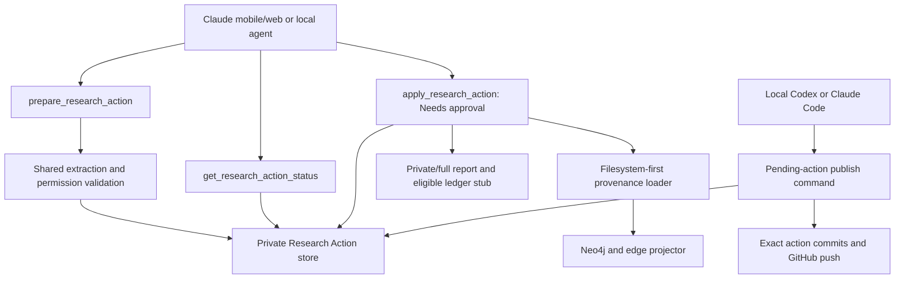
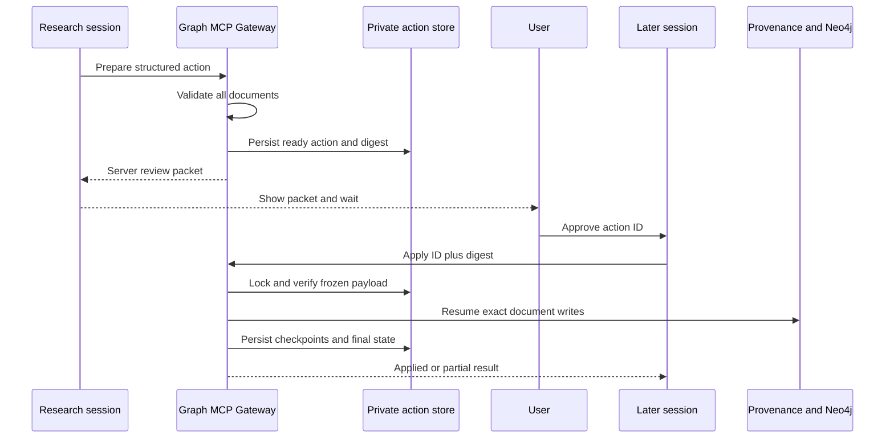
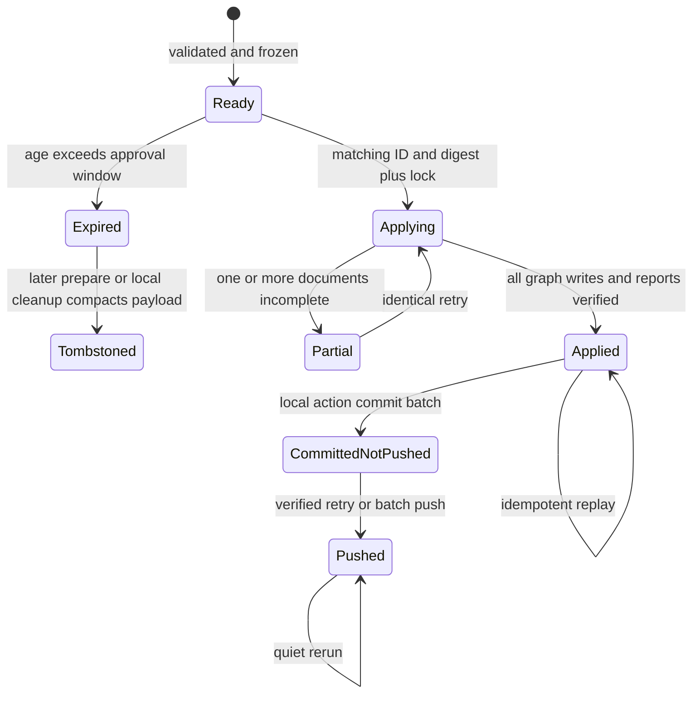

# Mobile Research Action Launch - Plan

## Goal Capsule

- **Objective:** Let a phone research session prepare a versioned Research Action, show a server-verified review packet, wait for explicit user approval, apply that exact version to the graph, and leave durable provenance that either local Codex or Claude Code can later commit and push.
- **Authority:** Current user decisions override the older remote-finalize design; `AGENTS.md` remains the project-memory authority; extraction and source-trace rules remain authoritative for evidence quality.
- **Execution profile:** Security-sensitive cross-interface feature with persistent files and graph writes; implement proof-first around state, idempotency, permission routing, and Git recovery.
- **Stop conditions:** Stop rather than guess if the implementation would require remote Git credentials, silently load a different action digest, expose `local_only` content in Git, or depend on provider-specific chat history.
- **Tail ownership:** `ce-work` owns implementation, tests, review, commits, and the local rollout proof; changing the Claude connector permission settings remains an explicit deployment step because it is external account state.

---

## Product Contract

### Summary

The mobile intake flow becomes a durable two-phase Research Action: prepare and review without graph mutation, then apply the exact server-owned version after explicit approval. Graph growth remains immediate; Git commit and push move to a local maintenance command usable from either Codex or Claude Code.

### Problem Frame

The current remote tools can load one document at a time, while the action report and Git finalization happen afterward. This makes a multi-document research decision depend on chat-held `doc_ids`, gives the user no immutable whole-action artifact to approve, and leaves the only complete finalize path disabled because a leaked connector bearer URL would gain access to local Git credentials.

The user's highest-value loop is mobile research intake because every accepted source compounds the graph's future usefulness. Lane Memo and investment advice remain important but episodic; they must not delay this accumulation loop.

### Actors

- A1. **User:** reviews the action packet, discusses concerns, explicitly approves or leaves the action pending, and periodically opens a local session to publish accumulated records.
- A2. **Research session:** Claude mobile/web, entitled ChatGPT web with the same full-MCP app, local Claude Code, or local Codex performs research and extraction using the session model and shared rules.
- A3. **Graph MCP Gateway:** prepares server-owned actions, exposes safe status, and applies an approved digest to local provenance and Neo4j.
- A4. **Local maintenance session:** Codex or Claude Code in the same repository commits one finalized Research Action per commit and pushes the verified batch.
- A5. **Neo4j and repository ledger:** persistent research memory and replayable evidence record.

### Requirements

#### Prepare and review

- R1. A research session can submit one bounded multi-document action containing structured report fields, extraction payloads, raw-storage inputs, and storage permissions; the server assigns the action ID.
- R2. Preparation validates every document with the same schema, vocabulary, URL, permission, size, and no-clobber rules as graph loading, but performs no graph, public-ledger, commit, or push mutation.
- R3. A prepared action is frozen by a canonical digest and persisted under the ignored private action store so another session or provider can resume it by action ID.
- R4. The server returns a deterministic frozen review packet generated from validated structured fields and server-derived document metadata; the packet identifies the action, digest, prepared/expiry timestamps, documents, findings, counterevidence/gaps, and approval instruction. Current age/state/recovery remain separate status fields so the packet shown after apply is byte-identical to the packet approved at prepare. Actual graph conflict IDs are appended only after apply computes them.
- R5. Ready actions remain reviewable for 30 days; applying an expired action fails closed and asks for a fresh preparation. A later prepare call or explicit local cleanup compacts an expired, never-applied payload into a tombstone that retains only safe metadata and its digest; the status tool itself remains read-only. A successfully applied action also discards its duplicated raw/extraction bodies after graph-completion receipts and report paths are verified, retaining the review fields, digest, document manifest, and execution receipts.

#### Approval and apply

- R6. Mobile protocol waits for explicit user approval of the displayed action ID before invoking the apply tool, and the apply tool remains configured as a native **Needs approval** capability.
- R7. Apply requires the action ID and full digest. For a nonterminal action it recomputes the normalized stored payload digest; for a compacted applied action it compares the argument with the retained digest and verifies durable receipts before returning the original result. It rejects stale, mismatched, tampered, expired, or concurrently executing actions before any new graph mutation.
- R8. Applying the same action is idempotent: completed documents are not duplicated, a lost response can be recovered through status, and a second completed call returns the original result.
- R9. Multi-document apply records per-document completion after each verified graph write; a recoverable graph failure leaves an explicit partial state and the same action can resume without changing its digest.
- R10. A completed action writes a server-rendered intake record. Repo-eligible-only actions receive a full ledger report; actions containing `local_only` material keep the full report private and expose at most a server-generated redacted ledger stub for repo-eligible documents.
- R11. No remotely callable Research Action tool executes Git commands or exposes Git credentials.

#### Cross-session operation and local publishing

- R12. Status-by-exact-ID returns the frozen rendered review packet, state, digest, and recovery details but never raw bodies or extraction JSON. List mode returns only bounded summary rows (ID, title, state, age, digest prefix, counts, next action) and no client-authored report prose.
- R13. Action records, not chat history, are the cross-platform handoff contract: Claude- or ChatGPT-web-created actions can be resumed by local Codex/Claude Code and vice versa when both can reach the same machine.
- R14. A local maintenance command discovers applied, uncommitted actions, commits each action's exact eligible paths separately, and pushes the verified batch only from `master` with an empty index and a verified HEAD relationship to `origin/master`. Unrelated unstaged or untracked work may exist but is never staged, modified, or included.
- R15. Push failure preserves committed action receipts; retry verifies ancestry and exact path scope before pushing and never sweeps unrelated commits or working-tree files.
- R16. The session-start digest reports ready-for-approval, partial-apply, uncommitted, and committed-not-pushed Research Action counts without making local hooks the primary notification channel.

#### Compatibility and operations

- R17. The existing direct `load_extraction` primitive remains available for already-approved weekly/local flows, but the mobile protocol uses prepare/status/apply and no longer exposes remote `finalize_research_action`.
- R18. Research and extraction use the active Claude/Codex session by default; the MCP server makes no LLM API call and this feature introduces no model-provider dependency.
- R19. MCP tool annotations describe read-only, additive, and idempotent behavior for compatible clients, but authorization and state validation do not rely on those hints.
- R20. The Python MCP dependency is bounded to the stable v1 line used by the repository until the planned v2 breaking release is deliberately migrated.
- R21. Research Action records carry a schema version and unknown major versions fail closed. The service accepts at most 50 nonterminal actions and 100 MiB of nonterminal staged payloads; exceeding either limit returns safe cleanup/publication guidance instead of accepting more staging.
- R22. Unscoped/list responses, exceptions, and service logs never echo raw bodies, extraction JSON, bearer values, or complete local-only report prose. Prepare and exact-ID status necessarily return the structured review prose to the authenticated research session, but still never return raw bodies or extraction JSON. The private action root is ignored by Git, not served as static content, and relies on the local OS user boundary rather than treating `.gitignore` as access control.

### Key Flows

- F1. **Phone research to approval:** A2 traces and researches a lead, prepares the complete action, shows A1 the server review packet, waits for discussion or approval, then invokes apply for the exact ID and digest behind one native approval prompt.
- F2. **Cross-session resume:** A1 opens a different supported session, supplies the action ID or asks for pending actions, reviews the safe status packet, and continues approval or recovery without needing the original chat transcript.
- F3. **Partial apply recovery:** one document succeeds and a later graph write fails; the action records partial state, status explains the failed document, and an identical retry resumes remaining work.
- F4. **Periodic local publish:** A1 opens local Codex or Claude Code and asks to publish pending intake; A4 verifies `master`, commits each applied action's exact ledger paths, pushes once, and records the result in private action state.

### Acceptance Examples

- AE1. Given a two-document action prepared on Claude mobile, when the user approves its displayed ID and digest, then one native approval applies both exact documents, writes one action record, and status reports `applied` without any Git command running remotely.
- AE2. Given a prepared action whose digest argument differs by one character, when apply is called, then no provenance file, report, or graph write occurs and status remains ready.
- AE3. Given a lost tool response after the first document was written, when another session queries status and retries the same action, then the first document remains singular and remaining documents complete.
- AE4. Given an action mixing `repo_full` and `local_only`, when it completes, then the full report is private, the repo ledger contains no client-authored text derived from the local-only document, and only eligible document paths can later be committed.
- AE5. Given two applied actions and unrelated unstaged/untracked work, when the local maintenance command runs from synchronized `master` with an empty index, then it creates two action-scoped commits, leaves unrelated work untouched, and performs one push.
- AE6. Given an action created in Claude and its ID pasted into local Codex, when Codex queries it, then Codex receives the same digest, review metadata, state, and recovery instruction but no raw source body.

### Success Criteria

- A phone-originated action reaches `applied` through one action-level native approval and is visible from a later local session by ID.
- Repeated, concurrent, stale, mismatched, and partial calls have deterministic states with no duplicate graph evidence or overwritten provenance.
- Remote tool enumeration contains prepare/status/apply and contains no Git-push tool.
- A local batch publish proves one commit per applied action, exact path scope, unrelated-file preservation, push-failure recovery, and a quiet rerun after success.

### Scope Boundaries

#### Included

- Ad hoc phone/web research intake, cross-session action state, graph apply, local provenance, local publish maintenance, connector protocol, dependency pinning, and operational documentation.

#### Deferred to Follow-Up Work

- Weekly-scan PR approval migration onto Research Actions, generic X/trending source expansion, OAuth 2.1 replacement for the current path bearer, watchdog/health monitoring, and a ChatGPT mobile MCP connector.
- Lane Memo workflow extraction, portfolio wiring, and investment Decision Briefs except for small shared-contract fixes encountered in touched files.

#### Outside This Product's Identity

- Automatic real-money trading, approval-free graph writes, remotely callable Git push, automatic synchronization of provider chat histories, or purchasing another model API for interactive research.

---

## Planning Contract

### Key Technical Decisions

- KTD1. **Mobile compounding loop first.** `(session-settled: user-directed — chosen over parallel Lane Memo and investment-advice delivery: graph growth compounds continuously while decision reports are episodic.)` This plan does not widen into the decision layer.
- KTD2. **Session inference remains the default.** `(session-settled: user-approved — chosen over purchasing another API path: the active Codex or Claude session already supplies the research and extraction model.)` MCP remains deterministic execution only.
- KTD3. **Two-phase server-owned Research Action.** Preparation validates and freezes the whole action; apply consumes only the frozen ID and digest. A workflow-level tool is justified because approval must cover a multi-document safety-critical unit rather than individual low-level writes.
- KTD4. **No Git capability in remote MCP.** `(session-settled: user-approved — chosen over MCP-triggered commit and push: immediate graph growth is preserved without escalating a leaked connector bearer to local Git credentials.)` The existing remote finalize tool is removed from enumeration rather than merely left behind a deploy flag.
- KTD5. **Durable artifact portability, not transcript portability.** `(session-settled: user-approved — chosen over platform-specific conversation state: the user expects Codex or Claude to resume the same action while accepting that chat histories do not synchronize.)`
- KTD6. **Private filesystem state, not a new database.** Action volume is single-user and low; canonical JSON with atomic replace, exclusive locks, content digest, and bounded listing is sufficient and keeps recovery inspectable.
- KTD7. **Per-document checkpoints inside an action.** Neo4j and filesystem writes cannot share a transaction, so apply records verified completion after each document and treats partial completion as a resumable state instead of pretending the action is atomic.
- KTD8. **Permission-sensitive report routing.** Client-authored analytical text is eligible for the repo only when every action document is repo-eligible. Mixed actions receive a private full report plus a server-only ledger stub that contains no free-form client text.
- KTD9. **One commit per action, one push per maintenance batch.** Private action state binds each commit to exact ledger paths; retry accepts only an ahead-of-`origin/master` chain fully explained by pending action receipts.
- KTD10. **Tool annotations are descriptive only.** Official MCP guidance treats annotations as untrusted hints, so client approval, bearer authentication, digest checks, path containment, and least privilege remain the enforcement layers.
- KTD11. **Pin stable MCP v1.** The installed SDK is `mcp 1.28.1`; official SDK guidance says v2 is a breaking line and recommends an upper bound before stable release. Use a v1-compatible bound and defer v2 migration.
- KTD12. **Digest is integrity, not identity.** The action digest prevents stale or mutated approval but does not replace authentication. Possession of the existing Cloudflare path bearer remains inside the graph-write trust boundary; this slice reduces blast radius by removing remote Git and bounding staging, while OAuth or short-lived audience-bound tokens remain follow-up security work.

### Assumptions

- Claude mobile/web remains the current phone-capable surface with the configured Graph MCP connector. ChatGPT custom MCP apps are currently web-only and full write access is plan-dependent; local Codex and Claude Code reach the same artifacts through the repository and local services.
- Ready actions expire after 30 days, contain at most 10 documents, and are bounded to 5 MiB of canonical UTF-8 bytes; at most 50 nonterminal actions and 100 MiB of nonterminal staged payload are accepted. Expired ready payloads compact to metadata-only tombstones during later prepare or explicit local cleanup, while applied actions retain no duplicated raw/extraction bodies. These values are safety limits rather than investment-policy parameters.
- Preparation may create duplicate ready actions after a lost response, but listing by slug, time, and digest makes them visible; apply idempotency is the cardinal requirement.
- Existing weekly automation may keep calling direct `load_extraction` until its separate migration, so that primitive is retained and regression-tested.
- Connector tool-list refresh and permission assignment may require a manual Claude settings step after the server restarts.

### High-Level Technical Design

#### MCP and canonical action contract

The externally callable signatures are fixed for v1:

```text
prepare_research_action(action_json: str)
get_research_action_status(action_id: str = "")
apply_research_action(action_id: str, action_digest: str)
```

`action_json` parses to this client contract; the server rejects unknown/extra fields at every object level so a misspelling cannot silently disappear:

```json
{
  "schema_version": "research-action/v1",
  "action_slug": "lowercase-safe-slug",
  "report": {
    "title": "...",
    "why_now": "...",
    "findings": "...",
    "search_summary": "...",
    "l8_notes": "...",
    "counterevidence_and_gaps": "..."
  },
  "documents": [
    {
      "extraction_json": "{...intermediate-format object...}",
      "storage_permission": "repo_full | repo_excerpt | local_only",
      "permission_basis": "...",
      "raw_text": "optional and mutually constrained by permission",
      "raw_url": "optional sanitized canonical URL",
      "raw_excerpt": "optional bounded excerpt"
    }
  ]
}
```

All six report strings are required and nonblank; each is bounded and their combined rendered report remains within the existing 200,000-character report limit. Each document reuses the exact direct-load validation and raw-input policy. The server parses and normalizes extraction objects, sanitizes URLs, derives document IDs/titles/counts, and digests the normalized validated payload—not the caller's original JSON spelling. Review rendering appends the server-derived document manifest; apply rendering additionally appends actual graph conflict IDs and execution receipts. The persisted server record adds server-owned ID, timestamps, state, expiry, locks, per-document checkpoints, report paths, and Git publication state outside the immutable digest payload.

#### Component topology



#### Cross-session approval sequence



#### Action lifecycle



### System-Wide Impact

- **Agent parity:** Claude mobile/web, entitled ChatGPT web, local Claude Code, and local Codex share action status and identifiers; only surfaces with the MCP connector can perform remote apply, and transcripts remain provider-local.
- **Data lifecycle:** private action payloads become the temporary approval source, extraction/raw files remain replay ground truth, Neo4j remains persistent research memory, and Git remains the delayed audit mirror.
- **Security:** remote capability shrinks by removing Git; private state now contains raw staged payloads and therefore inherits strict ignore, path-containment, size, and status-redaction requirements.
- **Operations:** the MCP service must restart and the Claude connector must refresh its tool list; `apply_research_action` must be set to Needs approval while status and preparation may be allowed.

### Risks and Mitigations

- **Stale or tampered approval:** bind apply to full canonical digest, recompute from stored payload, expire ready actions, and show digest/time in every review packet.
- **Concurrent apply or crash:** use an exclusive action lock, per-document persisted checkpoints, stale-lock handling, and idempotent graph/provenance primitives.
- **Private content leakage:** keep action payloads ignored, never return raw bodies from status, route mixed/full reports privately, and generate any repo stub solely from server-verified metadata.
- **Git recovery sweeping unrelated work:** require `master`, empty index, a verified HEAD/origin relationship, exact action pathsets, one action receipt per commit, and ancestry/path verification before retry push; tolerate but never stage unrelated unstaged/untracked work.
- **SDK churn:** bound v1 now and plan a deliberate v2 migration rather than accepting an unreviewed major upgrade.
- **Connector cache drift:** document tool count and permission mapping, expose an automated enumeration assertion, and require one real mobile smoke before declaring external rollout complete.
- **Unauthorised staging fills private disk:** enforce per-action, active-count, and aggregate staged-byte limits; compact expired ready payloads to tombstones and fail closed at quota.
- **Digest mistaken for authentication:** document the bearer trust boundary explicitly; retain client approval as a UX safety gate without claiming it is server authorization, and track OAuth/short-lived tokens separately.
- **Sensitive payload disclosure through diagnostics:** prohibit payload-bearing exceptions/logs, keep list mode metadata-only, return the review packet only for an exact action ID, and treat OS account access—not Git ignore rules—as the private-store boundary.

---

## Implementation Units

### U1. Research Action store and review rendering

- **Goal:** Add the private, server-owned action artifact, lifecycle, digest, safe status view, locking, and permission-sensitive report rendering.
- **Requirements:** R1, R3-R5, R10, R12-R13, R21-R22
- **Dependencies:** None
- **Files:** `mcp_server/research_actions.py`, `.gitignore`, `CONCEPTS.md`, `tests/test_research_actions.py`
- **Approach:** Store one versioned atomic JSON record per action under an ignored private root. Separate immutable approval payload from mutable execution metadata; compute the digest only from the normalized immutable payload. Reject unknown major versions, enforce active-count/aggregate-byte quotas, compact expired ready payloads during prepare or explicit local cleanup, and compact successfully applied records after their durable receipts are verified. Exact-ID status remains read-only and returns the review packet; list mode remains read-only and returns metadata only. Neither path returns raw or extraction bodies. Route full and redacted reports based on the strictest document permission and sanitize all error/status envelopes.
- **Execution note:** Start with failing lifecycle, digest-tamper, safe-status, and permission-routing tests before implementing storage.
- **Patterns to follow:** `mcp_server/intake.py` path containment, canonical JSON, no-clobber publication, UTC timestamps, and structured return values.
- **Test scenarios:**
  - A valid two-document payload creates a unique ready action with stable digest, timestamps, expiry, and review packet.
  - Empty/oversized fields, more than 10 documents, duplicate doc IDs, invalid slug, and unsupported state fail before publication.
  - Reordering JSON keys preserves digest; changing one report or document field changes it.
  - Status and pending-list output contain IDs, safe metadata, counts, state, and recovery hints but no raw text, source quotes, or extraction JSON.
  - A stored payload edited after preparation is detected by digest recomputation.
  - Concurrent lock acquisition yields one owner; stale and live lock behavior is deterministic and containment-safe.
  - Repo-only, local-only, and mixed permissions select full ledger, private report, and redacted stub behavior respectively.
  - Active-count and aggregate-byte quota failures leave no partial action; expired-ready compaction frees capacity while preserving ID, digest, timestamps, and terminal status.
  - Unsupported major schema versions cannot be listed as actionable or applied.
  - Applied-state compaction removes duplicated raw/extraction bodies but preserves idempotent status/apply replay, report paths, manifest, and digest.
  - Exact-ID status includes all six review fields; list mode and every error/log capture contain none of their prose, raw payloads, bearer values, or extraction JSON.
- **Verification:** Focused tests prove state transitions and inspect every published path and returned field for containment and leakage.

### U2. Shared validation plus prepare and status MCP tools

- **Goal:** Reuse one extraction-validation contract for direct load and Research Action preparation, then expose prepare/status without graph mutation.
- **Requirements:** R1-R5, R12, R17-R22
- **Dependencies:** U1
- **Files:** `mcp_server/graph_mcp.py`, `mcp_server/research_actions.py`, `mcp_server/intake.py`, `requirements.txt`, `tests/test_intake.py`, `tests/test_research_actions.py`, `tests/test_graph_mcp_manual.py`
- **Approach:** Extract the pure parse/schema/permission/URL/size preparation phase from the existing load implementation. The prepare tool validates the entire action before writing one private action record; status accepts an ID or returns a bounded pending summary. Add accurate MCP annotations and pin the stable v1 SDK line.
- **Execution note:** Characterize current `load_extraction` rejection and warning behavior first; the refactor must not change its public results.
- **Patterns to follow:** Existing `_load_extraction_impl` fail-closed error envelopes and `get_source_trace_manual` readable missing-resource behavior.
- **Test scenarios:**
  - Direct load characterization stays unchanged for valid, schema-invalid, permission-invalid, and oversized inputs.
  - Prepare validates multiple documents with the same rules but monkeypatch proof shows no driver, provenance publication, report, or Git function is called.
  - One bad document rejects the complete preparation and leaves no action file.
  - Status retrieves a Claude-created action by ID and list mode returns only recent actionable records.
  - Tool enumeration exposes prepare/status with correct descriptive annotations and does not treat annotations as an authorization gate.
  - The dependency specification accepts installed v1.28.1 and excludes v2.
- **Verification:** Focused intake and action tests pass, and an imported MCP server enumerates the expected read/write surface without starting a network listener.

### U3. Exact, resumable Research Action apply

- **Goal:** Apply one frozen action behind one native approval, checkpoint partial work, and write its permission-safe records without Git.
- **Requirements:** R6-R11, R13, R17-R19, R21-R22
- **Dependencies:** U1, U2
- **Files:** `mcp_server/graph_mcp.py`, `mcp_server/research_actions.py`, `mcp_server/intake.py`, `tests/test_research_actions.py`, `tests/test_intake.py`
- **Approach:** The apply tool reloads and locks the action, verifies ID/digest/age/state, then invokes the existing idempotent document loader in declared order. Persist each result before continuing. Complete only after graph verification, conflict projection, and report publication; return partial state otherwise. Remove remote finalize from MCP registration while retaining only any internal compatibility code still covered by tests.
- **Execution note:** Implement digest/expiry/concurrency rejection tests first, then partial-resume integration proof, then the happy path.
- **Patterns to follow:** Graph completion receipts in `mcp_server/intake.py`, exact affected-edge projection in `mcp_server/graph_mcp.py`, and recoverable `pending_graph` semantics.
- **Test scenarios:**
  - Matching ready action applies all documents, reports conflicts without resolving them, writes the correct report/stub, and never calls a Git function.
  - Wrong digest, expired action, tampered payload, unknown ID, and active lock all fail before the first driver is created.
  - First document succeeds and second returns `pending_graph`; status records partial state and retry resumes without duplicating the first document.
  - Lost final response followed by a repeat call returns the original applied result and does not allocate another report.
  - All graph writes succeed but report publication fails; retry publishes only the missing report/state and never reloads a completed document.
  - Mixed/local-only actions cannot place private free-form text in repo roots.
  - Remote tool enumeration contains apply and no `finalize_research_action`; direct load remains available for legacy weekly flow.
- **Verification:** Integration tests exercise real private files and action transitions with the graph boundary faked only at the driver seam; no Git subprocess is reachable from any exposed remote action tool.

### U4. Local pending-action commit and push recovery

- **Goal:** Let either local agent safely publish accumulated applied actions with one commit per action and one verified push.
- **Requirements:** R14-R16, R22
- **Dependencies:** U1, U3
- **Files:** `mcp_server/intake.py`, `mcp_server/research_actions.py`, `mcp_server/action_publisher.py`, `scripts/commit_pending_intake.py`, `crons/weekly_scan_digest.py`, `tests/test_action_publisher.py`, `tests/test_research_actions.py`, `tests/test_weekly_scan_digest.py`
- **Approach:** Discover commit-eligible action receipts from private state, resolve paths server-side, require `master`, an empty index, and an expected HEAD/origin relationship, commit exact paths in action order, and push the resulting explained chain once. Unrelated unstaged/untracked work is reported but untouched. Commit messages/trailers bind each commit to the action ID and digest. On failure, persist commit hashes and retry only when every ahead commit maps to the recorded action/pathset; if a process dies after commit but before receipt update, reconstruct that receipt from the trailer plus exact pathset.
- **Execution note:** Use temporary repositories and a local bare remote; prove failure and recovery before the production command exists.
- **Patterns to follow:** `git_preflight`, argv-list subprocesses, exact ledger prefixes, and digest's graceful degradation when Git is unavailable.
- **Test scenarios:**
  - Two applied actions plus an unrelated file produce two commits, one push, and leave the unrelated file untouched.
  - Local-only action is marked no-Git-required and never creates an empty commit.
  - Non-master, staged index, behind/diverged head, unexplained ahead commit, modified tracked target path, or path mismatch fails before staging; unrelated unstaged/untracked paths remain untouched and do not block a safe exact-path batch.
  - Push failure leaves both commits and action receipts; a later verified retry pushes the same chain without recommitting.
  - Mid-batch commit failure preserves prior commits, records the remaining action as pending, and resumes without duplicate commits.
  - A crash after `git commit` succeeds but before private receipt update is recovered from the action trailer and exact changed paths without producing a duplicate commit.
  - A successful rerun is quiet; digest counts ready, partial, uncommitted, and unpushed actions correctly.
- **Verification:** Temporary-repository history proves commit boundaries and exact paths; the command has a dry-run/status mode and returns nonzero on unsafe or incomplete publication.

### U5. Cross-platform protocol, rollout, and regression proof

- **Goal:** Make Claude mobile/web, entitled ChatGPT web, local Claude Code, and local Codex follow the same action protocol and make deployment state visible.
- **Requirements:** R6, R11-R13, R16-R22
- **Dependencies:** U2, U3, U4
- **Files:** `prompts/intake_protocol.md`, `docs/remote-access-architecture.md`, `AGENTS.md`, `crons/weekly_scan_prompt.md`, `tests/test_graph_mcp_manual.py`, `tests/test_weekly_scan_digest.py`
- **Approach:** Replace remote load/finalize instructions with prepare-review-approve-apply, document that action artifacts cross platforms while transcripts do not, add the local phrase-to-command handoff for “補提交入圖,” and keep weekly PR behavior explicitly legacy until migrated. Document connector refresh and permission mapping: prepare/status allowed, apply and legacy direct load Needs approval, no finalize tool.
- **Execution note:** This unit changes prompt-driven behavior; verify exact protocol strings and run a realistic tool-sequence smoke rather than relying on prose review alone.
- **Patterns to follow:** The self-contained remote rulebooks and dual-agent authority contract in `AGENTS.md`.
- **Test scenarios:**
  - Extraction rules instruct a phone session to prepare, display the returned packet, wait for explicit action approval, and apply the exact digest.
  - Rules forbid remote Git and explain local Codex/Claude Code publication without implying transcript synchronization.
  - Weekly prompt retains its PR gate and does not accidentally call the new apply path before its separate migration.
  - Tool documentation and imported enumeration agree on names, count, approval class, and side effects.
  - Session digest wording differentiates approval pending, graph partial, commit pending, and push pending.
- **Verification:** Full pytest passes, agent-skill synchronization check is clean, and the local MCP process restarts with the new tool list. External rollout requires one Claude mobile prepare/status/apply smoke and confirmation that apply remains Needs approval.

---

## Verification Contract

| Gate | Applies to | Done signal |
|---|---|---|
| Focused Research Action tests | U1-U4 | Lifecycle, leakage, validation, apply recovery, and Git batch scenarios pass in temporary roots and repositories. |
| Existing intake regression suite | U2-U4 | All current direct-load, provenance, graph-readiness, finalize-internal, and digest behavior remains green or is intentionally updated for removed remote exposure. |
| MCP enumeration and protocol tests | U2, U3, U5 | Imported server exposes prepare/status/apply, retains direct load, and exposes no remote finalize; rulebook matches the surface. |
| Full pytest suite | All | Repository test suite completes with no regression. |
| Dual-agent skill sync check | U5 | `scripts/sync_agent_skills.py --check` reports no drift. |
| Local service smoke | U5 | MCP starts under the repository virtual environment, read tools respond, and no API key is required by the server. |
| Claude mobile rollout smoke | U5 | One disposable action is prepared, displayed, approved once, applied, queried from another session, and left pending for local Git publication. |

---

## Definition of Done

- The server owns a frozen, digest-bound Research Action that is safe to review and resume across supported sessions.
- The Mobile Research Action protocol performs no graph mutation before action-level user approval, and apply cannot switch the approved payload. The retained legacy `load_extraction` primitive does not claim this action-level invariant until weekly scan is migrated.
- Partial, concurrent, expired, tampered, repeated, and response-loss paths are tested and recoverable or fail closed.
- Repo/private report routing cannot leak local-only client text into Git-eligible paths.
- No remotely exposed tool can commit or push; the old remote finalize capability is absent from enumeration.
- A local Codex or Claude Code session can publish all safe pending actions with exact per-action commits and verified push recovery.
- Documentation, digest, tool annotations, dependency bounds, and actual MCP enumeration agree.
- Focused and full tests pass, abandoned experimental code is removed, and the final diff receives structured code review.

---

## Appendix

### Sources and Research

- `docs/brainstorms/2026-07-13-remote-intake-provenance-requirements.md` — original per-action provenance and Git-ledger requirements, superseded here only where the user removed remote Git.
- `docs/plans/2026-07-15-008-feat-unified-workplan-plan.md` — implemented filesystem-first intake, graph receipts, exact manifest, report, and disabled finalize foundations.
- `docs/remote-access-architecture.md` — prior seven-tool surface and unresolved remote-finalize P0 that this plan replaces with a nine-tool, no-remote-Git surface.
- `docs/solutions/architecture-patterns/mcp-connector-route-past-cloud-sandbox-egress.md` — self-contained rulebook and connector approval lessons from real phone intake.
- [MCP Security Best Practices](https://modelcontextprotocol.io/docs/tutorials/security/security_best_practices) — authorization, token theft, least privilege, and server-side enforcement guidance.
- [MCP tool annotations guidance](https://blog.modelcontextprotocol.io/posts/2026-03-16-tool-annotations/) — annotations are risk vocabulary rather than enforcement.
- [Official MCP Python SDK](https://github.com/modelcontextprotocol/python-sdk) — v1 remains current stable while v2 is a breaking line; dependency upper-bound guidance shaped KTD11.
- [OpenAI: Developer mode and MCP apps in ChatGPT](https://help.openai.com/en/articles/12584461-developer-mode-apps-and-full-mcp-connectors-in-chatgpt-beta) — custom MCP apps are currently web-only; full write MCP is plan-dependent and tool snapshots require explicit refresh.

### Product Contract Preservation

The origin's per-action provenance, exact-path ledger, permission, and recoverability intent is preserved. The user changed two substantive choices in this session: approval now binds a prepared whole action, and Git commit/push is local-only rather than remotely callable.
