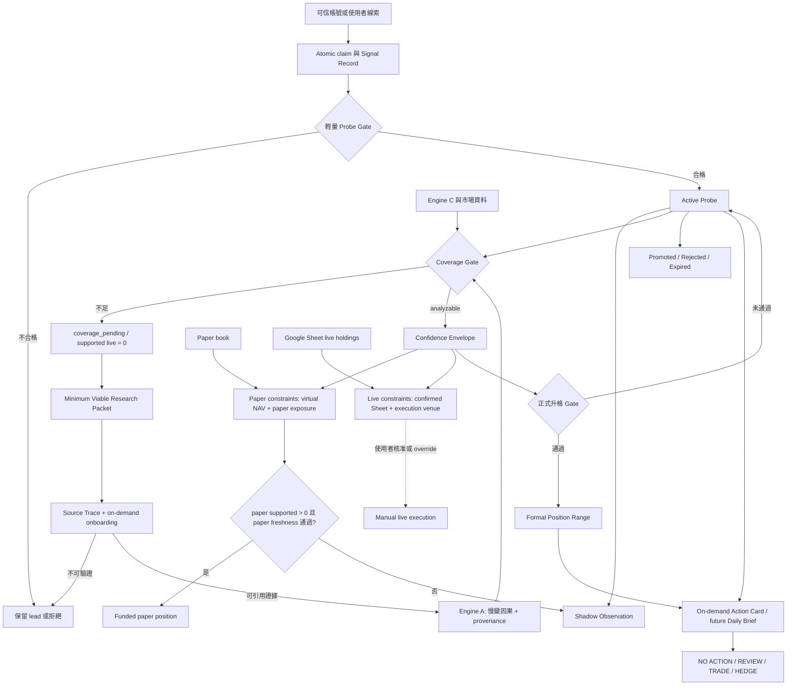
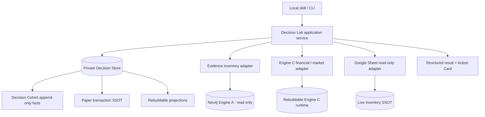
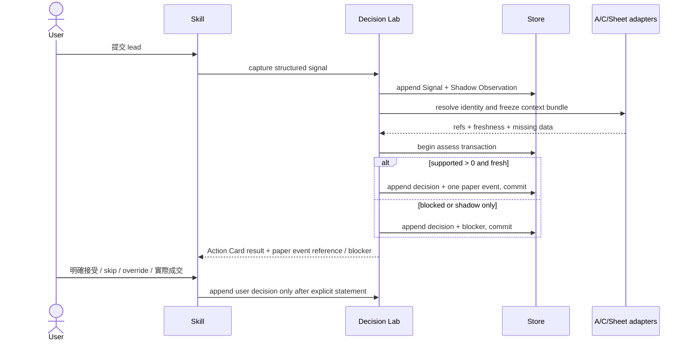
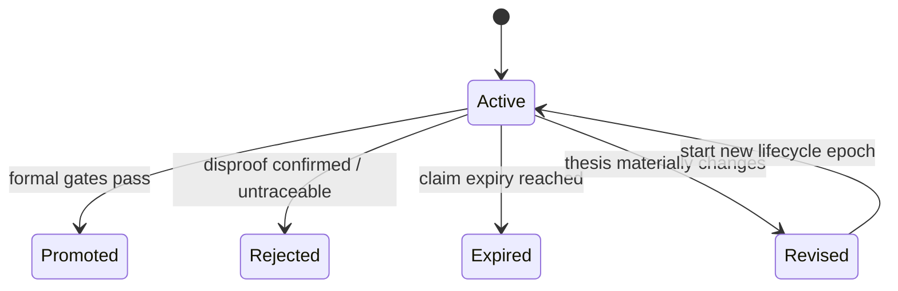

# Action-Oriented Alpha Decision Lab - Plan

## Goal Capsule

- **Objective:** 將可信網路線索、研究記憶與持倉狀態轉成可稽核的 `NO ACTION / REVIEW / TRADE / HEDGE` 建議、受支持的部位區間，以及可持續驗證的前瞻決策紀錄。
- **Product authority:** 系統負責提出有證據與風險邊界的投資決策；使用者保留最終接受、縮小或覆寫建議及手動下單的權力。Google Sheet 是 live inventory 唯一真相，paper ledger 是 counterfactual portfolio 唯一真相。
- **Execution profile:** 第一版完成本機手動 Signal → Shadow Observation → Coverage Gate／Minimum Viable Research Packet → Confidence Envelope／Probe sizing → funded paper position → on-demand Action Card 的閉環；排程 Daily Brief、自動 harvest 與遠端 decision MCP 延後。
- **Authority hierarchy:** Neo4j 圖譜資料不可清空、重建或由本功能寫入；Engine C runtime 可永久重建。Paper／Decision Store 只在本次 bootstrap cutover、第一筆非 fixture event 前可重建，之後 append-only facts 必須 backup／restore。Schema、policy 與 fixtures 進 Git，個人 runtime truth 不進 Git。
- **Stop conditions:** 任一實作若需降低 graph admission／formal promotion 標準、複製 live 或 paper position truth、猜測缺失的 ticker／price／FX，或修改 Neo4j 存量資料，必須停止並回報。
- **Tail ownership:** 完成者負責測試、runtime rebuild／restore 驗證、skill 轉接層同步、Neo4j read-only proof與 fixed-fixture fingerprint一致；不在本計畫內自動下單、推送 PR或擴充遠端 MCP。

---

## Product Contract

### Summary

StockBotv2 將以共用 Decision Lab application service 把手動線索轉成不可變 Shadow Observation，再依研究覆蓋、五軸 Confidence Envelope、投資政策與 lane-specific portfolio context 產生 Action Card。只有 Coverage Gate、paper-lane market/FX freshness通過且 `paper_max_supported_position > 0` 時才建立 funded paper position；第一版不自動交易，也不建立排程或遠端 decision surface。

### Problem Frame

目前系統能建立高品質圖譜、追溯證據並擋住研究品質不足的 thesis，但嚴格的二元 Gate 讓早期線索只能停在研究或被完全排除。這會錯過使用者最有可能取得差異化資訊的來源：少數可信帳號提出、尚未被完整公開資訊確認的產業 claim。

反方向的風險是把技術合作、政策題材、上市消息與商業訂單線性相加，形成「很多好消息所以值得加碼」的錯覺。系統需要允許早期參與，同時讓最弱的因果環節限制資本，而不是讓想像力繞過證據紀律。

現有 prospective paper portfolio 只記錄模擬交易，無法涵蓋所有合格但未實際交易的訊號。因此它可以衡量已選標的表現，卻還不能分離來源選股、系統驗證與使用者 discretionary override 各自帶來的效果。

### Key Decisions

- **產品以投資行動為輸出，不以研究庫完整度為終點。** `(session-settled: user-directed — chosen over 純研究記憶庫：使用者要系統根據研究記憶提出可控的高-alpha 投資決策。)` 圖譜仍是 research harness，不是產品的最終答案。
- **嚴格 Gate 保留，但分工為知識准入與正式升格；資本許可改為分層。** `(session-settled: user-directed — chosen over 二元投資 Gate：弱但可驗證的訊號可以取得小額風險預算，最終是否接受仍由使用者決定。)` 未追源社群 claim 仍不得污染圖，未通過正式 Gate 的標的仍不得冒充 formal position。
- **Probe 是研究狀態，Shadow Observation、paper 與 live 是獨立的觀測／執行路徑。** `(session-settled: user-approved — chosen over 將 paper 等同 Probe、live 等同正式部位：研究成熟度不能由是否占用資本表示。)`
- **所有通過輕量 claim gate 的訊號都建立 Shadow Observation；funded paper position 有條件建立。** `(session-settled: user-approved — chosen over 每個訊號都占用虛擬 NAV 或只記錄實際交易：完整 cohort 需要零資本觀測，但 paper book 只代表系統真正支持的 counterfactual 部位。)` Coverage Gate、paper market/FX freshness 與正的 paper supported position 必須全部通過，funded paper 才能寫入 paper ledger；live freshness 另算。
- **Engine A 維持窄邊界。** `(session-settled: user-approved — chosen over 將 Probe、持倉與市場狀態塞進圖譜：Neo4j 只保存慢變的產業因果結構及其 provenance，決策與時序資料留在各自權威。)`
- **Whitelist 是研究注意力與自動化權限，不是證據背書。** `(session-settled: user-approved — chosen over 把可信帳號當高 evidence tier：來源狀態只影響 Signal 是否自動 capture 與研究優先序，不能旁路 source-trace 或 formal Gate。)`
- **空圖仍立即建立 Shadow Observation，但 system-supported live range 為零。** `(session-settled: user-approved — chosen over 等完整入圖才記錄訊號或在無研究覆蓋時猜部位：完成 Minimum Viable Research Packet 後系統才可支持正的 live range，人工 override 另行留痕。)`
- **Google Sheet 維持 live inventory 唯一真相，交易保持人工。** `(session-settled: user-directed — chosen over broker automation 或 repo 內第二份 live ledger：使用者會手動下單並維護庫存，系統只讀取、分析與留下決策脈絡。)`
- **每日輸出是 action-first exception brief，而不是每日交易指令。** `(session-settled: user-directed — chosen over 固定頻率交易報告：使用者交易頻率低，但第一眼需要知道是否該交易、檢查、避險或不動。)`

### Actors

- A1. **使用者／投資決策者：** 維護 Signal Source Registry 與 live holdings，接受、縮小或覆寫系統建議，並手動執行交易。
- A2. **研究與決策 agent：** 拆解 claim、調用既有研究與財務引擎、產生 Confidence Envelope、部位區間及行動建議。
- A3. **StockBotv2 持久系統：** 保存證據、thesis 狀態、政策、paper transactions、decision cohort 與 outcome，並顯示資料是否新鮮完整。

### Decision Architecture



非二元化發生在「資本可以承擔多少風險」，不是在「一條主張算不算證據」。Wide loop 不依賴圖譜即可凍結訊號與 shadow outcome；narrow loop 才消耗研究產能。缺乏 Minimum Viable Research Packet 時，系統只能輸出 `SHADOW ONLY / RESEARCH REQUIRED`，不能產生 funded paper position 或正的 supported live range。

### Existing Engine Reuse Contract

| 既有能力 | 現況與權威 | 新產品直接復用 | 需要補上的最小能力 |
|---|---|---|---|
| Engine B intake 方法 | `skills/lead-intake/` 與 `skills/source-trace/` 已定義 atomic claim、追原文、來源 tier 與 graph admission | 作為 claim/provenance gate；推文仍只是 lead，不因開 Probe 就升格為 evidence | Signal Source Registry、Signal Record、claim 去重、輕量 Probe eligibility 與 research-priority queue |
| Research Action／Graph MCP | `mcp_server/research_actions.py` 已提供可核准、可續跑、有 digest 的遠端研究入庫單位 | 復用手機線索進場、人工核准與 evidence 寫入流程 | 讓 decision/probe 引用 Research Action；不得把研究核准誤當交易核准 |
| Company Onboard | `skills/company-onboard/` 已能為圖中不存在的新公司建立研究入口 | 作為 `coverage_pending` Probe 的 on-demand 補圖路徑 | 定義比完整 onboarding 更小的 Minimum Viable Research Packet 與 research work order |
| Engine A／Evidence Manifest | Neo4j、`query/graph_context.py` 與 `thesis/evidence_manifest.py` 已能輸出可追溯 claim、edge、來源獨立性與 promotion blocker | 只保存慢變的產業因果結構、物理／關係瓶頸及 provenance，支援 technical linkage 與反證 | 將 evidence delta 投影成決策輸入；Signal、Probe、持倉、政策、市場時序與 action 不進圖 |
| Lane Memo／Watchlist Gate／thesis lifecycle | `thesis/generate_lane_memo.py`、`thesis/preconditions.py` 與 `thesis/lifecycle.json` 已區分 Research Note、Watchlist 與 review-required 狀態 | 保留為 formal promotion 與 thesis disproof 的嚴格路徑 | 新增獨立 Probe lifecycle，避免和 thesis lifecycle 或 Research Action state 混用 |
| Engine C | `engine_c/checklist.py` 與 financial snapshots 已提供價格、估值、毛利率、稀釋、分析師資訊及五項 Gate | 支援 commercial maturity、financial resilience、valuation/payoff 與 outcome 定價 | 補 benchmark/beta/factor context、資料 freshness；客戶集中度與 backlog 仍可顯示 manual required |
| Investment Policy | `config/investment_policy.json` 是數字 SSOT，`thesis/investment_policy.py` 已算 formal position 與 factor cap | 沿用 versioned policy、NAV cap、high-risk budget 與正式部位計算 | 在同一政策權威下增加可設定的 Probe book cap、單筆 cap、review horizon 與區間計算 |
| Prospective Paper Portfolio | `paper_portfolio/` 已有 append-only event、thesis/policy/price/FX freeze 與 deterministic replay，但現有 tracked CSV 尚未承載實際決策 | 保留 append/replay/correction/reversal domain semantics，只保存 funded paper execution 與事後 P&L | 將 paper events 搬進 transactional private store，以 decision record reference 取代未成熟 Probe 的必填 thesis reference；tracked CSV 改為顯式 export／fixture，不再是 runtime truth |
| Google Sheet inventory | `fetchers/gsheets.py` 已是 read-only adapter，能標準化 ticker、持倉與 bucket，且已接入 investment-research skill | 作為 live holdings 唯一真相，不另建 live positions ledger | 將成本基礎升級為可檢查 freshness 的 mark-to-market NAV、FX、factor exposure 與 beta exposure |
| Health／weekly monitoring | `query/health_audit.py`、thesis freshness 與 weekly digest 已能找出過期 thesis、缺失財務資料和 pending research action | 成為 Daily Brief 的 exception 與 data-quality 輸入 | 新增 `coverage_pending`、research backlog 與每日例外彙整，不複製一套監控真相 |

### Requirements

**Signal 與 Probe intake**

- R1. 系統必須接受使用者提供或 Signal Source Registry 來源產生的線索，並凍結來源、觀測時間、atomic claim，以及當時價格或明確 `missing/unavailable` status；來源狀態只代表值得投入多少研究注意力，不代表 claim 為真。
- R2. 輕量 Probe Gate 必須要求 claim 可歸因、可驗證、有觀測期間或 expiry，並能寫出 disproof；它不得要求先通過正式 Watchlist Gate。
- R3. 每個通過 Probe Gate 的訊號都必須建立不占虛擬 NAV 的 Shadow Observation；只有 Coverage Gate、paper-lane market/FX freshness 與正的 paper supported position 全部通過，才能建立 funded paper position。
- R4. 同一來源或多個來源重複談相同 thesis 時，系統必須更新既有 claim/probe，而不是產生可被誤算成獨立成功樣本的新 Probe。
- R5. 社群原料可以觸發 Probe，但只有依既有 source-trace 規則追回的合格證據才能進 Engine A；Probe permission 不得旁路 graph admission。

**Confidence、Gate 與部位權限**

- R6. 系統必須維持三個不同決策邊界：evidence admission、Probe permission、formal promotion；各邊界的狀態與失敗理由必須可獨立查詢。
- R7. Confidence Envelope 必須分別呈現來源可信度、技術／因果連結、商業成熟度、財務韌性與估值／payoff，不得把不同類型的正面事件直接線性相加。
- R8. 部位權限必須由最弱且必要的因果環節、disproof 狀態與各 lane 投組上限共同約束，分別輸出 `paper_target`、`paper_max_supported_position`、`live_supported_range`、weakest link 與建議 action。
- R9. 使用者可以接受、低於建議區間配置或覆寫 supported cap；高於 cap 的覆寫必須留下當時理由，且不得回寫成系統原始建議。
- R10. Probe 必須有 `active → promoted / rejected / expired` lifecycle；初始 review 採可設定的 48–72 小時範圍，仍可驗證的 claim 可延續至 claim-specific expiry，但 unresolved 期間不得因同一敘事重複加碼。
- R11. Formal position 仍必須通過既有 evidence、L9 前置條件與五項財務核驗，再使用既有 formal sizing policy；Probe lane 不得降低正式部位標準。

**Execution 與持倉真相**

- R12. Shadow Observation、`paper` 與 `live` 必須和研究狀態正交；合格 Probe 強制有 shadow path，funded paper 依系統決策自動且冪等地建立，live execution 只在使用者核准並手動下單後存在。
- R13. Google Sheet 必須維持 live holdings 唯一真相，paper ledger 必須維持 counterfactual transactions 唯一真相；任何衍生報表都不得建立第二份可人工修改的 positions truth。
- R14. 系統必須把既有、無完整系統決策紀錄的真實持股標成 legacy/unclassified；它們可被監控並進入 research probe，但在 thesis 建立前不得收到自動加碼建議。
- R15. Probe 數值必須沿用 versioned investment policy 並可設定；初版可以使用粗略預設，不將百分比最佳化列為產品成立的前置條件。
- R16. 當 live holdings confirmation、價格、FX 或 Engine C snapshot 過期或缺失時，系統必須標示 `DATA NEEDED` 並只封鎖依賴該資料的 lane：Sheet 問題封鎖 live／hedge 精確數量，market／FX 問題同時封鎖 funded paper；不得虛構投組 hedge 數量。

**Action-first monitoring**

- R17. Daily Decision Brief 第一區塊必須直接回答 `NO ACTION / REVIEW / TRADE / HEDGE`、urgency、單一標的行動、投組行動，以及主要變化屬於 alpha 還是 beta。
- R18. Brief 必須涵蓋 position/probe exceptions、alpha delta、beta/factor context、新線索、催化劑／disproof calendar、來源追溯、資料缺失與需要使用者決定的項目。
- R19. `NO ACTION` 必須是附理由的正式結果；系統不得為了每日輸出而製造交易，也不得把一般波動自動解讀成 thesis 變動。
- R20. 重大 disproof、風險上限突破或關鍵資料異常必須能在日報外觸發即時 review；一般變化只進每日 exception digest，完整 thesis 與績效檢討採較低頻率。

**Decision learning 與 alpha attribution**

- R21. 統一 decision cohort 必須同時保存 raw qualified lead、系統決策、使用者決策、paper/live execution reference 與事後 outcome；不以三份互相漂移的 ledger 表示同一決策。
- R22. 系統必須能分開評估來源提供的 lead alpha、StockBot 驗證與 sizing 的 system alpha，以及使用者 skip／override 的 discretionary alpha。
- R23. Claim 是否被證實與股價是否上漲必須分開評分；正確 claim 可能已被定價，錯誤 claim 也可能因 beta 上漲而獲利。
- R24. 系統必須追蹤 Signal Source Registry 各來源的 claim accuracy、lead time 與 beta-adjusted outcome，提出升降級建議；Registry 的最終增刪仍由使用者決定。

**Research coverage 與 bootstrap**

- R25. Engine A 必須只保存慢變的產業因果結構、物理／關係瓶頸及 provenance；Signal、Probe、部位、政策、市場時序、績效與 action 必須留在各自權威。
- R26. Signal Source Registry 必須支援 `candidate / probation / active / suspended`；狀態只控制自動 Signal／Shadow capture 與 research priority。Funded paper 只由 Coverage／policy／freshness 決定；Registry 不得提高 evidence tier 或直接放寬部位上限。
- R27. 每個新 Probe 必須在 Shadow Observation 建立後執行 Coverage Gate；資料不足時標為 `coverage_pending / SHADOW ONLY / RESEARCH REQUIRED` 並產生有 expiry 的 research work order。
- R28. `coverage_pending` 的 system-supported live range 必須為零；使用者可以留下理由手動 override，但系統原始建議不得因此改寫。
- R29. Minimum Viable Research Packet 必須包含正確公司／ticker、最佳可得來源、一條 claim-to-economics 因果路徑、一條替代或反方路徑、基本價格／稀釋／財務 runway，以及 catalyst／disproof／expiry。
- R30. Narrow research loop 必須限制同時研究的工作量並依 decision relevance、可證偽性、時效與資訊價值排序；所有未被選中研究的合格訊號仍保留 shadow outcome，避免 coverage selection bias。

### Key Flows

- F1. **可信線索進場**
  - **Trigger:** 使用者貼入推文、文章或 Signal Source Registry 來源出現新材料。
  - **Actors:** A1、A2、A3
  - **Steps:** 凍結 raw lead → 拆 atomic claim → 去重 → 執行 Probe Gate → 合格者立即建立 Shadow Observation → 執行 Coverage Gate → 依 coverage 決定研究優先序。
  - **Outcome:** 早期訊號不因圖譜空缺而遺失，但 graph trustworthiness 不因投資興趣而降低。
  - **Covered by:** R1–R6、R25–R30
- F2. **Probe 形成部位建議**
  - **Trigger:** Probe 已通過 Coverage Gate，且有新證據、市場資料或持倉變化。
  - **Actors:** A1、A2、A3
  - **Steps:** 讀 Engine A → 讀 Engine C → 讀 live/paper exposure → 更新 Confidence Envelope → 套 policy constraints → 產生 action 與 position range → 使用者選擇並留下決策。
  - **Outcome:** 系統允許小額探索，但最弱因果環節與投組曝險會限制上限。
  - **Covered by:** R7–R16、R27–R29
- F3. **每日低頻決策**
  - **Trigger:** 每日排程或重大例外事件。
  - **Actors:** A1、A2、A3
  - **Steps:** 彙整 evidence delta、價格／beta、thesis due、position exceptions 與 data health → 先輸出 action line → 再提供理由與需決定項目。
  - **Outcome:** 使用者第一眼知道是否要動作，無事件時得到可信的 `NO ACTION`。
  - **Covered by:** R16–R20
- F4. **前瞻歸因與來源校準**
  - **Trigger:** Probe 到期、被推翻、升格或結束觀測期。
  - **Actors:** A1、A2、A3
  - **Steps:** 凍結 outcome → 分開判斷 claim correctness 與 market return → 計算 benchmark/beta context → 比較 system decision 與 user decision → 更新來源校準建議。
  - **Outcome:** 系統能知道 alpha 來自來源、研究過濾還是使用者判斷，而不是只看有買到的贏家。
  - **Covered by:** R21–R24、R30
- F5. **空圖 Probe bootstrap**
  - **Trigger:** 合格訊號涉及圖中不存在或 coverage 不足的公司／技術。
  - **Actors:** A1、A2、A3
  - **Steps:** 先保留 observed-time Shadow Observation → 標記 `coverage_pending` → 排入限量 research queue → 建立 Minimum Viable Research Packet → 重新執行 Coverage Gate。
  - **Outcome:** 研究完成前 funded paper 與 supported live range 維持零；完成後才進 Confidence Envelope，無須為每筆 Probe 做完整 onboarding。
  - **Covered by:** R25–R30

### Acceptance Examples

- AE1. **Covers R5–R11, R23.** Given `aleabitoreddit` 聲稱 Sivers 掌握 CW laser 瓶頸，When GF reference design 獲得一手佐證但仍無 named customer、PO 或 backlog，Then 系統建立 Shadow Observation、提高 technical linkage，但 commercial maturity 維持低檔；只有 weakest-link ceiling 仍支持正部位時才建立小額 funded paper，且不能把 EU／Nasdaq／GF 三項題材相加後自動升格 formal position。
- AE2. **Covers R3–R4, R21.** Given 同一帳號一週內三次重述相同 SIVE thesis，When 沒有新的 origin event 或可驗證 claim，Then 系統更新同一 Probe 的 signal delta，不建立三個 Probe、三筆 inception Shadow Observation 或三筆獨立 paper wins。
- AE3. **Covers R13, R16–R18.** Given Google Sheet confirmation 或現價／FX 超過 freshness threshold，When Action Card 評估 portfolio hedge，Then 首屏顯示 `DATA NEEDED / REVIEW` 與缺失欄位，不給出偽精確的避險股數。
- AE4. **Covers R17–R20.** Given 個股因半導體 beta 下跌但沒有新的公司 evidence，When 目前部位仍在 supported range，Then Action Card 可以建議 `NO ACTION` 或投組層級 `HEDGE`，不得把價格下跌本身當成 thesis disproof。
- AE5. **Covers R9, R12, R21–R23.** Given 系統支持 0.2%–0.5% Probe 而使用者選擇 0% 或 1% live，When 決策被記錄，Then funded paper position 仍按凍結的系統 target 持續，live choice 與 override reason 分開保存，事後可比較 shadow、system paper 與 user live 路徑。
- AE6. **Covers R10–R11, R20.** Given Probe 取得 named production order、財務清單完成且 evidence gate 通過，When formal promotion review 完成，Then 狀態轉為 promoted/formal 並改用既有 formal sizing policy；反之 disproof 觸發時在 48 小時內進入強制 review。
- AE7. **Covers R25, R27–R30.** Given Signal Source Registry 來源首次提到圖中不存在的公司，When claim 可歸因、可證偽且通過 Probe Gate，Then 系統立即建立 observed-time Shadow Observation，但標成 `coverage_pending / SHADOW ONLY`、funded paper 與 supported live range 都為零，並產生 Minimum Viable Research Packet 工作；完成後才重新評估 paper/live eligibility。
- AE8. **Covers R1, R5, R24, R26.** Given `active` 來源發出一則無法追回原文的推文，When 執行 source-trace，Then 該來源可取得較高研究優先序，但推文仍維持 lead-only，不因 Registry status 提高 evidence tier 或進 Engine A。
- AE9. **Covers R1, R13, R16, R21.** Given Sivers 在圖與 Engine C 使用 `SIVE.ST`、Google Sheet 使用 `FRA:2DG`，When 系統建立 decision snapshot，Then 三種 identity 都以明確 reference 保存；任一 mapping 未解決時 fail closed，不猜 ticker 或把兩個 listing 當成兩家公司。
- AE10. **Covers R3, R12, R21.** Given 同一 funded-paper apply 因 CLI 或 agent retry 執行兩次，When idempotency key 與 decision digest 相同，Then paper ledger 只存在一筆交易事件，第二次回傳既有 event reference。
- AE11. **Covers R13, R16.** Given Google Sheet confirmation 過期，When 使用者要求 Action Card，Then paper lane 若自身 context 完整仍可運作，但 live／hedge 不產生股數；Given 價格或 FX 過期，Then 卡片顯示 `DATA NEEDED / REVIEW`，且不建立使用過期市場資料的 funded paper event。

### Success Criteria

- 每一筆通過 Probe Gate 的 signal 都能找到 decision record 與 shadow outcome；只有 funded paper 才能在 paper ledger 找到 transaction reference。
- 每一項 action 與 position range 都能追溯至 point-in-time evidence、market/portfolio snapshot、policy version、weakest link 與資料新鮮度。
- On-demand Action Card 的第一區塊不讀正文也能回答「是否行動、何時、針對單股或投組、主要是 alpha 或 beta」；未來排程 Daily Brief 必須沿用同一 renderer contract。
- Formal Gate 的通過率與圖譜 evidence 規則不因 Probe lane 而放寬；tier 4 未追源材料不會成為 Engine A evidence。
- Engine A 中不存在 Signal、Probe、position、policy、market outcome 或 Action Card action；它們只能以外部 reference 被決策層讀取，且 Neo4j 存量 fingerprint 在實作前後一致。
- 每個 `coverage_pending` Probe 都有 research work order、排序理由與 expiry；未進 narrow research loop 的 Probe 仍保留 shadow outcome，但不占用 paper NAV。
- 結束的 Probe 能分別產出 claim correctness、absolute return、benchmark/beta-adjusted return、system-vs-user decision 差異與 source calibration。
- Live holdings 與 paper positions 不會互相覆寫；任一資料缺失都以 unknown／data needed 呈現，而不是猜值。

### Scope Boundaries

**Deferred for later**

- Probe cap、Probe book cap、formal-limit fraction、review horizon 的精確最佳化；初版採 versioned configurable defaults。
- 具體 hedge instrument 與 option strategy；初版只需指出應降低或對沖哪類曝險。
- 自訂 AI supply-chain benchmark；有足夠 closed decisions 前只保留 SOXX 或適當市場指數作 context。
- 全自動 X／open-web discovery 與 RSS harvest；初版以使用者 Signal Source Registry 與手動 lead 為主。
- Google Sheet write-back；初版維持 read-only，交易後由使用者更新或告知。

**Deferred to Follow-Up Work**

- 將 on-demand Action Card 擴成排程式 Daily Decision Brief、重大事件即時通知與 `query/health_audit.py` 整合；第一版只建立可重用的 action-first renderer 與資料 contract。
- 完整 source promotion／demotion 自動建議與 lead/system/discretionary alpha 報表；第一版先凍結足以事後計算的 cohort、decision、execution 與 outcome references。
- 新增遠端 MCP decision tools、手機端 context parity 與 cloud routine；第一版本機 application service、CLI 與 skills 必須先跑通。
- 進階 beta estimation、factor model、具體 hedge instrument 與 option sizing；第一版只提供 benchmark context、alpha／beta 變化分類與誠實降級。

**Outside this product's identity**

- Broker order routing、自動下單或無人監督的 live trading。
- 為了產生日報而進行每日換手或把交易頻率當成成功指標。
- 用複雜歷史回測或少量 paper wins 宣稱已證明 alpha。
- 讓未追源社群貼文直接成為圖譜 evidence，或以使用者想持有為由覆寫 provenance 規則。
- 要求每個 qualified signal 在建立 Shadow Observation 前完成公司完整 onboarding；完整圖譜覆蓋不是 wide capture 的前置條件。
- 將 Neo4j 圖譜清空、重建或用 Decision Lab schema 污染 Engine A；本計畫只允許唯讀取用既有圖譜 context。

### Dependencies / Assumptions

- 使用者會持續維護 Signal Source Registry 與 Google Sheet，並在手動下單後提供或更新成交資訊。
- 圖譜 coverage 不完整是預期狀態；產品必須將其轉成顯式 research readiness，而不是假設所有 Probe 都已有 context。
- Google Sheet adapter 已存在，但目前 bucket summary 以成本基礎計算；portfolio hedge 需要補 mark-to-market、FX 與 freshness。
- Engine C 可以一鍵回傳五項 checklist 的狀態，但 customer concentration 與 backlog 可能仍為 `manual_required`，不得把可查詢誤寫成資料齊全。
- 現有 paper portfolio 刻意未初始化；初版可用標準化虛擬 NAV 100，不需接觸實際資產金額。
- 部分非美股、跨掛牌標的或小型公司可能缺 market/beta 資料，系統必須允許 honest degradation。
- 使用者已授權本次 bootstrap 對 Engine C、尚未承載研究的 paper runtime 與 Decision Store 直接重建，不要求保留早期 schema 相容；cutover 後 private append-only facts 即升格為需 backup／restore 的 authority。Neo4j 資料始終禁止清空、重做或由本功能修改。
- 個人 Decision Lab 與 paper runtime state 不進 Git；可讀 export 是顯式操作，不是每次狀態變更的副作用。

### Sources / Research

- `skills/lead-intake/SKILL.md:65` 與 `skills/source-trace/SKILL.md:49`：lead、atomic claim、原文追溯與 graph admission 規則。
- `schema/graph_schema.md:24`、`schema/graph_schema.md:53`、`schema/graph_schema.md:124`、`schema/graph_schema.md:228`：Engine A 的 Entity／Edge／SourceDoc 邊界，以及市場時序不進圖的既有規則。
- `skills/company-onboard/SKILL.md:3`：圖中缺少公司時的既有 on-demand onboarding 入口。
- `query/graph_context.py:211`、`thesis/evidence_manifest.py:464`、`thesis/generate_lane_memo.py:408`：Engine A context、evidence gates 與 Research Note／Watchlist promotion。
- `engine_c/checklist.py:46` 與 `engine_c/market_data.py:16`：五項財務核驗與市場快照。
- `config/investment_policy.json:2` 與 `thesis/investment_policy.py:154`：versioned policy 與 formal position limit。
- `paper_portfolio/README.md:3` 與 `paper_portfolio/ledger.py:21`：prospective paper portfolio 邊界與 append-only events。
- `fetchers/gsheets.py:2`、`fetchers/gsheets.py:45`、`fetchers/gsheets.py:190`：既有 read-only live portfolio adapter 與目前以成本基礎匯總的限制。
- `query/health_audit.py:131` 與 `thesis/lifecycle.json:1`：到期 thesis、資料 freshness 與 review-required 狀態。
- `thesis/sivers_v3_lane_memo.md:1`、`thesis/sivers_v3_lane_memo.md:20`、`thesis/sivers_v3_lane_memo.md:84`：SIVE 目前仍是 Research Note，GF 證據停在 reference design 而非付費量產訂單。
- `docs/solutions/tooling-decisions/engine-c-sqlite-dual-backend.md`：SQLite 預設／Postgres 選用的既有 backend seam 與 rebuild 慣例。
- `docs/solutions/architecture-patterns/knowledge-graph-data-quality-and-engine-c-join-key.md`：`TICKER_MAP` 是 A→C canonical identity 權威；SIVE 驗收必須區分 `SIVE.ST` 與 `FRA:2DG`。
- [yfinance `Ticker.history` 官方參考](https://ranaroussi.github.io/yfinance/reference/yfinance.price_history.html)：point-in-time 價格與成交量使用具時間索引的 history row，不把無 timestamp 的 quote 當 freshness 證據。
- [yfinance `Ticker` 官方參考](https://ranaroussi.github.io/yfinance/reference/api/yfinance.Ticker.html)：跨市場 ticker 可使用 symbol 或 MIC；`fast_info`／`history_metadata` 可用但缺值必須誠實降級。
- [yfinance 使用聲明](https://ranaroussi.github.io/yfinance/index.html)：此資料源適合本機個人研究，但不是交易所級行情；所有決策必須保存 source、fetched-at 與 data status。

---

## Planning Contract

### Product Contract Preservation

Product Contract changed: R3、R12、R27，以及相關 Key Decisions、Flows、Acceptance Examples 與 Success Criteria，因使用者接受將「每個 qualified signal 都建立 paper execution」修正為「每個 qualified signal 都建立 Shadow Observation；paper-lane supported position 大於零且 market/FX freshness通過才建立 funded paper position」。其餘產品目標與嚴格 Gate 邊界不變；第一個 implementation slice 將排程、遠端 MCP 與完整 attribution 報表明確延後。

### Key Technical Decisions

| ID | 決定與理由 |
|---|---|
| KTD1 | **同一份 unified plan 原地升格。** `(session-settled: user-directed — chosen over 另建 implementation plan：使用者要求文件不要發散。)` Product Contract、technical plan 與驗收契約維持單一權威。 |
| KTD2 | **Shadow Observation 與 funded paper position 分離。** `(session-settled: user-approved — chosen over 每個 qualified signal 都占用虛擬 NAV：完整 cohort 需要全樣本，但 paper book 只應代表系統支持的部位。)` Shadow path 永遠建立；paper apply 必須引用已凍結且 supported position 大於零的 decision record。 |
| KTD3 | **新增 `decision_lab/` 作唯一 application boundary，CLI 與 skills 只做薄 adapter。** Gate、freshness、sizing、idempotency 與 ledger write 都在共用 primitive；skill 可提出五軸 assessment 與理由，但不能自行計算 cap 或改寫 structured result。Dependency 只允許 `decision_lab → read-only adapters → authorities`；neutral identity registry 與 relational primitive 不得由 graph loader 或 Engine C 業務模組擁有。 |
| KTD4 | **Decision Lab 與 paper runtime truth 不進 Git；Engine C runtime 一併改成可重建的 local state。** `(session-settled: user-directed — chosen over Git 追蹤 runtime DB／transactions：branch、worktree 與 binary diff 不應控制目前狀態。)` 預設資料根位於 `library/private/`，schema、policy、空白 template、匿名 fixtures 與顯式 export contract 留在 repo。 |
| KTD5 | **重建權限只在 bootstrap cutover 期間涵蓋 paper／Decision Store；Neo4j 絕不重建。** `(session-settled: user-directed — chosen over 保留早期相容包袱：目前尚未累積需要遷移的決策研究，但圖譜已是重要研究資產。)` Engine C projection 可由 ETL + source-backed manual-observation ledger永久重建；paper／Decision Store 可在第一筆非 fixture event 前一次性清空重建 schema，之後 append-only facts 成為需 backup／restore 的 private authority，只有 projection／cache 可重建。Neo4j 以 read-only credentials 為主要保護；exact fingerprint 只對 isolated fixed fixture 作 equality gate，live graph diff 僅供診斷，任何 graph write 都不屬於本計畫。 |
| KTD6 | **Decision Cohort 與 paper transactions 共用一個 transactional private store，但維持不同邏輯權威。** Signal、Shadow Observation、coverage assessment、decision、user choice、paper event、correction 與 outcome 不覆寫；paper event table 是 counterfactual transaction SSOT，Probe／position／work-order current state 都由 append-only facts 投影。這避免空白 CSV ledger 與 Decision Store 雙寫，SQLite／Postgres 共用 backend pattern，但個人 decision rows 不進客觀財務表。 |
| KTD7 | **公司 identity 分成 company ID、research/market ticker 與 execution symbol。** 現有 `TICKER_MAP` 搬到 side-effect-free neutral registry，graph loader、Engine C、Google Sheet adapter 與 Decision Lab 只作 consumer；Google Sheet alias 對應實際掛牌，任何 unresolved identity 使 Coverage Gate fail closed。此 refactor 不改 Neo4j node／edge data。 |
| KTD8 | **Coverage Gate 讀結構化 evidence inventory 與 Engine C checklist，不解析 Markdown。** `thesis/evidence_manifest.py` 的 inventory、來源獨立性、財務五項狀態與 counter-path 共同決定 `coverage_pending/analyzable`；缺項形成有 expiry 的 Minimum Viable Research Packet work order。 |
| KTD9 | **Probe sizing 是 formal policy 的獨立 deterministic lane。** `(session-settled: user-approved — chosen over 放寬 formal Watchlist Gate：弱但可驗證的 thesis 只能取得小額獨立風險預算。)` 初始 configurable defaults 為虛擬 NAV 100、單一 Probe 上限 0.5%、Probe book 上限 2%、review 72 小時；最弱必要軸、book/factor/liquidity remaining 取最小值，paper target 使用 recommendation range 中點。Trailing 20-session ADV 的 1% 只約束 live execution translation，必須使用 execution symbol、venue currency 與 live mark-to-market NAV；normalized paper weight 不冒充 live tradeability。 |
| KTD10 | **五軸 assessment 使用具證據 reference 的 ordinal rubric，不做加權總分。** `unknown` 使 supported cap 為零；`bounded_hypothesis`、`corroborated` 分別提供 0.2%、0.5% 的 axis ceiling；formal-eligible 轉交既有 formal sizing。多個好消息不能補掉 commercial maturity 或 financial resilience 的缺口。數值欄位統一稱 `max_supported_position`，不與 ordinal level 混名。 |
| KTD11 | **每次 evaluate 凍結單一 content-addressed as-of context bundle 與 calculator trace。** Bundle 除了 graph/evidence、Engine C、market/FX、Google Sheet、paper exposure 與 policy 的 digest、observed-at、fetched-at、status，也保存實際進入計算的 price、FX、ADV、benchmark、paper exposure 與 financial checklist scalar values；decision 另保存 rubric schema version、calculator version、constraint trace 與 frozen outputs。這不是複製 external authority，而是確保 Engine C 重抓或算法更新後仍可驗證當時 decision。預設 freshness 為 market/FX 36 小時、holdings confirmation 7 天、financial snapshot 14 天，全部可由 versioned policy 調整。 |
| KTD12 | **跨市場 freshness 依實際 history row timestamp，不依 yfinance regional market status。** 官方文件指出 non-US `Market.status` 可能為空；missing price、volume、FX 或 stale data 回 `DATA NEEDED`，保留研究權重但不輸出 live 股數，也不 fund 使用過期價格的 paper event。 |
| KTD13 | **Evaluate 與 apply 是不同 pure/domain primitives，但 v1 的 assess command 用單一 store transaction 原子保存 decision 與 eligible paper event。** Transaction 內重算 paper book remaining，並以 decision ID／digest 的 unique constraint 保證 retry 不重複；失敗整筆 rollback，Shadow 仍保留，重跑 assess 即可。一般流程不讓 agent discretionary 地挑選 eligible decisions；durable intent／reconcile／multi-writer protocol 延後到排程或遠端 writer 出現。Action Card 是純讀 renderer；correction／reversal與 supported-cap override 仍需 prepare → exact approved ID/digest → apply 的人工核准。 |
| KTD14 | **第一版只交付本機 skill 主流程 + 薄 CLI parity。** `(session-settled: user-approved — chosen over 同時建排程、harvest 與 remote MCP：先用最小垂直切片驗證決策閉環。)` 使用者主要看到「評估此 Signal」與 Action Card；CLI 對外只突出 `assess`／`card`，capture、record-decision、correction等為 skill 內部／管理用途。未來 surface 必須呼叫同一 application primitive；broker、憑證授權與 Google Sheet write-back 永遠 human-only。 |
| KTD15 | **Paper 與 live 使用不同 portfolio constraint universe。** Paper target 只看虛擬 NAV 100、paper book／factor exposure；live supported range 只看 Google Sheet confirmed snapshot、實際 NAV／factor exposure，cross-listing 以 company ID 聚合。Company→factor tags 由 versioned identity registry 提供，unresolved mapping 對該 lane 回 `DATA NEEDED`；paper 與 live 不互相污染 attribution。 |
| KTD16 | **Private runtime 採 local-single-user threat model，但 no-Git 不等於 confidentiality。** Runtime／backup root 必須 owner-only ACL、拒絕 repo/public/symlink/reparse destinations；credentials 只從 environment／OS secret facility 進入且不得序列化。v1 不做 application-layer at-rest encryption；full recovery export 只能到 private root，tracked export 必須 redacted，預設備份輪替數可設定。 |

### High-Level Technical Design

#### Data authority topology



Decision Store 保存 decision facts、足以驗證的 point-in-time input values 與其他權威的 references；它不複製 current live positions 或 graph claims。Paper transaction 與 decision link 在同一 physical transaction boundary 內，但 paper events 仍是唯一 counterfactual transaction truth。Engine C projection 可由 ETL + manual-observation inputs重建；private append-only facts 在 bootstrap cutover 後只能 backup／restore，projection 才可重建。Neo4j adapter 只接受 read-only credentials並只暴露 query port。

#### Capture, evaluate, and apply protocol



#### Probe lifecycle



Coverage 是 `coverage_pending/analyzable` assessment，Shadow／paper／live 是觀測或執行 lane，都不進 Probe lifecycle state。每個 `(probe_id, lifecycle_epoch)` 的 terminal transition 與 outcome envelope 在同一 transaction 內完成，最多一筆有效 terminal outcome；`revised` 開新 epoch，correction 只能追加引用舊 outcome。新 evidence 可以新增 assessment，但不能改寫 inception signal、shadow baseline 或舊 decision。

#### Observation and execution matrix

| Research state | Shadow Observation | Funded paper | Live | 系統可做的事 |
|---|---:|---:|---:|---|
| `coverage_pending` | 必有 | 不可 | 人工 override 才可存在 | `RESEARCH REQUIRED`、work order、supported live = 0 |
| `analyzable`, paper supported = 0 | 必有 | 不可 | 人工 override 才可存在 | 說明 weakest link、`NO ACTION/REVIEW` |
| `analyzable`, paper supported > 0, paper data fresh | 必有 | 系統 counterfactual，自動且冪等 | 只有 live lane fresh時才給 range／shares，使用者手動 | 輸出 paper target與 lane-specific `TRADE/REVIEW/DATA NEEDED` |
| `formal` | 延續 | 可延續或依 policy 調整 | 使用者手動 | 改用 formal sizing，不降低現有 Gate |

### Requirement Traceability

| Product concern | Implementation coverage |
|---|---|
| Signal capture、Probe Gate、去重與 graph admission 分離（R1–R5） | U2；U3 驗證 coverage 與 evidence boundary |
| Confidence Envelope、weakest-link sizing、override 與 lifecycle（R6–R11、R15） | U3、U4、U7 |
| Shadow／paper／live authority、legacy holdings 與 freshness（R12–R16） | U1、U4、U5、U6 |
| Action-first output 與可信 `NO ACTION`（R17、R19） | U6；R20 的 review-required state transition 由 U7 實作，跨標的 Daily Brief aggregation（R18）、排程與 notification delivery（R20）延後 |
| Decision Cohort 與 point-in-time attribution inputs（R21–R23） | U1、U2、U5、U7 |
| Source calibration（R24） | U7 保存基本結果；自動 Registry 升降級建議延後 |
| Engine A 邊界、Registry、Coverage／MVRP 與 research capacity（R25–R30） | U1–U3；自動執行 narrow research queue 延後 |

### Sequencing

U1 只建立最小 private Decision Store、neutral identity／storage primitives 與 read-only graph port，立即解鎖 U2 的 Signal／Shadow capture。U3 建立 Coverage Gate 與 as-of context，U4 產生 paper／live 分離的部位上限，U5 以單一 transaction 接 paper/live decision facts，U6 暴露 skill 主流程與 Action Card，U7 關閉 exactly-once outcome loop。U8 可在 U2–U7 期間並行完成 Engine C／tracked runtime cutover、manual-observation preservation、backup/restore 與 Git-index isolation；U9 最後整合 SIVE／空圖兩條垂直切片，要求 U1–U8 全部完成。

### System-Wide Impact and Failure Contract

| 失敗／漂移 | 可保留的能力 | 必須 fail closed 的能力 | 可觀測結果與復原 |
|---|---|---|---|
| Decision Store unavailable | 無；未持久化 raw lead 不得宣稱已 capture | capture、evaluate、apply、record decision | 回 `STORE UNAVAILABLE / NOT PERSISTED`，修復 store 後由原輸入重試 |
| Identity unresolved／ambiguous | 保存 raw Signal 與 blocker | qualified Probe、Coverage pass、paper/live sizing | 回 identity-specific work item；禁止 agent 猜 ticker |
| Neo4j／Engine C 關鍵 research context missing、stale 或 unavailable | Signal、Shadow、research work order | Coverage pass、正 paper/live supported cap | 統一 adapter status 為 `available/stale/missing/unavailable`，Action Card 回 `RESEARCH REQUIRED / DATA NEEDED` |
| Market／FX missing、stale 或 unavailable | Signal、Shadow、研究 confidence | funded paper、live shares／hedge units | Paper／live lanes皆回 `DATA NEEDED` |
| Google Sheet missing、unconfirmed、malformed 或 unavailable | Signal、Shadow、paper lane | live range、live shares／hedge units | Paper lane維持獨立；live lane回 `DATA NEEDED` |
| Market／FX 或 lane-specific freshness 在 assess 前改變 | 已有 Signal 與 Shadow | 沿用舊 context 產生新 decision／paper | 回 `DATA NEEDED`，重新 freeze context；不得以 retrieval time 假裝 observation fresh |
| Assess transaction 中斷或重試 | 既有 Signal 與 Shadow | partial decision／paper、duplicate paper event | 整筆 rollback；同一 decision digest 重試由 unique constraint 回同一結果 |
| Graph write attempt 或 fixed-fixture fingerprint drift | 保存 diagnostic manifest | 自動 repair、繼續交付 | read-only credential／query port直接拒絕 write；isolated fixture drift停止。Live graph外部 delta只做 attributed diagnostic，不作 equality gate |

External adapters 在 freshness 之外也必須驗證 typed finite values、ticker／execution symbol、currency／venue、timestamp、sign／range 與 corporate-action/unit sanity；異常一律 quarantine 為 `DATA NEEDED`。Structured blocker、context bundle、diagnostic、export 與 log 不得包含 credential value、token、DSN、service-account path 或未 redacted raw secret。

Dependency rule 由 import-boundary test 固定：`decision_lab` 不得 import graph writer／loader side effects；`engine_c` 與 `decision_lab` 不得互相 import。Identity registry 與 relational primitive 是 side-effect-free lower layer，graph loader、Engine C 與 Decision Lab 都只能單向依賴它們。

---

## Output Structure

```text
identity/
  registry.py
storage/
  relational.py
config/
  company_identity.json
  signal_sources.json
decision_lab/
  __init__.py
  __main__.py
  models.py
  store.py
  identity.py
  intake.py
  context.py
  coverage.py
  sizing.py
  execution.py
  outcomes.py
  action_card.py
  cli.py
  backup.py
  export.py
  schema.sql
  migrations/
  adapters/
    graph.py
    market.py
paper_portfolio/
  ledger.py              # domain/replay facade; no runtime file
  README.md
library/private/
  engine_c/            # projection + manual-observation inputs, ignored
  decision_lab/        # decision + paper authority, ignored
```

`library/private/` 只描述 runtime destination，不新增可追蹤資料。Paper ledger 是 Decision Store 內的邏輯權威，不再有第二個 runtime file；tracked CSV 只允許作匿名 fixture 或顯式 export。最終檔案名稱可在實作時調整，只要 authority、transaction 與 ignore boundary 不變。

---

## Implementation Units

### U1. Establish the private decision foundation and read-only boundaries

- **Goal:** 以最小 SQLite slice 建立 private Decision／paper store、neutral identity／storage primitives 與 Neo4j read-only query port，先解鎖 Signal capture，不等待 Engine C cutover。
- **Requirements:** R13、R21、R25；KTD3–KTD7、KTD16。
- **Dependencies:** 無。
- **Files:** `.gitignore`, `storage/__init__.py`, `storage/relational.py`, `identity/__init__.py`, `identity/registry.py`, `config/company_identity.json`, `loader/load_to_neo4j.py`, `loader/migrate_add_ticker.py`, `thesis/preconditions.py`, `thesis/generate_lane_memo.py`, `engine_c/etl_yfinance.py`, `query/health_audit.py`, `crons/weekly_scan_digest.py`, `scripts/add_tickers.py`, `decision_lab/__init__.py`, `decision_lab/store.py`, `decision_lab/schema.sql`, `decision_lab/bootstrap.py`, `decision_lab/adapters/graph.py`, `tests/test_storage_boundary.py`, `tests/test_identity_registry.py`, `tests/test_decision_store.py`, `tests/test_graph_read_only.py`。
- **Approach:** 抽出 side-effect-free relational primitive 與 neutral identity registry；所有已知 `TICKER_MAP` consumers 改讀 registry，loader 只保留相容 re-export，repo-wide boundary test禁止其他模組再從 graph writer 匯入。Decision／paper facts 共用 ignored private SQLite；runtime／backup path 建立前驗證位於 private root、非 symlink／reparse point／repo tracked destination，並套 owner-only ACL。Neo4j adapter 只接受 read-only credential並只暴露 query method；exact fingerprint 使用固定 graph fixture，不拿 live graph 的合法外部變化當 feature failure。
- **Execution note:** 這個單位不搬 Engine C、不解除既有 tracked runtime；它先產出可用且安全的 capture foundation。Postgres parity、Git-index cutover、backup/restore 與 Engine C rebuild 由 U8 負責。
- **Patterns to follow:** `engine_c/db.py` 的 connection semantics、既有 `TICKER_MAP` 值、Research Action 的 server-assigned IDs／digests，以及 L10（早期資料庫以 correctness 優先，但高風險 cutover 仍需 manifest、backup 與 reconciliation）。
- **Test scenarios:**
  1. Fresh SQLite root 建立 Decision Cohort、paper event 與 projection schema；第一筆 Signal write 不改 tracked files。
  2. Private root／backup root 權限不是 current-user-only，或目標是 repo path、public path、symlink／reparse point時，non-fixture write fail closed。
  3. Neutral registry 搬移前後 mappings 一致；所有七個既有 consumers 與 loader 都讀同一 registry，repo-wide test 找不到非相容層的舊 import。
  4. `decision_lab/identity.py` 只組合 neutral registry、Sheet execution aliases 與 application blockers，不保存第二份 canonical mapping。
  5. Decision Lab query port 無 write method，read-only credential 對 write query失敗；固定 fixture 的 canonical labels/properties/stable IDs、edge keys/endpoints/properties、constraints與 indexes fingerprint一致。
- **Verification:** private initialization、ACL/path validation、identity import boundary、Decision Store schema與 graph read-only tests 通過；U2 可在未完成 U8 前使用 fixtures capture 第一筆 Signal／Shadow。

### U2. Capture Signals, Shadow Observations, and source governance

- **Goal:** 建立統一 Decision Cohort 的 inception records、Probe projection、Signal Source Registry 與 deterministic deduplication。
- **Requirements:** R1–R5、R21、R26；F1；AE2、AE8、AE9；KTD2、KTD6、KTD7。
- **Dependencies:** U1。
- **Files:** `decision_lab/models.py`, `decision_lab/identity.py`, `decision_lab/intake.py`, `decision_lab/store.py`, `identity/registry.py`, `config/company_identity.json`, `config/signal_sources.json`, `fetchers/gsheets.py`, `loader/load_to_neo4j.py`, `tests/test_signal_intake.py`, `tests/test_shadow_baseline.py`, `tests/test_gsheets_snapshot.py`, `tests/test_identity_registry.py`。
- **Approach:** Signal 保存 raw payload digest、sanitized source、observed/ingested time、direction、canonical atomic claim 與 expiry；claim key 由 resolved company identity、claim semantics、direction 與 observation window 形成。每個 qualified signal 同步建立 immutable `ShadowBaseline`，best-effort 凍結 `price/currency/source/as_of/fetched_at/status`；缺價仍建立 Shadow，但 status 為 `missing/unavailable`、funding blocked，後補資料不得改寫 inception。重複材料 append signal delta，但同一 thesis 只建立一個 Probe 與 inception Shadow。v1 Registry 是 versioned config，狀態只影響 capture permission／priority；proposal/event workflow 延後到自動 harvest／source calibration 啟用。
- **Patterns to follow:** 由既有 `TICKER_MAP` 遷出的 neutral static identity authority、`fetchers/gsheets.py` 的 cross-listing alias、Research Action 的 server-assigned ID／digest、lead-intake 的 atomic claim 與 source-trace 邊界。
- **Test scenarios:**
  1. Covers AE2. 同一來源重送相同 thesis 三次，只產生一個 Probe／Shadow inception，另有三個可追溯 Signal observations。
  2. 相同公司但不同 atomic claim 或 expiry 產生不同 Probe，不因 ticker 相同誤合併。
  3. Covers AE8. `active` source 的 untraced post 可 capture 為 lead/Shadow，但不提高 evidence tier 或寫入 Engine A。
  4. Covers AE9. `co:sivers_semiconductors`、`SIVE.ST`、`FRA:2DG` 被解析成同一公司與不同用途的 symbol references。
  5. 未映射公司名、歧義 ticker、private-company `None` 各自回傳不同 blocker，不由 agent 猜 identity。
  6. Capture 當下 market adapter unavailable 時仍有 Shadow baseline status；U7 outcome 固定為 market return `unknown`，即使日後取得價格也不 backfill inception。
  7. Registry config status 可被 capture snapshot 引用，但不改 evidence tier、Coverage 或 paper eligibility；agent 未取得使用者授權不得修改 config。
- **Verification:** 任一 qualified signal 可由 decision ID 回查 raw digest、nullable Shadow baseline 與 canonical identity；重送與 correction 不破壞 append-only history，Registry 不形成第二套 evidence gate。

### U3. Build the Coverage Gate and point-in-time context bundle

- **Goal:** 以結構化 evidence／financial／portfolio inputs 判斷 analyzability、產生 Minimum Viable Research Packet 與限量 work order。
- **Requirements:** R6、R16、R25、R27–R30；F5；AE7、AE11；KTD8、KTD11、KTD12。
- **Dependencies:** U1、U2。
- **Files:** `decision_lab/context.py`, `decision_lab/coverage.py`, `decision_lab/models.py`, `decision_lab/store.py`, `decision_lab/adapters/market.py`, `thesis/evidence_manifest.py`, `engine_c/checklist.py`, `engine_c/market_data.py`, `engine_c/schema.sql`, `engine_c/migrations/20260721_add_probe_financial_baseline.sql`, `engine_c/etl_yfinance.py`, `fetchers/gsheets.py`, `tests/test_coverage_gate.py`, `tests/test_decision_context.py`, `tests/test_external_data_validation.py`, `tests/test_gsheets_snapshot.py`。
- **Approach:** Context builder 在單一 evaluation timestamp 取得 evidence inventory、五項 checklist、latest market/FX、live holdings confirmation 與 paper exposure，驗證 typed finite value、ticker/symbol、currency/venue、timestamp、sign/range與 corporate-action/unit sanity 後，將 refs/digests 與實際計算 scalars 一起 content-addressed freeze。Google Sheet retrieval 與 holdings confirmation 分離：Decision Store 的 explicit user-confirmation event 是 `confirmed_at` 權威並引用 Sheet digest；digest 改變即 `unconfirmed`，空值分為 `confirmed_empty/malformed/missing/unavailable`，不得用 API retrieval time 代替確認時間。Coverage pure function 檢查 identity、source、claim-to-economics path、counter-path、價格／稀釋／runway、catalyst／disproof／expiry；缺項形成 work order。
- **Financial runway contract:** Engine C 凍結 `cash_and_equivalents`、`total_debt`、`free_cash_flow_ttm` 及來源時間；FCF < 0 時 `runway_months = cash / (-FCF / 12)`，FCF ≥ 0 標 `self_funding`。任一 scalar 不可得則 `manual_required`，只接受帶 source reference 的 manual observation，不能以零代替；initial active research queue capacity 為 5，排序依 decision relevance、falsifiability、expiry、information value，再以 created-at 穩定排序。
- **Execution note:** Coverage 判斷先以 fixed inventories 寫測試，避免需要 live Neo4j 或網路才能驗證核心邏輯。
- **Patterns to follow:** `build_context_inventory()` 的 structured output、`engine_c/checklist.py` 的 `ok/manual_reviewed/manual_required/missing` 狀態、`query/health_audit.py` 的 freshness 判斷。
- **Test scenarios:**
  1. Covers AE7. 空圖公司通過 Probe Gate 後保留 Shadow、funded paper/live range 為零並產生 bounded MVRP work order。
  2. 圖中只有供應商自報資料時 technical path 可見但 independent-source requirement 未滿，Coverage Gate 不把它當 formal corroboration。
  3. Minimum Viable Research Packet 全部完成後，新 assessment 轉為 `analyzable`，舊 coverage event 不被覆寫。
  4. `manual_required` 的 backlog／customer concentration 明確出現在 blocker，不被空字串視為完成。
  5. stale market、FX 或 holdings confirmation 進 context bundle 為 `stale`，不以本次 retrieval time 假裝資料本身新鮮。
  6. 超過 queue capacity 的 work order 仍保留 Shadow outcome，並以相同輸入得到穩定排序。
  7. Context bundle 未成功持久化時不得 fund；Engine C 重建或 upstream 數值後來修訂，不會改寫已凍結 bundle。
  8. Sheet 空範圍、malformed rows、missing credential 與 confirmed zero holdings 產生不同 status；只有 digest-matching explicit confirmation 可通過 live freshness。
  9. NaN／infinite／負價格、ticker/currency mismatch、stale corporate-action unit 或極端 anomaly 被 quarantine 成 `DATA NEEDED`，不進 calculator。
  10. Runway 的 self-funding、negative-FCF、missing/manual-required 路徑 deterministic，manual input 必須帶 source／as-of。
- **Verification:** Coverage output 在沒有 Markdown parser、live network 或 graph write 的條件下 deterministic；每個 blocker 都對應 MVRP 欄位、expiry 與 next allowed action，凍結 bundle 足以離線重算當時 sizing，外部異常值無法觸發 paper apply。

### U4. Validate Confidence Envelopes and calculate Probe limits

- **Goal:** 將 agent 提交的五軸 assessment 轉成可重現的 paper target、live supported range、lane-specific caps、weakest link 與 action。
- **Requirements:** R7–R11、R15、R16；F2；AE1、AE5；KTD9、KTD10、KTD11、KTD12。
- **Dependencies:** U3。
- **Files:** `decision_lab/sizing.py`, `decision_lab/models.py`, `config/investment_policy.json`, `thesis/investment_policy.py`, `engine_c/market_data.py`, `tests/test_probe_sizing.py`, `tests/test_investment_policy.py`, `tests/test_market_context.py`。
- **Approach:** 擴充既有 versioned policy 的 `probe_lane`，formal calculator 保持行為相容。每個 axis 必須含 `unknown/bounded_hypothesis/corroborated` level、evidence refs、reason 與 missing data；validator 先套 weakest-link ceiling，再分兩個 portfolio universe 計算。`paper_target` 使用虛擬 NAV 100、paper book/factor exposure 與 midpoint；`live_supported_range` 使用 confirmed Sheet mark-to-market NAV、live factor exposure，cross-listing 以 company ID 聚合，只有 execution symbol／venue currency 的 ADV 可轉成 live notional/shares。Company→factor tags 由 versioned identity registry 提供；unresolved mapping 對該 lane fail closed。Decision 保存 policy/rubric/calculator versions、完整 constraint trace 與 frozen outputs。
- **Patterns to follow:** `validate_policy()` 的 fail-closed config validation、`calculate_position_limit()` 的 pure derived decision、paper ledger 的 frozen policy decision。
- **Test scenarios:**
  1. Covers AE1. EU、Nasdaq、GF 三個正面事件不會線性累加；commercial maturity 的低 level 限制最終 cap。
  2. 任一必要 axis 為 `unknown` 或缺 evidence ref 時 supported cap 為零。
  3. `bounded_hypothesis` 與 `corroborated` 得到不同 ceiling；相同輸入、policy/calculator version 與 context digest 永遠得到相同 range／target。
  4. Probe paper-book／factor remaining 比 axis ceiling 更低時限制 paper target；live factor cap 或 execution-symbol 1% ADV cap更低時只限制 live range，兩個 universe 不交叉污染。
  5. Coverage Gate 未通過時，即使 agent 提交高分 assessment 仍為零。
  6. Formal promotion 改走既有 formal calculator，Probe config 不改變原 formal sizing tests。
  7. stale price／FX 可保留研究 confidence output，但 paper target 不可 apply，且不輸出 live shares；Sheet unconfirmed 只封鎖 live range，不改 system paper cohort。
  8. `SIVE.ST` 的 market data 不可替代 `FRA:2DG` 的 live ADV／currency；缺 execution-venue data 時只回 live `DATA NEEDED`。
  9. Factor tag unresolved、同公司跨掛牌重複、paper/live NAV denominator 不同時，constraint trace 明確顯示各 lane 的 authority與 blocker。
- **Verification:** policy validation、paper/live weakest-link property tests與既有 formal policy regression 全部通過；structured result 明示 calculator version、所有 caps、winner constraint、data authority 與 lane-specific status。

### U5. Link funded paper and explicit live decisions without duplicating truth

- **Goal:** 將 paper-eligible decision 冪等地投影成 system counterfactual paper event，並保存使用者明確 live choice／成交 reference。
- **Requirements:** R9、R12–R16、R21–R23；AE5、AE10、AE11；KTD2、KTD4、KTD13。
- **Dependencies:** U1、U4。
- **Files:** `decision_lab/execution.py`, `decision_lab/store.py`, `decision_lab/schema.sql`, `paper_portfolio/ledger.py`, `paper_portfolio/README.md`, `tests/test_decision_execution.py`, `tests/test_paper_portfolio.py`。
- **Approach:** 保留 `paper_portfolio` 的 append/replay/correction domain facade，但把 paper events 放入 private Decision Store。每次 `assess` 在單一 DB transaction 內 append decision，重新計算 current paper book/factor remaining，若 lane eligible 則同時 append 一筆 paper event與 execution link；`UNIQUE(decision_id, decision_digest)` 保證 retry-safe，任一步失敗整筆 rollback。Probe paper event 必填 decision／policy／calculator／context refs，formal thesis ref 為條件式。Live choice、override reason與使用者回報的成交是 append-only facts，current live position永遠重讀 Google Sheet。
- **Execution note:** 先保留現有 ledger replay characterization，再以空 private schema 做一次性 cutover；不建 durable intent、reconcile command 或 remote multi-writer protocol，也不回填 legacy SIVE 決策成交易。Correction／reversal與高於 supported cap 的 override 復用 Research Action 形狀：prepare server-assigned ID + immutable digest + expiry，apply 必須帶 exact native-approved ID/digest，agent 單次呼叫不得 prepare 後自我核准。
- **Patterns to follow:** `paper_portfolio/ledger.py` 的 append/replay/correction/reversal、Research Action 的 digest mismatch 與 retry-safe replay。
- **Test scenarios:**
  1. Covers AE10. 相同 decision/digest/idempotency key 重試兩次只產生一個 paper event。
  2. 同一 key 搭配不同 digest fail closed；不同 decision 不會誤取舊 event。
  3. `coverage_pending`、paper supported = 0、stale price/FX 或 paper book cap exceeded 都不能 fund；Sheet unconfirmed 不阻擋獨立 paper lane。
  4. Covers AE5. 系統 paper target、使用者 live 0%／1% 與 override reason 分開保存，後者不改寫系統 decision。
  5. 未明確陳述的 live acceptance／fill 不得由 agent 推定或寫入。
  6. Correction／reversal 保留原 paper row 並需要核准；replay current position 唯一來自交易 events。
  7. Action Card read 不產生 paper、live 或 Sheet write side effect。
  8. 在 decision insert、cap recompute與 paper insert 各點注入 failure，transaction 都不留 partial decision／paper；重跑同一 digest 只得到一筆結果。
  9. Transaction 開始時 paper capacity 已被另一筆 decision 使用，則本次重新計算後記錄 cap blocker，不沿用 context bundle 內的舊 remaining。
  10. 未有 exact approved action ID/digest 或 native approval 時，correction／reversal／override apply fail closed；prepare 本身不能變更 state。
- **Verification:** paper replay、Decision Store facts 與 Google Sheet current position 不互相覆寫；eligible assess 原子產生恰一筆 paper event，failure 全 rollback，retry、cap recompute、correction／approval boundary均 deterministic。

### U6. Expose on-demand Action Cards through one local CLI and shared skills

- **Goal:** 讓使用者透過本機 skill 的「評估此 Signal」流程取得 Action Card；CLI 對外只突出 `assess`／`card`，所有 surface 使用相同 structured primitive。
- **Requirements:** R1、R8、R9、R16–R19、R21；F1–F3；AE3、AE4、AE11；KTD3、KTD13、KTD14。
- **Dependencies:** U2–U5。
- **Files:** `decision_lab/action_card.py`, `decision_lab/cli.py`, `decision_lab/__main__.py`, `skills/lead-intake/SKILL.md`, `skills/investment-research/SKILL.md`, `tests/test_action_card.py`, `tests/test_decision_lab_cli.py`, `tests/test_skill_decision_contract.py`。
- **Approach:** CLI 接受檔案或 stdin JSON 並回 canonical JSON；Markdown Action Card 只是 renderer。`assess` 原子保存 decision／eligible paper event，`card` 純讀；capture、record-decision、correction等 management commands供 skill orchestration 使用，不在一般操作說明中並列。首屏固定輸出 action、urgency、標的／投組範圍、alpha-vs-beta context、weakest link、paper/live state、freshness、blockers、approval-required 與 next action。Adapters 只回 enum error code 與 redacted metadata；serializer拒絕 credential/token/DSN/path fields。`lead-intake` 在 qualified lead 後呼叫 capture；`investment-research` 在「我該做什麼」時讀 Action Card，兩者不複製公式。
- **Patterns to follow:** repo 的 argparse CLI、skills 權威／轉接層同步契約、Graph MCP wrapper 的 structured core + serialized adapter 分層。
- **Test scenarios:**
  1. 同一 fixture 直接呼叫 application service 與 CLI，得到相同 decision ID、blockers、range、policy version 與 freshness。
  2. Covers AE3. stale Sheet／price／FX 的卡片第一行為 `DATA NEEDED / REVIEW`，不輸出 hedge shares。
  3. Covers AE4. 個股跟隨 SOXX 下跌且沒有 evidence delta 時，可輸出有理由的 `NO ACTION` 或 portfolio-level `HEDGE` context，不把價格下跌當 disproof。
  4. Skill contract 不含 Probe 百分比、Gate threshold 或 sizing 公式，只呼叫 primitive 並解釋結果。
  5. 無 Google credentials、Neo4j 暫時不可用或 yfinance failure 時，CLI 回 redacted structured blockers 而非 stack trace 或猜值；canary secret 不出現在 stdout、store、manifest、backup 或 Action Card。
  6. `card` 是純讀；`assess` 對所有 eligible decisions 原子建立 paper event，不允許 skill 選擇性漏投；management mutation 使用 prepare/apply approval boundary。
  7. `--help` 與 skill 面向使用者只呈現評估／卡片主流程，內部 command 不被描述成日常決策步驟。
- **Verification:** CLI help、JSON schema、redaction/canary-secret、Markdown snapshot、skill contract、approval boundary 與 adapter parity tests 通過；執行 skill sync 後兩端轉接層無漂移。

### U7. Close outcomes and preserve decision attribution

- **Goal:** 凍結 Probe outcome，提供基本 claim／market attribution，並保證 lifecycle epoch exactly-once；整體 release proof 留給 U9。
- **Requirements:** R10、R20（只含 review-required state transition）、R21–R24、R30；F4；KTD6、KTD11。
- **Dependencies:** U1–U6。
- **Files:** `decision_lab/outcomes.py`, `decision_lab/cli.py`, `decision_lab/store.py`, `tests/test_decision_outcomes.py`。
- **Approach:** 每個 lifecycle epoch 的 `promoted/rejected/expired` transition 與 outcome envelope 在同一 Decision Store transaction 內完成，分開保存 claim correctness、absolute return、benchmark-adjusted return、system paper vs. user live choice、凍結 scalar inputs、calculator/trace versions 與 evidence refs。`revised` 開新 epoch；correction 只追加引用原 outcome。Replay 優先驗證 frozen constraint trace／outputs，不要求新版 calculator 重現舊算法。第一版只計算可重現 benchmark context，不宣稱完整 beta alpha；Registry 自動升降級只累積 inputs。
- **Patterns to follow:** thesis lifecycle 的 disproof + 48h review、paper valuation 的 price/FX freeze、Prospective Paper Portfolio 不回填歷史決策。
- **Test scenarios:**
  1. Probe expiry 凍結 observed/current/benchmark 價格，claim correctness unknown 不被市場上漲自動改成 true。
  2. Shadow inception price status 為 missing/unavailable 時，market return 永遠 `unknown`，不得用事後價格 backfill。
  3. 使用者 skip、低配或 override 可以和 system paper outcome 比較，但少量樣本不產生 alpha 已證明的結論。
  4. disproof 觸發後進入 review-required state，48 小時規則與後續 rejected/revised/promoted reference 可稽核；notification delivery 不在本單位。
  5. Terminal transition commit boundaries、重複 expiry 與 retry 不產生 terminal-without-outcome、duplicate-terminal 或 dangling outcome；`revised` 只在新 epoch 建立 outcome。
  6. Calculator version 已更新時，舊 decision 仍能以 frozen trace驗證當時 range／paper target，不由 current code靜默重算。
- **Verification:** lifecycle invariant audit 為零異常，basic outcome report、claim-vs-market separation與 calculator-version replay tests通過。

### U8. Cut over Engine C and tracked runtime safely

- **Goal:** 在不阻塞首次 Signal flow 的前提下，完成 Engine C／tracked runtime relocation、manual observation preservation、Postgres parity、private backup/restore與 Git-index isolation。
- **Requirements:** R13、R16、R21、R25；KTD4–KTD6、KTD16。
- **Dependencies:** U1；可與 U2–U7 並行，但 U9 前必須完成。
- **Files:** `.gitignore`, `engine_c/db.py`, `engine_c/schema.sql`, `engine_c/migrate.py`, `engine_c/etl_yfinance.py`, `engine_c/set_manual_field.py`, `engine_c/manual_observations.py`, `engine_c/stockbot.db`, `decision_lab/bootstrap.py`, `decision_lab/backup.py`, `decision_lab/export.py`, `paper_portfolio/config.json`, `paper_portfolio/transactions.csv`, `paper_portfolio/README.md`, `tests/test_engine_c_migrations.py`, `tests/test_runtime_cutover.py`, `tests/test_private_backup_restore.py`, `tests/test_private_export.py`。
- **Approach:** 先產生 tracked-runtime manifest／checksum並把 Engine C rows分類成 ETL-reproducible 與 manual/source-backed。Manual customer concentration、backlog與其他非 ETL observation 先轉成 append-only private input ledger，必填 source／as-of／author；新 Engine C projection由 ETL + manual ledger重建。初始化新 runtime、reconcile、切換 authority pointer、驗證 fresh-clone init成功後，才把 tracked DB／paper config／transactions 從 Git index與 runtime authority移除；任一步失敗回指舊 read-only runtime，不刪來源。Decision／paper authority在第一筆 non-fixture event後只允許 owner-only backup/restore與 projection rebuild。
- **Data lifecycle:** Full recovery backup/export 只能寫入 owner-only private root且拒絕 tracked／fixture／symlink destinations；tracked export 必須走明確 redaction allowlist。預設保留最近三份 recovery backups，可由 private config調整；rotation只刪除已驗證且不在 active pointer上的舊 backup。v1 不加 application-layer encryption，依 OS account／disk protection。
- **Patterns to follow:** `engine_c/migrate.py` 的 migration registry、L10（高風險 cutover 要有 backup、dry-run、manifest與 reconciliation）、Research Action 的 digest mismatch fail-closed。
- **Test scenarios:**
  1. Bootstrap manifest、backup checksum、reconciliation或 pointer switch任一步失敗，舊 runtime仍 read-only可回指；沒有半套 authority。
  2. Postgres migration重跑不重複套用，required tables／versions與 SQLite schema contract一致。
  3. Engine C runtime刪除後，以 ETL fixture + manual observation ledger重建；manual customer concentration／backlog values與 provenance完全保留。
  4. Engine C rebuild不改 private decision／paper event IDs、digests或 projections。
  5. 第一筆 non-fixture event後 backup → restore → replay，paper positions、decision links與 outcomes一致；destructive reset fail closed。
  6. 成功 cutover後 Git index不再追蹤實際 DB／transactions，daily writes不弄髒 worktree；full export到 repo／fixture path被拒絕，redacted export不含私人欄位或 secrets。
- **Verification:** cutover rollback、Engine C rebuild/manual rehydrate、dual-backend migration、private restore/export與 index-isolation tests通過；舊 runtime只在 reconciliation成功後退出 authority。

### U9. Prove the two vertical slices and reconcile documentation

- **Goal:** 以 SIVE 與空圖公司驗證完整 v1，對齊 SOP／glossary，並完成 release-level graph／runtime safety proof。
- **Requirements:** R1–R30；F1–F5；AE1–AE11；KTD1–KTD16。
- **Dependencies:** U1–U8。
- **Files:** `tests/fixtures/decision_lab/`, `tests/test_decision_lab_e2e.py`, `tests/test_graph_preservation.py`, `docs/investment-sop.md`, `CONCEPTS.md`, `AGENTS.md`。
- **Approach:** SIVE fixture 使用 legacy live holding + Research Note + `co:sivers_semiconductors`／`SIVE.ST`／`FRA:2DG` mapping；空圖 fixture驗證 shadow-first、MVRP與 supported=0。Engine C rebuild後只靠 frozen bundle／trace驗證舊 decision，private restore後重播 paper/outcomes。Neo4j write proof以 read-only credential/query-boundary test為主，exact fingerprint equality只跑 isolated fixed graph fixture；live graph只輸出 stable-ID attributed delta diagnostic，避免其他研究入圖造成 false failure。最後更新 SOP與 CONCEPTS，不新增第二份 plan。
- **Test scenarios:**
  1. SIVE lead 建立 Shadow，GF reference design沒有 production order時受 commercial weakest-link限制；legacy live holding未有新 thesis前不自動加碼。
  2. Paper 使用 `SIVE.ST` market context但不聲稱通過 live ADV；live shares只有 `FRA:2DG` venue/currency/ADV與confirmed Sheet context齊全才輸出。
  3. 空圖公司保留 Shadow與 MVRP work order，funded paper/live range為零；packet補齊後才重新評估。
  4. Engine C rebuild、Decision Store restore與 paper replay後，frozen decision／outcome audit一致。
  5. 固定 graph fixture fingerprint一致，Decision Lab write不可達；live graph外部 delta只產 diagnostic，不自動 repair或誤歸因。
  6. 全部 AE1–AE11、runtime isolation、secret redaction、skill parity與文件術語一致。
- **Verification:** 兩條垂直切片離線可重現，全部 acceptance examples與 release gates通過；SOP／CONCEPTS／runtime behavior一致。

---

## Verification Contract

| Gate | 適用單位 | 驗證方式 | 完成訊號 |
|---|---|---|---|
| Focused domain tests | U1–U9 | `python -m pytest tests/test_storage_boundary.py tests/test_signal_intake.py tests/test_shadow_baseline.py tests/test_coverage_gate.py tests/test_probe_sizing.py tests/test_decision_execution.py tests/test_action_card.py tests/test_decision_outcomes.py tests/test_runtime_cutover.py tests/test_decision_lab_e2e.py` | capture、coverage、lane sizing、execution、card、outcome 與 cutover 全部通過 |
| Existing regression suite | U1、U3–U9 | `python -m pytest` | Engine C、formal policy、paper ledger、Research Action、graph queries 與既有 gates 無回歸 |
| Skill portability | U6、U9 | `python scripts/sync_agent_skills.py --check` | `skills/` 與 `.agents/skills/`、`.claude/skills/` 無漂移 |
| Runtime cutover and isolation | U8、U9 | 在 temp clone 模擬 manifest → backup checksum → init → reconcile → authority switch，並檢查 Git index／ignore 與 rollback pointer | 真實 DB／transactions 不再被 Git 追蹤；cutover 失敗可回指舊 read-only runtime，成功後日常 writes 不出現在 diff |
| Engine C rebuild | U8、U9 | 從空 runtime 載入 ETL fixtures + source-backed manual ledger，再比對 private authority | financial/checklist reconciliation與 manual provenance一致；Decision／paper event IDs、digests 與 projections 不變 |
| Private authority restore | U8、U9 | 第一筆 non-fixture event 後做 backup → restore → replay，並嘗試 destructive reset | paper positions、decision links、outcomes 與 digests 完全一致；reset fail closed，只有 projection 可重建 |
| Paper apply atomicity | U5、U9 | 對單一 assess transaction各寫入點做 fault injection，並重送相同 decision digest | failure 全 rollback；eligible decision最多一筆 paper event，book cap在 transaction內重算 |
| Lane separation | U4、U5、U9 | 固定 paper/live exposure、cross-list與 execution-venue fixtures | paper target不讀 live NAV／ADV；live range不讀 paper NAV，只有 execution symbol data可產 live shares |
| Neo4j preservation | U1、U9 | 用 read-only credential／query port拒絕 write；exact canonical fingerprint equality只對 isolated fixture，live graph只做 attributed delta diagnostic | write capability不可達，fixture fingerprint一致；合法外部 live graph ingestion不被誤判為本功能寫入 |
| Dependency boundaries | U1、U2 | repo-wide import-boundary 與 identity-registry fixture tests | 所有 consumers讀 neutral registry；`decision_lab` 不依賴 graph writer；Engine C／Decision Lab 無互相 import |
| Private data and secrets | U1、U3、U6、U8 | ACL/path、canary-secret、redacted export與backup rotation fixtures | owner-only roots；secret不進 CLI/store/log/export；full export無法寫入 tracked／fixture path |
| CLI and agent parity | U6 | `python -m decision_lab --help` 加固定 JSON fixtures／skill contract tests | direct service、CLI 與 skill adapter 的 structured result 相同 |
| Optional live smoke | U3、U6 | 僅在本機 credentials／network 可用時讀取 Google Sheet、Neo4j 與 yfinance；不寫入外部系統 | 取得帶 as-of/fetched-at 的 context，或誠實回 `DATA NEEDED` |

驗證不得依賴真實帳戶資產金額。所有自動測試使用 temp runtime、fake adapters 與匿名 fixtures；live smoke 是補充，不取代 deterministic tests。

---

## Definition of Done

- Plan 中 R1–R30 的 v1 coverage 或 follow-up disposition 可由 Requirement Traceability 一次找到，沒有 launch-blocking open question。
- U1–U9 的 feature-bearing tests、全套 regression、skill sync check 與 runtime-isolation check 通過。
- Qualified signal 永遠先產生含 nullable price status 的 Shadow Observation；`coverage_pending` 或 stale market/FX 不會建立 funded paper event，Sheet unconfirmed只封鎖 live lane。
- Supported Probe 的 paper target、live range 與 weakest link 可由同一 context digest、policy／rubric／calculator versions、constraint trace與 evidence refs驗證。
- Google Sheet、paper transaction table、Decision Cohort、Engine C 與 Neo4j 的邏輯 authority 不重疊；Decision Store 只凍結重算所需的 point-in-time values 與 external refs，不複製 current live positions 或 graph claims。
- Engine C 能從 tracked schema、ETL fixtures與 source-backed manual observation ledger重建；Decision／paper append-only facts 在 bootstrap 後只能 backup／restore，projections可重建；日常 runtime write不讓 worktree變髒。
- Neo4j read-only credential／query boundary成立，fixed fixture canonical fingerprint一致；live graph外部 delta可診斷但不誤歸因，沒有執行任何 graph reset、backfill、property update或 Decision Lab write。
- SIVE 與空圖案例跑完 capture → coverage → sizing → action → execution/outcome 的適用路徑，重試不產生重複事件。
- Action Card 第一眼能回答是否行動、urgency、alpha/beta context、range、weakest link、data needed 與 approval boundary；`NO ACTION` 是有理由的正式結果。
- CLI 與兩個 skills 使用共用 primitive，skills 不保存 sizing constants 或平行 gate 邏輯；每個 eligible assess在同一 transaction自動得到恰一筆 paper event。
- Broker order routing、Google Sheet write-back、未核准 override／correction、Registry config／policy 變更與 graph admission均不會被 agent自動執行；human-only mutation需 exact approved action ID/digest。
- 所有 dead-end、暫存 migration、debug artifact 與已棄用的 tracked runtime 路徑從最終 diff 移除；沒有為相容早期空資料留下 workaround。
