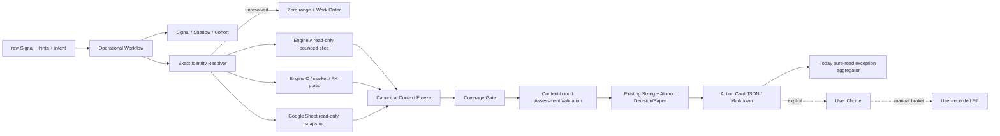

# Engine D Operational Workflow - Plan

## Goal Capsule

- **Objective:** 將使用者提供的一條原始 Signal 串成可操作、可閱讀、可稽核的 Engine D workflow：保留 Signal／Shadow，解析 canonical identity，唯讀取得 bounded Engine A、Engine C、market／FX 與 Google Sheet holdings context，凍結 point-in-time bundle，重用 Coverage／Confidence／sizing／atomic execution primitives，最後輸出 Action Card 與 on-demand「今天需要動作嗎？」brief。
- **User outcome:** 使用者只需提供原始文字與少量可選 hints，不必知道 `context_digest`、`coverage_assessment_id`、holdings digest、graph／financial payload 或 idempotency key；缺資料時仍得到明確 blocker、bounded research work order 與零 funded range，而不是例外堆疊或猜值。
- **Authority contract:** Engine A 永遠唯讀；Engine C 與 Google Sheet 維持 current-state authority；Engine D 只保存 immutable decision facts、當次使用的 content-addressed context、paper counterfactual、明確 user choice／fill 與 outcome。Recommendation、choice、fill、Sheet position 是四種不同 facts。
- **Execution profile:** 本次完成本機 application service、user-facing CLI、on-demand brief、re-assessment delta、skill adapters、測試、review、文件與 commits；不做排程、remote MCP、broker routing、自動 graph admission 或上游 COHR 資料研究擴張。
- **Stop conditions:** 若實作需要猜 ticker／price／FX／holdings／evidence、寫 Neo4j、複製 Coverage 或 sizing 公式、另建 live／paper position truth、用 recommendation 推定 choice／fill，或覆寫舊 decision/context，立即停止並回報。
- **Tail ownership:** 完成者負責 targeted 與完整測試、Neo4j preservation proof、skill sync、plan 關閉、AGENTS 記憶更新、code review finding 修正及邏輯 commits；不得 push。

---

## Product Contract

### Summary

Engine D v1 已有正確的 primitives，但公開入口停在低階 `assess`／`card`：caller 必須先自行組出 frozen context digest 與 coverage ID，導致 research agent、CLI 與人類操作之間缺少一條共同 operational path。本計畫新增 application orchestration，而不是第二套決策引擎；所有資本 permission 仍由既有 Coverage、Confidence/sizing 與 atomic paper execution 決定。

### Actors

- A1. **使用者／投資決策者：** 貼入 Signal、確認當次 Sheet holdings、選擇 research／paper／live intent，明確回報 live choice 與 fill。
- A2. **研究 agent／skills：** 做 claim 拆解、source trace、語意研究與五軸 assessment；只傳遞可由 frozen context 驗證的 refs，不自行計算另一套 sizing。
- A3. **Engine D application service：** 負責 deterministic composition、狀態檢查、freeze、gate、計算、atomic persistence、re-assessment delta 與 renderer。
- A4. **External authorities：** Neo4j Engine A、Engine C runtime、市場／FX provider 與 Google Sheet holdings；可 unavailable／stale／malformed，但不得由 Engine D 代填。

### Requirements

**User-level workflow**

- R1. `evaluate-signal` 必須接受 raw Signal text、optional source URL、ticker／company hint、thesis／claim、effective time／as-of 與 execution intent；內部 digests、assessment IDs、payloads 與 idempotency key 不得成為必要輸入。省略 as-of 時使用首次 operation 建立的現在時間；省略 intent 時安全預設為 `research`，`paper`／`live` 必須明確指定，resolved values 回顯於 Card。只有 raw text 時，以 content digest 建立不含敏感內容的 `signal:` internal URI，來源維持 `manual/unattributed`、tier 4、untraced、neutral，expiry 取 versioned review horizon；atomic claim／catalyst／disproof可保持 missing status，不得用可通過 gate 的 sentinel冒充研究結論。
- R2. 每次合格或 identity unresolved 的輸入都必須先保存 Signal、Shadow 與 prospective cohort；無 identity／空圖／資料缺口不能讓 wide capture 消失。
- R3. Canonical identity 只可由 neutral identity registry 的 exact company ID／ticker mapping，或由 read-only graph exact result 再回到 registry 驗證；不得從公司名稱、slug、Sheet alias 或 LLM 猜 ticker。
- R4. Workflow 必須依序取得 bounded Engine A evidence／causal slice、Engine C checklist／financial observation、price／market、FX 與 Google Sheet holdings，再以 config 內 freshness／policy values 建立 content-addressed context。
- R5. 語意研究與 source trace 留在 skills／agent；Python service 只接受結構化 research result。Context freeze 必須建立 canonical `reference_index`，涵蓋本次 graph/source stable IDs、Engine C/manual observation、market、FX、holdings與policy refs；assessment 的每個非 `unknown` 軸只能引用該 context且符合該軸 authority類型的 refs，否則 fail closed為零 supported range。
- R6. Workflow 必須重用既有 Coverage Gate、Confidence/sizing 與 atomic system-decision＋eligible-paper primitives；不得複製公式、paper ledger 或 source-tier／graph-admission 規則。
- R7. Execution intent 的 lane permission 必須明確：`research` 不建立 funded paper 或 live permission，`paper` 可建立 eligible paper 但不給 live permission，`live` 才評估兩條 lane；permission blocker 仍經同一 Coverage/sizing trace 留痕。
- R8. Retry 必須由 server-owned canonical inputs、cohort、context digest、execution intent與policy/calculator version產生 idempotency；intent也必須進 immutable decision request/digest。相同 evaluation不得重複 paper event；相同 operation ID＋不同 payload必須 conflict；新 as-of／新 authority state走 re-assessment而非覆寫。

**Fail-closed context and authority**

- R9. Missing states 必須區分 `unavailable`、`stale`、`malformed`、`unconfirmed`、`missing`、`unresolved_identity`、`graph_unavailable`、`graph_empty`、`graph_company_missing`、`graph_coverage_deficit` 與 `manual_required`，並產生 bounded research work order；不得以空字串或零值偽裝 observed data。這些是 `completed_with_blockers` 的 domain result，不是 `INVALID_INPUT`；只有 malformed/sensitive input、store corruption或 idempotency conflict才讓 command失敗。
- R10. Engine A adapter 必須只有 read query surface，拒絕 write keyword、`CALL` 與 multi-statement，使用 read access mode；freeze 只保存當次 bounded slice 與 source refs，不做全圖 snapshot／fingerprint authority。
- R11. Engine C adapter 必須沿用其 DB abstraction 與 checklist APIs；COHR customer concentration／backlog `manual_required` 必須成為 blocker，不可猜值或讓本次實作擴成無界資料研究。
- R12. Google Sheet 是 live inventory 唯一 authority。先成功讀取 snapshot才可產 digest；`--confirm-holdings` 只確認本次 exact digest與 timestamp，讀取失敗不能當空持倉，只有成功讀取零列後的明確確認才是 `confirmed_empty`。Digest變更或 confirmation過期立即回到 `unconfirmed`；Engine D不寫 Sheet、不以成本基礎假裝 mark-to-market NAV。
- R13. Price 或 FX missing／stale／malformed，以及 FX direction mismatch，必須封鎖依賴 lane；非 base currency 不得假設 1.0，price currency／FX pair 必須與 context 方向一致。
- R14. Public JSON／Markdown、stderr 與 exception 必須通過 allowlist／redaction；不得包含 private runtime path、service-account path、持股明細、raw credentials、URL userinfo／token query或完整 sensitive payload。Provider exception不得原樣輸出；錯誤只回 stable code與安全下一步。

**Re-assessment, action facts, and brief**

- R15. `reassess` 必須從既有 public decision／cohort ID 取得原 Signal，重新讀 authorities 並建立新的 context、coverage、decision；舊 context digest、decision、paper event 永不修改，delta 顯示 evidence、financial、holdings、policy 與 action 變化，且 `automatic_repair=false`。
- R16. Live choice 與 live fill 必須由兩個明確 user commands／service calls 輸入；choice綁 exact decision ID/digest、confirmation reference、selected weight與reason。Fill只能綁已存在的正向 explicit choice與 user-report/execution reference；不得從 recommendation推定 choice、從 choice推定 fill、從 fill改寫 Sheet。
- R17. Action Card與today brief各自必須先產一份 redacted public DTO再渲染 JSON／Markdown；同一 artifact兩種格式的 IDs、action、blockers、supported range、review time與user request必須一致。Action Card需能在 unresolved／zero-size狀態成立；brief明確包含九欄：`action_needed`（今天是否需動作）、`recommended_action`（`NO ACTION / REVIEW / TRADE / HEDGE`）、reason、alpha delta、beta／portfolio risk、supported range、blockers、next review、user response needed。
- R18. `today` 必須純 on-demand掃描「有 Signal 尚無 decision」及 active cohorts、paper positions、current confirmed Sheet holdings、lifecycle／disproof、context freshness、market／FX／beta movement、pending choice與unreported live execution；新增明確唯讀 enumeration primitive，不讓 CLI直查 private tables。一般波動不得自動視為 thesis disproof，無重要變化時 `NO ACTION`是正式結果。
- R18a. Today 必須反向比對 current Sheet positions 與 cohorts/latest decisions；Sheet-only／legacy holding 以 `REVIEW`、零 supported sizing及 bounded evaluate/onboard work order 呈現，且 pure-read brief不得自動建立 cohort或 decision。

**Agent and documentation parity**

- R19. `lead-intake` 與 `investment-research` 必須呼叫同一 application workflow contract：skill 做研究／互動，Python 做 deterministic persistence／gate／audit；skill 不得硬編碼政策值或自算 Confidence/sizing。
- R20. Public CLI help 必須優先顯示 `evaluate-signal`、`reassess`、`today`、`card`、`record-choice`、`record-fill`；既有低階 surface 可相容保留，但不再是正常使用路徑。
- R21. 所有可調數值必須來自 `config/investment_policy.json` 或其 validated policy view；workflow 不得硬編碼 NAV、lane caps、threshold、freshness、factor cap、review interval 或 multiplier。
- R22. 本次變更必須同步 canonical skills 及 generated adapters、更新 AGENTS current state，並以 targeted、preconditions、sync check、diff check、full suite 與 Neo4j preservation proof 驗收。

### Key Flows

- F1. **Signal 到 Action Card：** raw input → wide capture → exact identity → read authorities → optional explicit holdings confirmation → freeze → Coverage → validated assessment → sizing／atomic paper → Action Card。
- F2. **Coverage deficit：** wide capture 成功 → unresolved／empty graph／missing data status → zero range → work order with expiry／priority／missing fields → REVIEW card；不把 absence 當 thesis false。
- F3. **Re-assessment：** 以 decision/cohort 定位原 Signal → 重新取 authorities → 新 bundle／decision → attributed delta → 舊 facts unchanged。
- F4. **Explicit live facts：** live card → user `accept/reduce/skip/override` choice → manual broker action（系統外）→ user records fill → Sheet 仍是 current position authority。
- F5. **Today brief：** 讀 active cohorts／latest cards／paper／lifecycle → 讀 current authorities → 分類 alpha/beta/data/action exception → 聚合成單一 action-first report；不產生新 decision 或交易。
- F6. **Skill parity：** skill 完成 claim/source trace／research packet → 呼叫與 CLI 相同 workflow request → 接收 JSON audit object → 以繁中解釋 Card／blockers，必要時引導使用者確認 holdings 或補 provenance。

### Acceptance Examples

- AE1（R1–R8）SIVE／aleabitoreddit Signal 在完整 fixture context 下，一個 user-level call 建立 Signal、Shadow、frozen context、coverage、decision、eligible paper event 與 JSON／Markdown Card；retry 回原 IDs，paper event 仍一筆。
- AE2（R2–R3、R9）未知公司或 identity 無法解析時仍保存 cohort／Shadow，Card 為 `REVIEW`、range=0，列出 `unresolved_identity` work order。
- AE3（R2、R9–R10）圖中公司不存在輸出 `graph_company_missing`，圖完全為空輸出 `graph_empty`；兩者都另帶 `graph_coverage_deficit` blocker，不視為 thesis false、不呼叫任何 graph write。
- AE4（R9、R11、R13）financial observation missing／stale、price missing、FX missing／direction mismatch 各自保留明確 status，paper/live range 依 lane 歸零。
- AE5（R11）COHR checklist 的 customer concentration／backlog `manual_required` 在 Card 顯示 provenance work order，不能用空值通過。
- AE6（R12）holdings 未確認或 confirmation 過期時，paper lane 可在其餘完整時獨立運作，但 live／hedge quantity 為零並要求使用者確認 current digest。
- AE7（R15）新的 evidence、price、FX、holdings 或 policy 產生新 context／decision；舊 decision bytes 不變，delta 列出變化且 `automatic_repair=false`。
- AE8（R16）沒有 explicit choice 不得產生 choice；沒有 explicit fill 不得產生 fill；fill 後 Sheet 不被寫入。
- AE9（R17–R18a）today fixtures 分別產生 `NO ACTION`、`REVIEW`、`TRADE`、`HEDGE`，每份都含九個 action-first欄位；另有 Sheet-only holding fixture輸出 `REVIEW`而不新增 cohort，且一般 beta move不會偽造 thesis delta。
- AE10（R10、R14、R22）source inspection 與 runtime proof 顯示 Engine A 無 write path、Neo4j preserve；public output 不含 private path、holdings rows 或 sensitive payload。
- AE11（R19–R22）canonical skill 修改經 sync 後兩端 adapters 無 drift，skills 只引用 operational commands／contracts，不複製 config 數值與公式。

### Success Criteria

- 從一條正常 Signal 到 Card 只需 user-level inputs；正常 CLI help／skills 不要求任何 Engine D internal identifier。
- 每個輸出 position range 都能追到 frozen allowlisted evidence、authority statuses、policy version、coverage、weakest link 與 lane blockers。
- Wide capture 對 identity／graph／financial failures 有韌性；資本 permission 對同樣 failures fail closed。
- Re-assessment 與 retry 分別具備「新 context、不改舊 facts」及「相同 context、不重複 side effect」語意。
- Today brief 能直接執行並以低頻投資者為中心，只報重要 change／exception；`NO ACTION` 具理由。
- Engine A 未被修改；Google Sheet、Engine C 與 paper ledger 的 authorities 沒有被複製或混淆。

### Scope Boundaries

**Deferred**

- 排程 Daily Brief、notification、cloud routine 或 remote Decision MCP。
- 自動 X／RSS harvest、完整自然語言 entity extraction、通用 LLM research engine。
- COHR 兩筆 manual observations 的實際一手研究；workflow 只需產生 work order。
- Google Sheet write-back、broker routing、模擬 broker fill、live position ledger。
- 新 factor model、hedge instrument selection 或政策數值最佳化。

**Never in this workflow**

- 寫入、清空、重建或自動修復 Neo4j。
- 讓 source whitelist／Signal 自動提高 evidence tier 或繞過 lead-intake／source-trace approval。
- 從 recommendation 推定使用者 choice／fill，或由 Engine D 自動修改 live holdings。
- 以 missing=0、unknown=false、成本基礎=current NAV、或 FX=1.0 猜測缺失 authority data。

---

## Planning Contract

### Context & Research

- `decision_lab/intake.py`、`context.py`、`coverage.py`、`sizing.py`、`execution.py`、`action_card.py` 與 `store.py` 已提供需要重用的 primitives；目前缺的是 user-level application composition。
- `decision_lab/cli.py` 目前只 expose 低階 `assess`／`card`，且 `assess` 需要 internal digest／coverage ID；新 surface 應保留 backward compatibility，但 public path 改由 orchestrator 建立這些值。
- `decision_lab/adapters/graph.py` 已有唯讀 query guard；新 runtime adapter 必須以單一 bounded read query 組 structured slice，不能把 `query/graph_context.py` 的 Markdown 當 frozen evidence payload。
- `engine_c/checklist.py` 與 `engine_c/market_data.py` 是既有 current-state APIs；`engine_c/db.py` 是 dual-backend authority boundary。`decision_lab/` 不直接 import Engine C，composition 放在外層 runtime package以維持 dependency direction。
- `fetchers/gsheets.py` 是 read-only holdings adapter；execution aliases 是 composition concern，alias 不能變成 identity authority。若 Sheet 缺 current market value／NAV，live portfolio context 必須 `malformed`／`unavailable`。
- `identity/registry.py` 是 current neutral A→C join SSOT；舊 learning 指向 loader 的說法已漂移，計畫採 current code。
- `docs/solutions/architecture-patterns/engine-d-content-addressed-decision-context.md` 決定 freeze／immutability／authority 邊界；`docs/solutions/tooling-decisions/engine-c-sqlite-dual-backend.md` 決定 Engine C adapter 不可直接碰 backend。
- 現有 validation gap：五軸 assessment 只要求 `evidence_refs` 非空，尚未驗 refs 屬於 frozen context。這是 funded capital permission 的 Now blocker，必須先補 allowlist binding。
- External research 不需要：本次沒有未定的第三方技術選型，repo authority 與既有 tests 足以決定實作。

### Key Technical Decisions

- **KTD1 — application service 是唯一高階 workflow。** `(session-settled: user-directed — chosen over CLI／skills 各自拼 primitives：避免 gate、sizing、idempotency 與 redaction漂移。)` CLI 與 skills 只做 input／output adapter。
- **KTD2 — orchestration core 與 authority adapters 反向相依。** Workflow 只依賴 Protocol／normalized status；Engine A/C/Sheet/yfinance concrete composition 放在 repo 外層 runtime package，既有 domain package不直接 import Engine C 或 graph writers。
- **KTD3 — wide capture 可 unresolved，capital assessment 必須 fail closed。** `(session-settled: user-directed — chosen over identity resolve 前不落地：保留 prospective cohort，且以零 range／work order 阻止資本。)` Store schema 不新增第二種 cohort。
- **KTD4 — frozen context 是 assessment refs 的 capability boundary。** Assessment refs必須存在於 context的 canonical `reference_index`且符合 axis-to-authority allowlist；自造、移除、跨 context或錯 authority refs一律 blocker，不只做非空檢查。
- **KTD4a — axis reference allowlist 固定於 workflow contract。** `source_reliability` 可引用 graph source assertion／source-trace refs；`technical_causal_link` 可引用 graph entity/edge/assertion refs；`commercial_maturity` 可引用 graph commercial assertion與 Engine C backlog/customer observation refs；`financial_resilience` 可引用 Engine C financial/manual observation refs；`valuation_payoff` 可引用 Engine C valuation、market與 FX refs。Policy／holdings refs只約束 lane，不可拿來支持任一 thesis axis。空／未知／跨-context／錯-authority ref標 `assessment_context_mismatch:<axis>`，該軸為 unknown且封鎖所有 funded lanes；允許單軸混合其列出的多種 authority refs。
- **KTD5 — execution intent 以 lane permission blocker 表達。** `(session-settled: user-directed — chosen over另建 research-only sizing engine：保持一套 Coverage/sizing trace。)` `research` 封鎖 paper/live；`paper` 封鎖 live；`live` 仍不代表 user choice 或 broker fill。
- **KTD6 — default CLI provider honest degradation。** 本機 command 可在無 Neo4j／Engine C／Sheet／network 時完成 capture 與 Card，但 statuses 必須真實且 range=0；fixture／agent provider 可注入完整 research result，Python 不自造 thesis 內容。
- **KTD7 — re-assessment append-only。** 新 authority state 建立新 bundle／coverage／decision；delta 是新 decision 的 derived/public field，不回寫原 context，`automatic_repair` 永遠 false。
- **KTD8 — today brief 為 pure-read exception aggregator。** 不 freeze 新 context、不產生 decision、不自動確認 holdings；只比較 current authorities 與 latest frozen facts，再重用 Action Card classification／renderer concepts。
- **KTD9 — explicit live facts 是 human-only boundary。** `(session-settled: user-directed — chosen over自動接受或成交：choice、fill、Sheet position 分離。)` CLI 需明確 action、數值、reason／venue，不提供隱式 default。
- **KTD10 — public output 採 allowlist。** Action Card與today各自有一份 redacted public DTO，各自的 JSON／Markdown renderer只讀同一 DTO；只輸出 public IDs、status、aggregates、refs與work orders。Raw holdings rows、private normalized rows、private paths、credentials、exception repr不可進 renderer，外部文字在Markdown／terminal輸出前須 escape控制字元與格式字元。

### High-Level Technical Design

The diagram is a boundary map, not method-level design. Concrete adapters return normalized values plus status／as-of／source refs；workflow owns order and idempotency；domain primitives own validation／calculation／persistence。

### Assumptions

- User has pre-authorized plan→implementation→review→tests→commit and explicitly prohibited push, so no intermediate handoff menu is required.
- Exact company-name resolution is allowed only when a read-only graph exact match returns canonical `co:*` and the neutral registry validates it；otherwise status remains unresolved。
- Default review／work-order expiry uses validated `probe_lane.review_hours` from versioned policy, not a new constant。
- Raw user/social Signal starts as lead-level material unless skill supplies source-traced structured evidence；source URL alone never upgrades tier。
- Today action aggregation uses deterministic priority：disproof／terminal／資料失效先 `REVIEW`，portfolio factor over-cap為 `HEDGE`，explicit accepted choice awaiting fill或 eligible awaiting user choice為 `TRADE`，其餘 `NO ACTION`；多 cohort取最高優先但保留個別明細，holdings/FX unavailable時不虛構 hedge quantity。

### Implementation Units

#### U1 — Seal primitive contracts for unresolved capture and context-bound assessment

- **Goal:** 讓 wide capture 可在 unresolved identity 下持久化，同時強化 funded decision 對 frozen context 的引用約束。
- **Files:** modify `decision_lab/models.py`, `decision_lab/intake.py`, `decision_lab/store.py`, `decision_lab/coverage.py`, `decision_lab/sizing.py`, `decision_lab/execution.py`; add/modify focused tests under `tests/test_signal_intake.py`, `tests/test_decision_execution.py`, `tests/test_decision_store.py`。
- **Approach:** 延伸既有 cohort/event schema 的 nullable identity語意，不建新 ledger；dedupe key使用 normalized unresolved token。新增 monotonic identity binding：只允許 `(NULL,NULL)`單向綁定 registry驗證的 canonical pair，同值 retry idempotent、任何 remap拒絕，並原子追加 `identity_resolved` audit event；舊 Signal/Shadow不改寫。Manual raw-only capture允許 claim/disproof missing status與 `signal:` digest URI，不用 sentinel。Assessment validation依 KTD4a；lane permission blockers進既有 trace。若需 schema version提升，必須以 explicit forward migration及backup/recovery test交付。
- **Dependencies:** none。
- **Test scenarios:** raw-text-only與unresolved Signal仍有 Signal／Shadow／cohort並到zero-size Card；same unresolved retry dedupe；identity單向綁定與remap拒絕；fake／cross-context／wrong-authority evidence ref歸零且不產paper；research/paper/live intents分 lane；既有SIVE v1 primitives維持相容。
- **Verification:** 每一筆 decision 的 refs 都可由其 context digest重建；無 identity 或 invalid ref 不可能建立 funded paper。

#### U2 — Add normalized authority ports and default runtime composition

- **Goal:** 以唯讀、可注入、honest-degradation adapters取得 Engine A/C、market、FX 與 Sheet context。
- **Files:** add `decision_lab/workflow_ports.py`; add package `engine_d_runtime/__init__.py`, `engine_d_runtime/adapters.py`, `engine_d_runtime/bootstrap.py`; reuse/modify `decision_lab/adapters/graph.py`, `market.py`, `holdings.py`; targeted tests in new `tests/test_engine_d_runtime.py` and existing graph/Sheet tests。
- **Approach:** Core定義 normalized port results；runtime package才 import `engine_c.checklist`, `engine_c.market_data`, `fetchers.gsheets`, Neo4j driver。Graph query bounded、structured、read-only；FX驗 pair/direction。Raw Sheet rows不離開 adapter；既有 sizing所需的最小 normalized rows（ticker/company_id、shares、currency、market_value_base）可進 private frozen context，public workflow DTO只回 aggregates＋digest，維持既有 `_live_portfolio`為唯一 factor計算路徑。
- **Dependencies:** U1。
- **Test scenarios:** company not in graph、empty graph、missing/stale/malformed financial、COHR manual_required、missing price、missing/wrong FX、Sheet unavailable/malformed、explicit confirmation current/expired、Neo4j query rejection與 read mode。
- **Verification:** `decision_lab/` 無 Engine C／graph writer import；各 failure回 normalized status，不洩漏 provider exception／private path。

#### U3 — Build the operational application service and re-assessment

- **Goal:** 提供一個 user-level request 從 Signal 到 Action Card，並支援 append-only re-assessment delta。
- **Files:** add `decision_lab/workflow.py`; modify `decision_lab/context.py`, `decision_lab/action_card.py`, `decision_lab/__init__.py`; add `tests/test_operational_workflow.py` and fixtures as needed under `tests/fixtures/decision_lab/`。
- **Approach:** Workflow先完成 wide capture再碰外部 providers；只有 raw text時使用 R1的 honest intake defaults，缺 catalyst/disproof/semantic assessment時產 `claim_unresolved`等 blocker。Freeze前以 canonical Signal/cohort＋intent建立並持久化 server-owned evaluation operation與首次 effective_at；相同 evaluate retry續跑或回既有result，不重讀成另一個 as-of，只有 explicit reassess建立新 operation。Unresolved也freeze honest context、產 zero-size decision/Card；identity新解析時先走 U1 monotonic binding。Reassess比較 old/new canonical sections並保存 delta，不 mutate old rows。
- **Dependencies:** U1, U2。
- **Test scenarios:** SIVE happy path、unknown company、empty graph、unresolved identity、各 external missing/stale blockers、retry single paper event、reassess new context/old immutable、automatic_repair false、JSON/Card safe payload。
- **Verification:** caller不提供 internal fields仍能取得完整 audit refs；所有 context／coverage／decision IDs由 service建立並可追溯。

#### U4 — Implement on-demand action-first today brief

- **Goal:** 純讀掃描 active decision state與 current authorities，產出低頻使用者真正可用的 action brief。
- **Files:** add `decision_lab/brief.py`; add minimal read/list helpers to `decision_lab/store.py`; extend `decision_lab/action_card.py` renderer utilities only when可重用；add `tests/test_decision_brief.py`。
- **Approach:** 透過 store唯讀 enumeration列出尚無 decision與已有 latest decision的 cohorts，並反向比對 current Sheet positions以找 legacy/Sheet-only holdings；計算 lifecycle、freshness、current authority deltas、pending choice/fill與portfolio cap exceptions。聚合保留 per-item reasons與next review，不建立新 decision/context/confirmation；需要改變 frozen recommendation時明確要求 `reassess`。
- **Dependencies:** U3。
- **Test scenarios:** isolated `NO ACTION`、disproof/data gap `REVIEW`、supported actionable delta `TRADE`、factor cap `HEDGE`；pending choice、unreported execution、stale context、beta-only move、不完整 holdings不給 hedge quantity。
- **Verification:** brief具 `action_needed`、`recommended_action`、reason、alpha delta、beta/portfolio risk、supported range、blockers、next review、user response needed九欄，且執行前後store mutation count不變。

#### U5 — Promote the user-facing CLI and safe renderers

- **Goal:** 將高階 workflow變成正常 CLI surface，保留低階相容入口但不要求人類組 internal payload。
- **Files:** modify `decision_lab/cli.py`, `decision_lab/__main__.py`, `decision_lab/redaction.py`; modify/add `tests/test_decision_lab_cli.py`, `tests/test_operational_cli.py`。
- **Approach:** 加入 `evaluate-signal`, `reassess`, `today`, `card`, `record-choice`, `record-fill`；default store/runtime從 repo bootstrap取得，測試可注入。所有 commands支援 `--format json|markdown`；錯誤至少區分 store unavailable、invalid/sensitive input、not found、idempotency conflict、context mismatch、approval required/stale，且不印 repr/path/payload。Choice/fill要求 explicit flags與confirmation/report refs。
- **Dependencies:** U3, U4。
- **Test scenarios:** stdin／flag Signal、JSON/Markdown、help surface、retry、card pure read、choice/fill explicit、invalid input、provider failure redaction、private path/holdings absence。
- **Verification:** normal path無 `context_digest`／coverage ID等 flags；CLI與直接 workflow回傳同一 public contract。

#### U6 — Integrate lead-intake and investment-research skills

- **Goal:** 兩個 research skills共用同一 operational workflow，明確分工語意研究與 deterministic persistence。
- **Files:** modify only canonical `skills/lead-intake/SKILL.md`, `skills/investment-research/SKILL.md`; regenerate `.agents/skills/` and `.claude/skills/`; modify `tests/test_skill_decision_contract.py`。
- **Approach:** 在 lead intake 的 capture／source-trace decision point及 investment research 的回答／sizing point加入同一 workflow command與 input/output contract；禁止 skill填 internal IDs、自算 sizing或硬編碼政策值，並說明 holdings confirmation／manual live facts。
- **Dependencies:** U5。
- **Test scenarios:** adapters sync、兩個 skills引用相同 commands、無 policy數字／公式、沒有 graph admission bypass、繁中 output與 blocker引導。
- **Verification:** `sync_agent_skills.py --check` clean；contract test證明 parity與 authority boundaries。

#### U7 — Complete operational docs, preservation proof, and plan closure

- **Goal:** 讓 repo memory、操作說明與驗收狀態與實作一致，並完成全域 regression gate。
- **Files:** modify `AGENTS.md`, `docs/plans/README.md`, this plan frontmatter/status；必要時更新 existing operational README（不得建立第二份 spec/design/status doc）；modify preservation/architecture tests only for genuine new boundary assertions。
- **Approach:** AGENTS current work記錄 workflow完成、執行 commands、external config與仍開的 COHR blockers；plan改 completed。先跑 targeted，再跑 preconditions/sync/diff/full suite；只修本次 regression，已知基線 failure原樣記錄且不得掩蓋。
- **Dependencies:** U1–U6。
- **Test scenarios:** source-tree write-path scan、external Neo4j fingerprint/preservation、private runtime ignored/redacted、full pytest與 baseline comparison、clean worktree after logical commits。
- **Verification:** completion checklist全數可由 command output、tests與 git history證明；不 push。

### Dependency Order

`U1 → U2 → U3 → U4 → U5 → U6 → U7`。U1先封住資本安全；U2建立 authority seam；U3才有完整 orchestration；U4純讀依賴 latest Card contract；U5／U6只適配已穩定 service；U7統一驗收與關閉文件。

### System-Wide Impact

- **Data lifecycle:** Store schema只做向前 migration；unresolved cohorts可在後續 re-assess獲得 identity，但舊 observed-time event不改寫。新 decision／paper event仍走單一 transaction。
- **Failure propagation:** Adapter failure轉 normalized status；workflow繼續 wide capture、停止 affected capital lane；CLI只顯示 safe error code與 work order。
- **Authority:** A read-only、C current state、Sheet live truth、D immutable history、paper counterfactual各自不變；runtime package是 composition，不是新 authority。
- **Security/privacy:** Credentials只在 adapters初始化使用；public models採 allowlist且 holdings只出 aggregate/digest。Production Neo4j仍需 least-privilege read credential，query guard不是 credential替代品。
- **Agent parity:** CLI與兩個 skills能執行相同高階 action；agent可看相同 statuses／work orders，卻不能繞過 holdings confirmation、evidence allowlist或 explicit live actions。
- **Performance:** 每次 evaluation只做 bounded graph query與少量 authority calls；today應批次讀 store並對相同 ticker去重 current provider calls，避免 per-event N+1。
- **Compatibility:** Low-level `assess`／`card`保持，existing tests與private store可升級；public default help與docs移向高階 surface。

### Risks & Mitigations

- **RISK1 — Orchestrator變成第二套研究引擎。** Mitigation: ports只收 normalized facts／structured research result；claim拆解與 source trace留在 skills。
- **RISK2 — Unknown identity無法建既有 decision。** Mitigation:先以 nullable cohort identity和 zero-size decision擴充既有 primitive；禁止在 unresolved狀態 paper/live。
- **RISK3 — Agent自造 evidence refs。** Mitigation: context allowlist binding是 U1 blocker，negative test必須先綠才接 high-level workflow。
- **RISK4 — Sheet缺 market value造成假 NAV。** Mitigation:不以成本替代；live lane malformed/unavailable並要求外部欄位或設定。
- **RISK5 — Network/provider不穩。** Mitigation: status-specific honest degradation；default CLI仍產 Card/work order，fixture tests不依賴 network。
- **RISK6 — Today製造每日交易。** Mitigation: pure-read、exception-only、NO ACTION first-class、price/beta move不等於 thesis change。
- **RISK7 — Full suite既有 failures混淆 regression。** Mitigation:實作前記錄 exact baseline，實作後比較同一 node IDs／trace；不修改 assertion來假裝綠。

### Open Questions

#### Resolved During Planning

- **公司名稱怎麼解析？** Exact graph lookup後仍必須經 neutral registry驗證；沒有 exact canonical match就 unresolved，不能 fuzzy guess。
- **Research-only是否建立 paper？** 不建立；以 existing lane permission blocker留痕，但仍可建立 zero-size system decision與Card供 audit。
- **缺外部服務能否完成 command？** 可以完成 capture／zero-size Card；資本 lane fail closed。
- **Today是否寫入 re-assessment？** 否，today純讀；需要更新 decision時由 `reassess`明確建立新 context。
- **是否補 COHR資料？** 不在本次 scope；只驗 manual_required blocker與work order。

#### Deferred to Implementation Judgment

- Public ID接受 decision ID與cohort ID時的 precedence與錯誤 code命名，需遵循既有 CLI style，但不得洩漏查詢細節。
- Bounded graph query的具體欄位投影依現有 schema命名調整；必須只含本次 assessment真正使用的 entity/edge/assertion/source refs。

---

## Verification Contract

### Proof Strategy

1. **Baseline:** 實作前完整 pytest，確認是否仍為 378 passed／2 known failures並保存 failure node IDs／reason。
2. **Primitive safety:** U1 targeted tests先證明 unresolved capture、evidence allowlist、lane permission與atomic idempotency。
3. **Adapter contracts:** fixtures覆蓋 unavailable/stale/malformed/unconfirmed/manual_required與 graph read-only；不以 live external services作必要測試。
4. **Workflow E2E:** SIVE happy path及所有 fail-closed scenarios從 user-level request跑到 public Card。
5. **Brief/CLI/skill parity:** JSON／Markdown golden structure、pure-read、explicit live facts、redaction、sync。
6. **Repository gates:** preconditions、Neo4j preservation、diff check、full suite baseline comparison、clean status。

### Acceptance Coverage Matrix

| 驗收項目 | 主要測試 |
|---|---|
| 1. SIVE Signal happy path | `tests/test_operational_workflow.py` |
| 2–4. 公司未入圖／空圖／identity unresolved | `tests/test_operational_workflow.py`, `tests/test_engine_d_runtime.py` |
| 5–6. financial missing／stale | `tests/test_engine_d_runtime.py`, workflow blocker assertions |
| 7–8. holdings unconfirmed／expired | `tests/test_operational_workflow.py`, `tests/test_gsheets_snapshot.py` |
| 9–10. price／FX missing or wrong direction | `tests/test_engine_d_runtime.py` |
| 11. COHR manual_required | `tests/test_operational_workflow.py` |
| 12. idempotent paper retry | `tests/test_operational_workflow.py`, existing execution tests |
| 13. re-assessment immutable delta | `tests/test_operational_workflow.py` |
| 14–15. explicit live choice／fill | `tests/test_operational_cli.py`, existing execution tests |
| 16. Card JSON／Markdown | `tests/test_operational_cli.py`, action card tests |
| 17. Brief four actions | `tests/test_decision_brief.py` |
| 18–19. sensitive redaction／private path | CLI and workflow negative tests |
| 20–21. Engine A no write／preservation | existing graph read-only/preservation plus runtime tests |
| 22. skill sync | skill contract tests and sync check |

### Required Commands

- `python -m pytest tests/test_signal_intake.py tests/test_decision_context.py tests/test_coverage_gate.py tests/test_probe_sizing.py tests/test_decision_execution.py tests/test_action_card.py tests/test_graph_read_only.py tests/test_graph_preservation.py`
- `python -m pytest tests/test_operational_workflow.py tests/test_engine_d_runtime.py tests/test_decision_brief.py tests/test_operational_cli.py tests/test_skill_decision_contract.py`
- `python thesis/preconditions.py`
- `python scripts/sync_agent_skills.py --check`
- `git diff --check`
- `python -m pytest`

`thesis/preconditions.py` 預期在 COHR兩個 `manual_required`仍存在時非零，但輸出必須只剩既知上游缺口；full suite若仍有既知 failures，需證明 node IDs與原因與 baseline相同，新增 tests不得失敗。

---

## Definition of Done

- [x] User-level evaluate request可從 raw Signal到 Action Card，不要求 internal digest／assessment IDs。
- [x] Unresolved／empty graph／missing/stale/unconfirmed/manual_required皆保存 wide capture、產 work order、funded range=0。
- [x] Assessment evidence refs受 frozen context allowlist約束。
- [x] Same-context retry不重複 paper；re-assess建立新 facts且舊 decision不變。
- [x] Live choice／fill只由 explicit input建立，Sheet未被 Engine D修改。
- [x] Today brief可執行且覆蓋 `NO ACTION / REVIEW / TRADE / HEDGE`與九個欄位。
- [x] JSON／Markdown public output通過 redaction，不含 private path／holdings detail／credentials。
- [x] Engine A無 write path且 preservation proof通過。
- [x] Lead-intake與investment-research共用 workflow，generated skill adapters sync clean。
- [x] Targeted tests、preconditions、sync check、diff check與完整 suite完成，baseline差異已歸因。
- [x] Review findings已修正，plan標 completed，README／AGENTS已更新。
- [x] 變更依邏輯邊界 committed，working tree clean，未 push。

## Completion Evidence

- Engine D／authority／preservation targeted suite：`122 passed`；後續 action-intent、strict Sheet 與 Markdown hardening 另由 scoped tests及完整 suite覆蓋。
- 新增 operational workflow／brief／CLI／skill／FX tests：全數通過。
- `python thesis/preconditions.py`：second slice與investment rules通過；只剩既知 COHR customer concentration／backlog `manual_required`。
- `python scripts/sync_agent_skills.py --check`、`python -m compileall ...`、`git diff --check`：通過。
- 完整 suite：`423 passed, 2 failed`；兩個 failure與開工前基線相同，分別是缺少 `extractions/enablence_sivers_onet_els_2026.json`，以及舊 SourceDoc test未接受既有 `section=None`。
