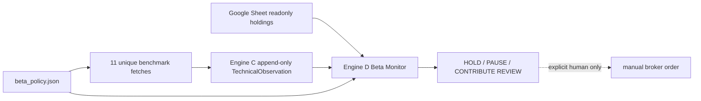

# Daily Beta Technical Monitor v1 - Plan

## Goal Capsule

- **Objective:** 對目前已持有的 ETF／權值股固定 universe，每日以完整收盤價產生可稽核的 RSI14、
  MACD 12-26-9、SMA20／50／200、252-session drawdown 與 realized volatility；Engine D 再把 signal pace、
  Sheet 持倉、現金與候選風險上限組成 `HOLD / PAUSE CONTRIBUTION / CONTRIBUTE REVIEW` 與保守的 supported
  contribution range。
- **User outcome:** 現有 14 個商品約只抓 11 條 unique series；QQQ／TQQQ 共用 QQQ，0050／006208／00631L
  共用 0050／Taiwan 50。Daily Brief 可直接看見訊號、約束與候選金額，不需每天人工計算指標。
- **Authority contract:** Engine C 保存 append-only point-in-time TechnicalObservation；Google Sheet 仍是 live
  inventory authority；versioned beta policy 保存 instrument mapping、signal thresholds 與風險上限；Engine D
  只做 deterministic monitor。`CONTRIBUTE REVIEW` 不是 choice、fill 或 broker order。
- **Capital scope:** v1 只使用成功讀取的 Sheet NAV／cash，扣除 policy reserve 後產生 `sheet_conservative` range；
  表外現金、資產、drawn debt 與 undrawn facilities 未建立人工 authority 前一律不加入。輸出不得宣稱是完整
  household safe maximum。
- **Execution profile:** 本次完成 config、Engine C technical ETL／雙 backend schema、Engine D monitor、固定 Daily
  entry、runbook／skill、測試、文件、專案記憶、commit 與 push。v1 使用既有本機 06:30 排程，不架 server。
- **Stop conditions:** 若需要猜 missing price／FX／cash／look-through、使用 forming intraday bar、讓 indicator 提高
  hard cap、從 recommendation 推定 choice／fill、寫 Google Sheet 或遷移既有 Decision Store，立即停止並降級。

---

## Scope Decision

### Phase I — 本次實作與驗收

1. 固定 14 商品／11 technical series 的 instrument registry 與 policy validation。
2. Engine C 以 adjusted close 算 signal、raw close 保留 execution 參考；至少 252 個完整 sessions 才是
   `observed`，短歷史回 `insufficient_history`。
3. append-only `technical_observations`，保存 source、session、fetched_at、series digest、scalar metrics、status
   與 blockers；SQLite 自動 non-destructive ensure，Postgres 走 versioned migration。
4. Engine D 計算離散 `signal_pace = 0 / 0.25 / 0.5 / 1.0`，並套 Sheet deployable cash、campaign budget、
   leveraged nominal/effective cap、technology proxy cap 與已知 single-company lower-bound cap。
5. `scripts/daily_beta_snapshot.py` 一支固定入口完成 refresh → monitor → Markdown／JSON；任一商品失敗不阻斷其他
   商品，但該商品 range 歸零。
6. Daily prompt／daily-brief skill 在 Engine C 財務 ETL 後呼叫此固定入口；beta 日常 telemetry 不進 pq1，只有
   `CONTRIBUTE REVIEW` 才作為人工 live-capital review 呈現。

### Phase II — 只保留啟動條件，不在本次展開工作包

**與 beta monitor 直接相關：**

- 建立 household capital authority：表外資產／現金、operating floor、planned outflows、drawn debt 與 loan terms；
  完成後才把 `sheet_conservative` 升格為 household-level range。
- ETF point-in-time look-through refresh，取代 v1 的 versioned conservative factor proxies，並對完整 single-company
  overlap 執行 hard cap。
- explicit-fill-only Google Sheet narrow writer：穩定 `position_id`、pending checkpoint、exact write、read-back digest、
  Decision Store reconciliation receipt。
- 只有本機常離線且不能接受補跑、需要 intraday／各市場收盤即時通知、每日必達 SLA 或雙 provider redundancy，
  才升級最小 always-on market-data worker。
- 問答型 LLM advisory 採 zero-code-first：只有使用者明確詢問黑天鵝／regime／替代策略時，才讀取 monitor／Sheet
  aggregate 並按需補抓最新客觀資料後直接回答。它不跑每日 LLM 研究、不建 Engine A 式 graph／claim pipeline、
  不新增 current-state authority 或自動 pq，也不得改動 deterministic hard caps。只有重複取數摩擦被實測證明後，
  才為它另立唯讀 compact context composer implementation unit。

**與本切片無關但保留在 roadmap：** Paywall ROI／合法手動入口、通用 token-efficient Daily runner、其他
Engine A／B research backlog 繼續以既有 brainstorm／AGENTS 優先序管理；本 plan 只連結，不建立 Phase II
implementation units，避免產生第二個 active scope。

---

## Product Contract

### Requirements

- **R1 — Fixed universe:** policy 必須明列 canonical sheet ticker、provider symbol、sleeve、signal benchmark、
  leverage multiple、campaign budget、technology proxy load 與 optional known issuer loads。相同 benchmark 只 fetch
  一次；instrument rows 可多對一引用。
- **R2 — Complete-session only:** fetcher 不得使用尚未收盤的 forming daily bar。每筆 observation 分開記
  `last_complete_session` 與 `fetched_at`；跨市場不得假裝共同 close timestamp。
- **R3 — Technical integrity:** signal 用 adjusted series；raw close 只作顯示。RSI 採 Wilder smoothing，MACD
  採 EMA 12／26 與 signal EMA9；realized vol 用 log return 年化。所有 scalar 必須 finite。
- **R4 — Honest partial history:** 少於 252 sessions 或 adjusted close 缺失時回明確 blocker。可以顯示已可計算的
 短窗資訊，但 `data_status != observed` 時 contribution range 必須為零。DRAM 預期會撞此路徑。
- **R5 — Versioned signal state:** 深度由 drawdown＋RSI 決定；MACD histogram slope 與 price/SMA200、SMA50 slope
  只縮放 pace。三者不是獨立證據；任何 threshold 變更必須改 policy version。
- **R6 — Timing/sizing separation:** technical state 只能選離散 pace，不能放寬 deployable cash、campaign budget、
  leverage、factor 或 single-company hard ceiling。
- **R7 — Conservative capital:** Sheet unavailable／malformed、NAV 不一致、cash bucket 缺失時全部 range 歸零。
  v1 deployable cash 只等於 Sheet cash 扣除 operating reserve 與 alpha reserve；貸款額度永不計入。
- **R8 — Portfolio-safe allocation:** 多個商品同時觸發時，依 policy priority 逐筆分配同一份 deployable cash；
  公開 ranges 可相加且不得超過本輪 frozen cash budget。
- **R9 — Leveraged underlying:** TQQQ 的 signal 取 QQQ，00631L 取 0050／Taiwan 50；execution price／持倉仍用
  實際商品。combined nominal 與 effective cap 都要通過。
- **R10 — Point-in-time persistence:** 每次 fetch 成功、部分成功或失敗都 append observation status；相同 payload
  digest retry idempotent。latest query 必須能取回前一個不同 session，供 signal escalation／repeat cadence。
- **R11 — Alert cadence:** signal 首次升級立即 review；維持同 tier 時只依 versioned repeat-session cadence 重現，
  避免每天重複轟炸。降級／無訊號回 `HOLD`，不產生 sell 建議。
- **R12 — Human boundary:** daily entry 可自動抓資料與產 recommendation，但不建立 live choice／fill、不寫 Sheet、
  不下單。所有金額標明 `capital_scope=sheet_conservative` 與 `policy_mode=paper_observation`。
- **R13 — Safe output:** provider exception、private DB／service-account path、raw holdings rows與 credentials 不得出現在
  JSON／Markdown；只輸出 aggregate exposure、ticker、status、blocker code、policy version 與 range。
- **R14 — Local-first reliability:** fixed entry 記錄 degraded status、missing series 與最後完整 session；下一次可補 bars，
  但不得把補到的歷史價格冒充當時已發出的 recommendation。

### Signal State v1

先固定透明、可 forward-observe 的候選，不做歷史參數最佳化：

| Tier | 必要條件 | turning／regime guard | pace |
|---|---|---|---:|
| none | 其他情況 | — | 0 |
| pullback | drawdown ≤ -10%、RSI ≤ 45 | — | 0.25 |
| deep | drawdown ≤ -20%、RSI ≤ 40 | MACD histogram slope ≤ 0 且 price < SMA200 時維持 0.25；否則 0.5 | 0.25／0.5 |
| capitulation | drawdown ≤ -30%、RSI ≤ 35 | MACD histogram slope > 0 才到 1.0；否則 0.5 | 0.5／1.0 |

SMA50 5-session slope 與 price/SMA20／50／200 一併輸出作 regime telemetry；不因跌破 MA 強迫賣出。

### Candidate Risk Policy v1

- policy mode：`paper_observation`。
- leveraged beta：5% warning／8% nominal pause；15% warning／20% effective pause。
- technology effective proxy：60% warning／70% pause。
- single-company known look-through lower bound：30% warning／35% pause。
- Sheet reserve：5% NAV operating reserve＋3% NAV alpha reserve；不足時 deployable cash=0。
- campaign budget：core 5%、tilt 3%、active tilt 2%、leverage 1.5%、single-name／large-cap tilt 1% NAV，
  再乘 signal pace與所有 hard constraints。

這些是使用者偏積極科技型方向下的 v1 forward-observation policy，不是自動 live mandate；後續以 30–90 天
紙上觀察調整，不能回測挑最好參數後冒充 out-of-sample。

### Acceptance Examples

- **AE1:** 已知單調上漲／下跌／震盪 price fixture 的 RSI、MACD、SMA、drawdown、volatility 與 digest 可重現；
  NaN／非正價格被隔離。
- **AE2:** 14 instrument config 驗證通過且只產 11 unique benchmark fetches；TQQQ／00631L 不讀自身 technical
  series 判 timing。
- **AE3:** 251 sessions、missing adjusted close、provider unavailable、forming-bar-only 各回 non-observed status與
  zero range；其他 series 照常完成。
- **AE4:** 同一 observed payload retry不重複；新 session append新 observation；latest／previous session查詢正確。
- **AE5:** Sheet cash 10%、reserve 8% 時最多只分配剩餘 2% NAV，且多商品 ranges 合計不超過該金額。
- **AE6:** leverage nominal尚有空間但effective已滿時，TQQQ／00631L range=0；indicator再極端也不提高上限。
- **AE7:** known TSMC lower bound跨過35%時，2330與Taiwan-50相關商品 pause；warning區只顯示 warning不自動賣。
- **AE8:** signal tier 首次升級輸出 `CONTRIBUTE REVIEW`；相同 tier 未達 repeat cadence 時 `HOLD`；任何輸出都
  無 choice／fill／Sheet mutation。
- **AE9:** Daily fixed entry 在部分 provider失敗下仍輸出 aggregate degraded report；public payload無 private path／
  raw holdings rows。
- **AE10:** SQLite／Postgres schema驗證、daily prompt、canonical daily-brief skill、generated adapters與 automation
  allowlist均引用同一固定入口。

---

## Technical Design

- `engine_c/technical.py` 擁有純計算、fetch normalization、append/query primitives。
- `decision_lab/beta_monitor.py` 擁有 validated policy、signal state、portfolio aggregation、allocation與renderer；
  不 import broker或Sheet writer。
- `scripts/daily_beta_snapshot.py` 只是 composition root：載入 `.env`、refresh Engine C、讀 Sheet、呼叫 monitor。
- public report只含 holdings aggregates與每商品 candidate；raw Sheet rows不離開 composition process。

---

## Implementation Units

### U1 — Versioned beta policy與fixed universe

- **Files:** add `config/beta_policy.json`, `decision_lab/beta_policy.py`, `tests/test_beta_policy.py`。
- **Approach:** 嚴格 schema validation；拒絕 duplicate ticker／benchmark、非有限數字、caps倒置、未知 sleeve、
  leverage≤0、pace不在封閉集合或 missing provider symbol。
- **Verification:** repository policy載入後為14 instruments／11 benchmarks，所有比例與priority可由config重建。

### U2 — Engine C technical observation ledger

- **Files:** add `engine_c/technical.py`, `engine_c/etl_technical.py`, Postgres migration；modify `engine_c/db.py`,
  `engine_c/schema.sql`, `engine_c/migrate.py`; add `tests/test_engine_c_technical.py`並更新migration測試。
- **Approach:** 純Python deterministic indicator math；yfinance只在fetch boundary。append-only payload digest；latest
  query按benchmark／session去重。完整session採保守過濾，部分歷史誠實降級。
- **Verification:** AE1–AE4，SQLite／Postgres雙backend contract，現有financial/manual authorities不變。

### U3 — Engine D beta monitor與safe allocation

- **Files:** add `decision_lab/beta_monitor.py`, `tests/test_beta_monitor.py`。
- **Approach:** 先凍結Sheet aggregate與policy view，再算signal；按priority從單一deployable cash sequential allocation。
  leverage／tech／known issuer constraints使用effective exposure。output標scope、binding constraint與warnings。
- **Verification:** AE5–AE8；把RSI從35改15但capacity不變時，hard maximum不得增加。

### U4 — Fixed Daily composition entry

- **Files:** add `scripts/daily_beta_snapshot.py`; modify `crons/daily_brief_prompt.md`,
  `.codex/rules/stockbot-automations.rules`, `skills/daily-brief/SKILL.md`,相關tests；sync agent skill adapters。
- **Approach:** technical refresh失敗逐series降級；Sheet失敗仍輸出technical health但range全零。命令支援
  `--format json|markdown`與`--no-refresh`供診斷。
- **Verification:** AE9–AE10；scheduled entry只有窄固定prefix，不開放任意Python／shell。

### U5 — Documentation、memory與closeout

- **Files:** update兩份brainstorm、`docs/plans/README.md`, `AGENTS.md`與必要操作文件。
- **Approach:** Phase I完成後plan改`completed`；Phase II只留啟動條件。記錄DRAM短歷史、Sheet conservative scope、
  server promotion條件與操作命令。
- **Verification:** targeted tests、full `pytest`、skill sync check、`git diff --check`、private authority未被Git追蹤；
  邏輯commit後依repo政策push master。

---

## Blind-Spot Gates

- **A1／A2／A4／A5：** 本切片不建立產業thesis或alpha主張；technical oversold不代表低估或未被定價。
- **A3：** provider、adjustment與session timestamp全部帶source／digest；短歷史不補假資料。
- **B6：** policy先凍結再forward observe；本次不交付「打敗大盤」宣稱。
- **B7：** MA／MACD只做regime pace guard；不把單一多頭樣本外推到所有regime。
- **B8：** 每個signal必須落到0／離散pace／supported range／binding constraint。
- **B9：** Sheet cash、leverage、tech proxy、known issuer concentration與sequential allocation是hard gates。
- **C10：** C保存observation，D決定permission，Sheet保存inventory，三者不混authority。
- **C11：** 科技高容忍度以較高cap表達，不把所有科技名稱當獨立風險。
- **C12：** 第一切片僅11條日線series＋一支fixed entry；server、writer與通用runner延期。

## Overall Falsification

若30–90天forward observation顯示訊號頻繁whipsaw、`CONTRIBUTE REVIEW`大多在後續更深跌前重複出現，或
Sheet-conservative range仍會因look-through缺失而跨過實際hard cap，則v1不能升格為live sizing policy；只能保留
technical telemetry，直到state machine／look-through／household authority修正。若本機06:30連續漏跑而使用者
無法接受次日補bars，則「不需要server」假設被推翻，啟動Phase II最小worker。

## Completion Record

- U1–U5 全部完成；repository policy 為14 instruments／11 unique benchmarks，policy mode維持
  `paper_observation`、capital scope維持`sheet_conservative`。
- 真實 fixed-entry 驗收成功讀取Yahoo與Google Sheet；DRAM因短歷史誠實回`insufficient_history`，report為
  `partial`而非假裝全綠。其餘series可產point-in-time signal；輸出沒有choice／fill／Sheet mutation。
- Sequential allocation不只共用cash，也會逐筆投影technology／leverage／known issuer capacity；holdings rows
  市值合計若對不上NAV即fail closed。
- 驗證：targeted suites passed；full suite 587 tests passed；skill adapters sync；`git diff --check`通過。
- Phase II維持本plan「Scope Decision」列出的啟動條件，未建立第二個active implementation scope。
- 2026-07-28 post-completion clarification：問答型 LLM advisory 已加入 Phase II 邊界，但現階段只是可立即使用的
  對話行為契約，不回頭改寫 Phase I completion，也不宣稱已有新的自動化模組。
