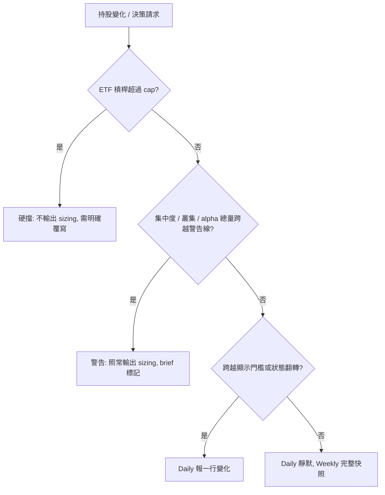

# Portfolio Risk Policy Redesign - Plan

## Goal Capsule

- 目標：把投資組合風控從多維度 factor cap 收斂成單一原則——只有槓桿硬擋，其餘一律紀錄加警告。
- Product authority：`config/investment_policy.json` 與 `config/beta_policy.json` 是數值 SSOT；`AGENTS.md` 是政策 SSOT，本次變更會推翻其中數條既有定案。
- 資本邊界不變：live 永遠由使用者手動下單，Google Sheet 仍是 live inventory 唯一權威。
- Open blockers：單筆部位上限在新原則下屬硬擋或警告尚未決定（見 Outstanding Questions），會影響 alpha 層的 requirement 形狀。

---

## Product Contract

### Summary

風控收斂成單一原則：只有槓桿硬擋，其餘一律紀錄加警告。刪除 alpha 從未生效的產業 factor 體系與其衍生的 mapping blocker，改以跨 alpha/beta 的發行人穿透、thesis 叢集顯示，以及價格異動觸發的集中曝險事件監控取代。

### Problem Frame

系統目前有兩套並行且不一致的曝險機制。alpha 用 `config/investment_policy.json` 的 `factor_exposure_caps` 搭配 `config/company_identity.json` 的 `factor_tags`，對應不到就 fail closed。但 47 家登記公司只有 3 家有 tag，ETF 一家都沒有，所以它實際產生的只有一串 `holdings_*_mapping_unresolved` blocker；而 live sizing 從未啟用，這套機制至今沒有保護過任何東西。beta 用 `config/beta_policy.json` 的 `technology_proxy_load` 與 `issuer_loads` 做保守估計加警告，正在運作。

兩套的視野差距極大。2026-07-29 實測：beta 算出科技曝險 63.2%、TSMC 穿透 29.4%；alpha 只算得出 photonics 與 small_cap 各約 1.5%，那是 Sivers 一檔貢獻的。同一個投資組合被兩個引擎用兩種標準看，長期會累積不一致。

科技曝險 60% 的警戒線與實際策略衝突。使用者刻意全押科技，這條線長期處於觸發狀態，成為一個永遠在響、響了也不會採取行動的警報，反而稀釋對其他警報的注意力。

TSMC 是另一種問題。29.4% 的 NAV 曝險中超過一半透過 0050（成分 58.69%）與 006208（57.39%）間接持有——買 ETF 時的心理帳戶是「分散」，實際不是。使用者知道並接受這個集中，但明確表示「出問題的時候我不接受」，而目前沒有任何機制會在事件發生時把消息與曝險連結起來。

### Key Decisions

- KD1. 硬擋只留給不可逆的風險，其餘一律警告 (session-settled: user-directed — chosen over 全部只警告 / 全部硬擋)。所有 live 交易都由使用者手動下單，系統物理上攔不住，硬擋的實際意義是「不輸出 sizing、強迫重想一次」。合格的硬擋只有兩項：槓桿（每日重設損耗與強制平倉）與單筆部位上限（一檔歸零就是歸零）。集中度、叢集、alpha 總量都是可以慢慢調整的配置問題，屬警告層。

- KD1a. 單筆部位上限維持 5% 硬擋 (session-settled: user-directed — chosen over 降為警告 / 放寬數值)。它防的是單一 thesis 全錯造成的重創，不可逆程度與槓桿同級。alpha 現況 1.7%，這條線完全不 binding，保留不產生摩擦。

- KD2. ETF 槓桿與貸款槓桿分開計算，合計顯示 (session-settled: user-directed — chosen over 合併成單一指標)。兩者風險性質不同：ETF 槓桿有每日重設損耗但不會被強制平倉；貸款沒有損耗但有利息與到期還本。合併會讓貸款一提款就卡住 ETF 加碼，與「可長抱至到期」的貸款策略衝突。

- KD3. 集中度與叢集只紀錄不設限 (session-settled: user-directed — chosen over 手動標記叢集加上限)。對 20% 上限的 alpha 使用比 29.4% 的 TSMC 更嚴的規則會自相矛盾。

- KD4. 維持美金計價 (session-settled: user-approved — chosen over 雙幣別並列：比例無因次)。貸款餘額用當下匯率換算成 USD 後，匯率變動造成的實質槓桿變化會自動反映在比例上，不需變更計價基準。

- KD5. 事件監控由價格異動觸發，不主動輪詢新聞 (session-settled: user-directed — chosen over daily 固定搜尋 / weekly / 純 on-demand)。beta monitor 已在計算短期報酬，零新增資料源，雜訊極低。已知盲點：已發生但市場尚未反應的事件抓不到。

- KD6. 刪除 alpha factor 體系而非補完 (session-settled: user-approved — chosen over ETF look-through 加 factor 詞彙擴充)。補完的工程量遠大於它保護的東西，而那套機制目前是 dead code。刪除後 `holdings_*_mapping_unresolved` 自然消失。

### Enforcement Tiers

### Requirements

**硬擋層**

- R1. ETF 槓桿曝險超過 cap 時，Engine D 不輸出 live supported range；使用者需明確覆寫才能取得數字。
- R2. 貸款槓桿以 Capital Authority 的 `drawn_amount` 乘上當下匯率換算成計價幣別後計入曝險，不設硬擋。
- R3. Brief 顯示 ETF 槓桿、貸款槓桿與兩者合計三個數字，避免各自未超標而合計已危險。
- R4. 單筆部位超過 `single_position_nav_cap` 時比照 R1 硬擋。

**集中度與叢集（警告層）**

- R5. 單一發行人曝險穿透 ETF 成分計算，涵蓋 alpha 與 beta 全部持股，並標示直接持有與間接持有的佔比。
- R6. alpha 部位列出時一併顯示各自的 disproof condition，共享同一假設的部位自然浮現，不建立正式的叢集實體。
- R7. alpha 總量超過設定比例時發出警告，不阻擋。

**集中曝險事件監控**

- R8. 集中曝險標的出現價格異動且跨越觸發門檻時，執行 web search 取得可能原因。
- R9. 事件監控輸出訊號摘要與對應的曝險數字，標明未經查證，不下「已發生什麼事」的結論。
- R10. 事件監控不建立 lead、不進 pq1/pq2、不寫 Engine A；要深入研究走既有 lead-intake 路徑。

**呈現**

- R11. Daily 只在數值跨越顯示門檻或狀態翻轉時報告，其餘時間對風險數字靜默。
- R12. Weekly 提供完整風險快照與趨勢。

**移除**

- R13. 刪除 `factor_exposure_caps` 與 `factor_tags` 驅動的 alpha 曝險計算。
- R14. `holdings_company_mapping_unresolved` 與 `holdings_factor_mapping_unresolved` 不再產生。
- R15. 移除科技曝險警戒線與上限。

### Acceptance Examples

- AE1. 貸款進場後的合計槓桿
  - **Covers R2, R3.**
  - **Given:** 總資產 40 萬美金，ETF 槓桿有效曝險 15.7%。
  - **When:** 提取 600 萬台幣貸款，當下匯率 30（折 20 萬美金）。
  - **Then:** 合計槓桿以 ETF 槓桿加上 20 萬美金計算；台幣升值至 25 時同一筆貸款折 24 萬美金，合計槓桿隨之上升，不需變更計價基準。

- AE2. 事件監控觸發
  - **Covers R8, R9, R10.**
  - **Given:** TSMC 穿透曝險 29.4%，其中逾半為間接持有。
  - **When:** 2330.TW 單日跌幅跨過異動門檻。
  - **Then:** brief 顯示搜尋到的可能原因、標明未經查證，並附上 29.4% 曝險與間接持有佔比；不建立 lead、不產生 decision。

- AE3. 未跨門檻時的靜默
  - **Covers R11.**
  - **Given:** TSMC 曝險由 29.3% 變為 29.5%，未跨越顯示門檻。
  - **When:** daily brief 產生。
  - **Then:** 不出現任何集中度相關訊息。

- AE4. 硬擋觸發
  - **Covers R1, R4.**
  - **Given:** ETF 槓桿有效曝險已達 cap，或某 alpha 部位已達 `single_position_nav_cap`。
  - **When:** 使用者請求該標的的 live sizing。
  - **Then:** 不輸出 supported range，並說明需要明確覆寫。

### Scope Boundaries

- ETF 完整成分股 look-through（每季更新持股明細）。
- factor 詞彙擴充與 47 家公司的 factor_tags 補齊。
- 幣別獨立指標與幣別 cap。
- 自有資本與總資產雙分母；貸款月還款由使用者人工管控。
- 事件監控的入圖路徑——它只顯示消息與曝險連結，研究與入圖仍走既有 lead-intake 與 graph admission 閘門。
- live promotion：live 資本永遠需要使用者明確接受、手動下單並回報。

### Dependencies / Assumptions

- Capital Authority sheet 的 `drawn_amount` 與 `currency` 欄位有實際維護；未提款時貸款槓桿為零。
- TWD/USD exact-direction FX adapter 已存在，不需新建。
- beta monitor 的 technical observations 已在計算 1/5/20-session 報酬，可直接當價格異動觸發器。
- 已凍結的 decision 不回溯改寫（content-addressed 原則），因此變更後一段時間內 brief 會同時存在新舊語彙。

### Outstanding Questions

**Deferred to Planning**

- 顯示門檻的具體數值：TSMC 穿透、合計槓桿、alpha 總量各自要變化多少才在 daily 報告。屬 v0 參數，先設值再依實際雜訊調整。
- 價格異動的觸發門檻（單日跌幅，或相對波動度的倍數）。同屬 v0 參數。
- alpha 總量警告線落在 10% 或 20%。
- 事件監控的搜尋詞構造與結果篩選方式。
- 發行人穿透是否涵蓋 alpha 標的的上游依賴（例如 AAOI 對台積電產能的間接依賴）。此問題也決定「發行人穿透」能否成為 `CONCEPTS.md` 的正式詞彙。

### Sources / Research

- `config/beta_policy.json` v2026-07-28.2 — 14 個 instruments、`technology_proxy_load`、`issuer_loads`、`unmapped_technology_proxy_load`。
- `config/investment_policy.json` v2026-07-21.1 — `factor_exposure_caps`（semiconductor 25%／photonics 10%／small_cap 5%）、`single_position_nav_cap` 5%。
- `decision_lab/sizing.py` 的 `_live_portfolio` — alpha 曝險計算與 mapping blocker 產生點。
- `decision_lab/beta_monitor.py` 的 `_portfolio_snapshot` — beta 曝險計算，含 unmapped 部位保守計為 100% 科技曝險。
- `config/company_identity.json` — 47 家公司，僅 3 家有 `factor_tags`。
- `fetchers/gsheets.py` 的 `CAPITAL_AUTHORITY_HEADERS` — `drawn_amount`、`currency`、`annual_rate_pct`、`maturity`、`repayment_structure`。
- 2026-07-29 實測：科技曝險 63.2%、TSMC 穿透 29.4%、槓桿有效 15.7%（warning 15%）、槓桿名目 6.7%（warning 5%）、alpha 部位 1.7%、現金 11.0%、可部署現金 3.0%。
